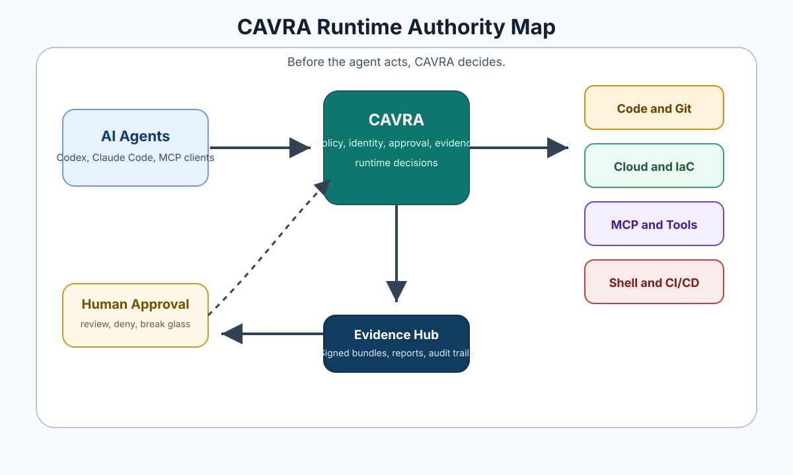
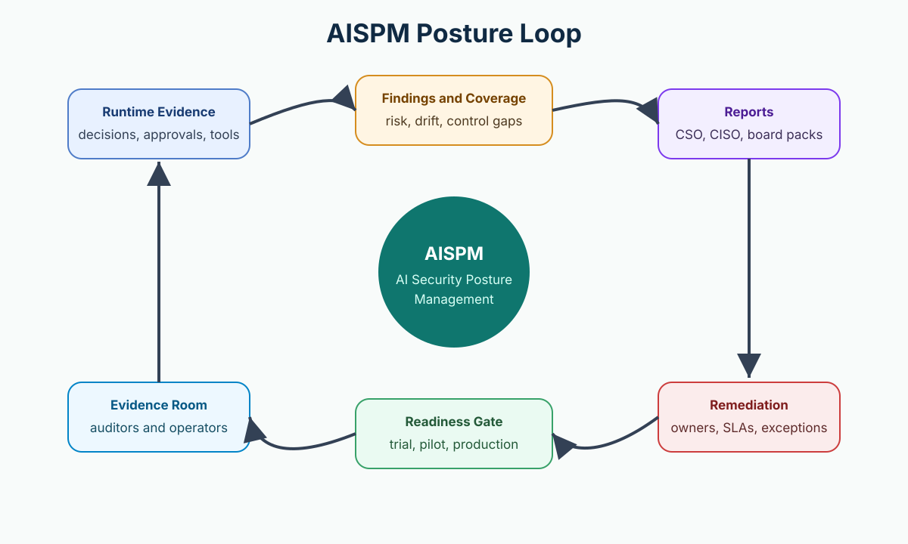
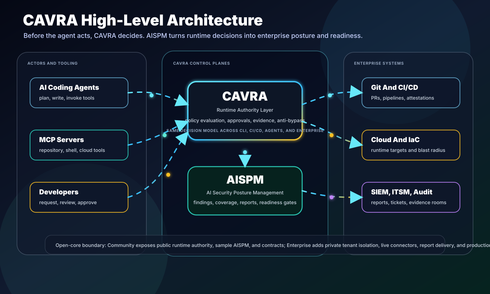
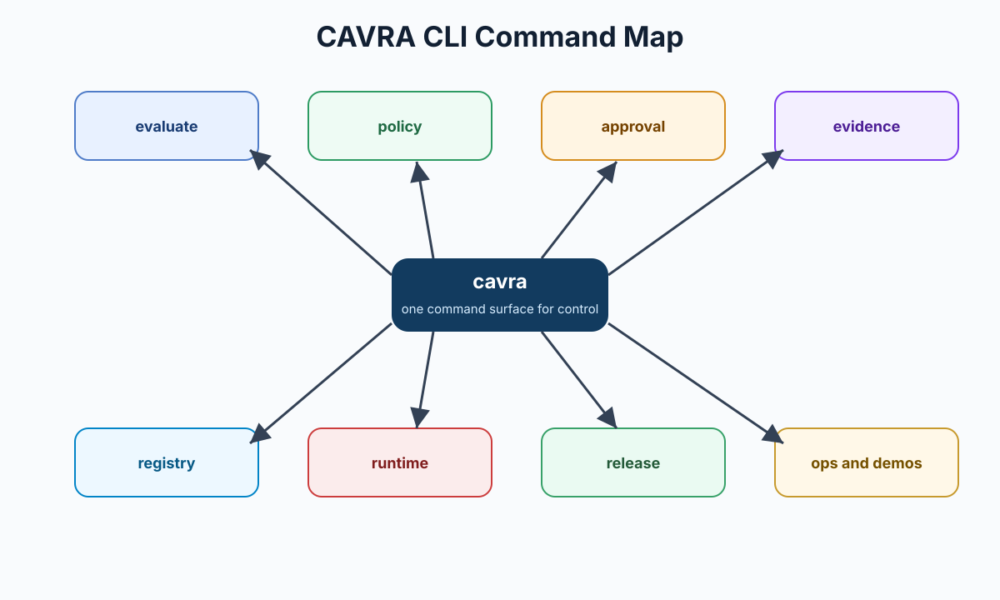
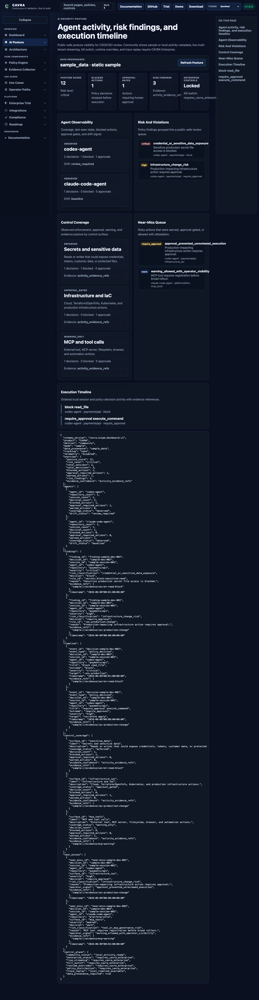

<p align="center">
  
</p>

# CAVRA

Controlled Agentic Verification and Runtime Authority

**Before the agent acts, CAVRA decides.**

CAVRA is a runtime governance layer for AI coding agents, agentic engineering workflows, and the emerging AI model/artifact risk lifecycle. It evaluates what agents can read, write, execute, approve, connect to, and change across code, shell, Git, MCP tools, CI/CD, cloud, infrastructure, and regulated delivery workflows. The roadmap now also treats models, registries, AI artifacts, risk metadata, and compliance evidence as governed asset types under the same decision, identity, evidence, and posture planes.

The commercial product front door is **[cavra.mind-ops.cloud](https://cavra.mind-ops.cloud/)**. It explains CAVRA Managed, Enterprise Subscription, Trial Access, AISPM, trust, resources, and the public product journey. The public interactive sandbox remains **[huzefaaa2.github.io/cavra](https://huzefaaa2.github.io/cavra/)**.

## Introduction Video

Start with the CAVRA product introduction video to see the runtime authority model, evidence flow, AISPM posture loop, and product paths before reading the full documentation.

https://github.com/user-attachments/assets/60105a67-7c2f-4fda-8743-4d53146c3983

The full CAVRA e-book is now the first page of the GitHub Wiki: [Before the Agent Acts: The CAVRA Technical Textbook](docs/wiki/Home.md). Start there for the end-to-end guide to CAVRA architecture, product paths, CLI, GUI, AISPM, deployment, and operations.

If you are unsure where to start, use the [CAVRA Public Documentation Map](docs/public-documentation-map.md). It separates public user documentation from release evidence, development/testing artifacts, and historical archive material.

For implementation details, read the new textbook chapter [CAVRA Technology Stack And Implementation Model](docs/wiki/Textbook-18-CAVRA-Technology-Stack.md). It explains the public Community stack across Python, FastAPI, Typer/Rich, static web front ends, JSON/SQLite persistence, policy and evidence formats, cryptography, Docker, Azure, GitHub Actions, and validation.

For the current implementation summary, read [IMPLEMENTATION_SUMMARY.md](IMPLEMENTATION_SUMMARY.md) and [CAVRA Unified Enterprise Status Report](docs/product/cavra-unified-enterprise-status-report.md). They explain that the public roadmap scope is complete, what remains deployment-specific, and when new roadmap work should be added.

For live Managed and Enterprise execution, read [CAVRA Managed And Enterprise Live Validation Plan](docs/managed-enterprise-live-validation-plan.md). It defines the sanitized manifest that operators use to attach real tenant, connector, SMTP/report delivery, runtime workflow, AISPM production gate, and customer closeout evidence refs without committing private material. Installed operators can run it with `cavra release managed-enterprise-live-validation-plan --require-live`.

For production activation, use the [CAVRA Managed And Enterprise Cutover Runbook](docs/managed-enterprise-cutover-runbook.md). It binds the live validation plan to preflight freeze, go/no-go, rollback, activation, customer closeout, and public-safe status synchronization. Installed operators can run it with `cavra release managed-enterprise-cutover-runbook --require-live`.

For the first post-cutover window, use the [CAVRA Managed And Enterprise Stabilization Report](docs/managed-enterprise-stabilization-report.md). It proves API, identity, tenant isolation, connectors, runtime controls, SMTP/reporting, AISPM, audit/evidence, and support-alert health before exiting cutover mode. Installed operators can run it with `cavra release managed-enterprise-stabilization-report --require-live`.

For steady-state operations, use the [CAVRA Managed And Enterprise Steady-State Handoff](docs/managed-enterprise-steady-state-handoff.md). It proves named ownership, SLO monitoring, security operations, connector operations, runtime operations, AISPM operations, support, customer success, and evidence custody before launch mode becomes normal operating cadence. Installed operators can run it with `cavra release managed-enterprise-steady-state-handoff --require-live`.

For final operating release indexing, use the [CAVRA Managed And Enterprise Operating Release Index](docs/managed-enterprise-operating-release-index.md). It aggregates live validation, cutover, stabilization, steady-state handoff, evidence archive, and public-safe status sync into one customer-safe readiness result. Installed operators can run it with `cavra release managed-enterprise-operating-release-index --require-live`.

For customer-safe launch communication, use the [CAVRA Managed And Enterprise Operating Announcement](docs/managed-enterprise-operating-announcement.md). It proves the release summary, customer value, operating assurance, security/trust claims, publication channels, and approvals are ready without private tenant or commercial material. Installed operators can run it with `cavra release managed-enterprise-operating-announcement --require-live`.

For one-pass launch-to-operations verification, use the [CAVRA Managed And Enterprise Operating Chain](docs/managed-enterprise-operating-chain.md). It loads and validates the live validation plan, cutover runbook, stabilization report, steady-state handoff, operating release index, and operating announcement as a single end-to-end gate. Installed operators can run it with `cavra release managed-enterprise-operating-chain --require-live`.

For customer-safe release attestation, use the [CAVRA Managed And Enterprise Operating Release Certificate](docs/managed-enterprise-operating-certificate.md). It summarizes the operating chain into certificate sections, owner signoffs, public-safe claims, evidence custody, validity window, and next review. Installed operators can run it with `cavra release managed-enterprise-operating-certificate --require-live`.

For publication control, use the [CAVRA Managed And Enterprise Certificate Publication Index](docs/managed-enterprise-certificate-publication-index.md). It proves approved certificate publication targets, public-safe claims, rollback references, channel owners, and evidence refs before the certificate is surfaced publicly or to customers. Installed operators can run it with `cavra release managed-enterprise-certificate-publication-index --require-live`.

For the merged Community-to-Enterprise enhancement plan, read [CAVRA Unified Enterprise Product Enhancement Roadmap](docs/product/cavra-unified-enterprise-product-enhancement-roadmap.md). This is the numbered tracker for identity, multi-tenancy, KMS/HSM signing, immutable audit, compliance packs, connector SDKs, zero-trust scanner agents, policy lifecycle tooling, event-driven monitoring, scale testing, broader agent adapters, model/artifact governance, LLM guardrail testing, supply-chain security, and buyer trust documentation.

The roadmap is normalized at the public-contract level: every numbered row currently in the tracker is completed for the stated repository scope, and [Phase 7 Roadmap Closeout](docs/phase7-roadmap-closeout.md) defines the stop rule. Future repeated customer monitoring, scorecard refresh, drift remediation, renewal, and closeout cycles are live operations evidence unless they introduce a new CAVRA capability, API, CLI command, validator, connector, deployment target, evidence schema, trust artifact, edition, or packaging model. This boundary is enforced by `python3 scripts/validate_roadmap_completion_boundary.py --repo-root .`.

For future work triage, use the [CAVRA Roadmap Intake Gate](docs/roadmap-intake-gate.md). It classifies new requests as either `live_operations_evidence`, `new_product_roadmap_candidate`, or `needs_architect_review` before anything is added beyond the closed R7.61 roadmap boundary. Installed operators can run it with `cavra release roadmap-intake-gate --require-live`.

For accepted product candidates, use the [CAVRA Roadmap Candidate Charter](docs/roadmap-candidate-charter.md). It proves scope, ownership, public-contract boundaries, acceptance criteria, docs/test/release plans, and redaction controls before a future phase or roadmap item is opened. Installed operators can run it with `cavra release roadmap-candidate-charter --require-live`.

For future phase opening, use the [CAVRA Roadmap Future Phase Opening Gate](docs/roadmap-future-phase-opening-gate.md). It proves a chartered product candidate has phase owner, product and architecture owners, scoped milestones, dependencies, exit criteria, test/docs/release/security controls, rollback planning, and the R7.61 boundary reference before a future product phase is opened. Installed operators can run it with `cavra release roadmap-future-phase-opening-gate --require-live`.

For registered future phases, use the [CAVRA Roadmap Future Phase Registry](docs/roadmap-future-phase-registry.md). It records approved future phases with sanitized ownership, backlog, release gate, status report, public-contract boundary, and exit-criteria refs without adding R7.62. Installed operators can run it with `cavra release roadmap-future-phase-registry --require-live`.

For one-pass future work governance closeout, use the [CAVRA Roadmap Future Work Governance Index](docs/roadmap-future-work-governance-index.md). It aggregates intake, charter, phase-opening, and registry results into a single ready/blocked decision without reopening R7. Installed operators can run it with `cavra release roadmap-future-work-governance-index --require-live`.

For an operator shortcut across the closed roadmap boundary and the future-work governance chain, use the [CAVRA Roadmap Governance Quickcheck](docs/roadmap-governance-quickcheck.md). It validates the R7.61 completion boundary and the future-work governance index in one pass. Installed operators can run it with `cavra release roadmap-governance-quickcheck --repo-root . --require-live`.

For scale-readiness controls, read [CAVRA Benchmark And SLO Regression Gates](docs/benchmark-slo-regression-gates.md). It defines the latency, throughput, HA/DR, and failure-mode evidence gate used to prove the R6.1 benchmark contract before live Enterprise readiness.

For broader agent coverage, read [CAVRA Generic Agent Adapter SDK And Action Taxonomy](docs/generic-agent-adapter-sdk.md). It explains how non-coding agents can normalize business, identity, data, finance, model-governance, support, and communications actions into CAVRA decisions.

For native AI risk validation, read [CAVRA AI Red-Team And Supply-Chain Gates](docs/ai-red-team-and-supply-chain-gates.md). It defines public guardrail tests, AI artifact supply-chain checks, malicious model checks, and red-team readiness packets without raw prompt or model egress.



## What CAVRA Does

CAVRA adds a governed control point between AI agents and meaningful engineering actions.

- Evaluates agent actions before they happen.
- Blocks unsafe file, command, Git, cloud, MCP, CI/CD, and infrastructure activity.
- Routes high-risk actions for approval.
- Records signed evidence for audit and verification.
- Tracks governed agents and MCP trust boundaries.
- Supports PR attestation and CI/CD required checks.
- Provides a public sandbox GUI for hands-on exploration.
- Includes AISPM, AI Security Posture Management, for posture, findings, reports, readiness packets, and production gates.
- Plans a unified governance path for model registries, AI artifacts, scanner metadata, supply-chain checks, and compliance mapping without requiring raw model or training-data egress.

## AISPM

AISPM turns CAVRA runtime evidence into AI security posture.

It helps teams answer:

- Which agents, tools, repositories, and workflows are covered?
- Which controls are enforced, shadowed, or missing?
- Which findings and exceptions are open?
- Which report packets are ready for security, compliance, or executives?
- Which blockers remain before trial, pilot, or production launch?



Community AISPM includes dashboard samples, schemas, report center contracts, public-safe sandbox views, and self-hostable interfaces. Provider-backed capabilities such as report delivery, audit storage, tenant context, and connectors require user configuration. CAVRA Managed operates those services for customers, and CAVRA Enterprise Subscription adds commercial support, certified connectors, compliance packs, and implementation help.

## Product Model

This repository is the public CAVRA Community and product documentation repository. Community is the full self-hosted public product surface, not a crippled demo. Hosted operations, certified commercial packs, customer-specific support, and private managed-service automation live outside this public repository.


| Capability | CAVRA Community | CAVRA Managed | Enterprise Subscription | CAVRA Trial |
| --- | --- | --- | --- | --- |
| Local CLI, policy engine, approvals, and evidence | Included | Hosted and operated | Supported | Evaluated |
| AISPM, report center, dashboards, and public contracts | Included | Hosted and operated | Supported | Evaluated |
| Self-hosted tenant model, SSO/RBAC hooks, audit export, report delivery interface | Included, requires configuration | Managed by CAVRA | Supported | Evaluated |
| Connector framework and reference connectors | Included | Managed by CAVRA | Supported | Evaluated |
| Certified connectors, commercial policy packs, compliance packs | Not bundled | Available when subscribed | Included by contract | Evaluated when approved |
| Managed onboarding, uptime, updates, billing, customer-success operations | Self-operated | Included | Optional managed path | Temporary evaluator path |

Terminology:

- **CAVRA Community** is the public self-hosted product.
- **CAVRA Managed** is hosted CAVRA operated as a managed service.
- **CAVRA Enterprise Subscription** is the commercial relationship for support, SLA, certified integrations, commercial policy and compliance packs, implementation help, and private customer operations.
- **CAVRA Trial** is temporary evaluation access for CAVRA Managed and/or Enterprise Subscription capabilities. It is not a separate source edition.

## Architecture

CAVRA is organized around four planes:

- **Decision plane:** policy evaluation, runtime actions, command checks, MCP checks, approval routing.
- **Identity and trust plane:** governed agents, MCP trust, OIDC, RBAC, tenant context, entitlement state.
- **Evidence plane:** signed evidence bundles, immutable append-only audit logs, trust roots, attestations, KMS/HSM custody readiness, metadata, search, SIEM export, retention.
- **Posture plane:** AISPM dashboards, findings, reports, trial readiness, pilot evidence rooms, production readiness gates.



## Quick Start

Clone the repository:

```bash
git clone https://github.com/Huzefaaa2/cavra.git
cd cavra
```

Install locally:

```bash
python -m venv .venv
source .venv/bin/activate
pip install -e .
```

Run the CLI:

```bash
cavra version
cavra policy list
cavra evaluate write_file iam/admin-role.tf --json
```

Start the sandbox GUI:

```bash
python -m http.server 5173 --directory apps/sandbox-ui
```

Open `http://localhost:5173`.


## Community Deployment On Azure

CAVRA Community can be published as a self-hosted Azure deployment:

- FastAPI backend on Azure Container Apps.
- Static sandbox UI on Azure Static Web Apps.
- Container image build and publish through Azure Container Registry.
- GitHub Actions deployment through Azure OIDC.

The deployment artifacts are:

- `docker/Dockerfile.azure-api`
- `.github/workflows/deploy-azure-api.yml`
- `.github/workflows/deploy-azure-static-ui.yml`

Use [Azure Community Deployment](docs/azure-community-saas-deployment.md) for the full setup, required GitHub variables, Azure resources, persistence boundary, and validation steps. Provider-backed services such as report delivery, audit storage, object storage, database, policy registry, and connector credentials must be configured by the self-hosting operator.

## Community Container And Kubernetes Deployment

CAVRA Community can also run as a containerized API service on Kubernetes:

- Community API image published to GitHub Container Registry through `.github/workflows/publish-community-api-image.yml`.
- Docker source at `docker/Dockerfile.azure-api`.
- Helm chart at `charts/cavra`.
- Helm validation workflow at `.github/workflows/helm-cavra.yml`.
- Optional bundled PostgreSQL dependency for test and small operator environments.
- External PostgreSQL, Kubernetes Secret, ingress, TLS, and cloud/on-prem deployment paths for production-style clusters.

Use [Kubernetes Deployment](docs/kubernetes-deployment.md) for local `kind`/Minikube, AKS/EKS/GKE, on-prem, external database, secrets, TLS, and validation instructions.

Trial, Managed, and Enterprise Subscription Azure deployments use a separate private workflow set in
`Huzefaaa2/cavra-enterprise` for the trial portal, evaluator entitlement workflow, private
commercial packages, managed control plane, connector jobs, authenticated operator UI,
and AISPM production readiness gate. Public-safe overview:
[Azure Trial And Enterprise Deployment](docs/azure-trial-enterprise-deployment.md).

## CLI Command Families

The `cavra` CLI covers local decisions, policies, approvals, evidence, registries, operations, runtime workflows, releases, and demos.



Common command groups:

- `cavra evaluate`
- `cavra agent ...`
- `cavra policy ...`
- `cavra approval ...`
- `cavra evidence ...`
- `cavra registry ...`
- `cavra ops ...`
- `cavra runtime ...`
- `cavra release ...`
- `cavra init claude-code`
- `cavra demo before-the-agent-acts`

Full reference: [Generated CAVRA Full CLI Reference](docs/cli-reference.md), [GitHub-style CLI Manual](docs/cli-manual/README.md), [CAVRA CLI Command Reference](docs/wiki/Textbook-08-CAVRA-CLI-Command-Reference.md), and [CLI](docs/wiki/CLI.md).

## GUI And Sandbox

The sandbox UI demonstrates the product as a reader and evaluator experience:

- Dashboard
- Demo scenarios
- AI Posture and AISPM
- Evidence console
- Approvals
- Agent registry
- MCP trust registry
- Report center
- Trial and pilot readiness packets



Guide: [CAVRA GUI And Sandbox Guide](docs/wiki/Textbook-09-CAVRA-GUI-And-Sandbox-Guide.md).

## Documentation

Use the documentation map when you need a starting point or need to distinguish
public user docs from internal evidence:

- [CAVRA Public Documentation Map](docs/public-documentation-map.md)

Primary public paths:

| Need | Link |
| --- | --- |
| Product overview | [cavra.mind-ops.cloud](https://cavra.mind-ops.cloud/) |
| Technical textbook | [GitHub Wiki textbook](docs/wiki/Home.md) |
| Full CLI reference | [Generated CAVRA Full CLI Reference](docs/cli-reference.md) |
| GitHub-style CLI manual | [CAVRA CLI Manual](docs/cli-manual/README.md) |
| API reference | [API](docs/wiki/API.md) |
| Product model | [Product Model](docs/wiki/Product-Model.md) |
| Install and deploy | [Install And Deploy CAVRA](docs/wiki/Textbook-05-Install-And-Deploy-CAVRA.md) |
| Kubernetes and Helm | [Kubernetes Deployment](docs/kubernetes-deployment.md) |
| Community guide | [CAVRA Community User Guide](docs/wiki/Textbook-06-Community-Edition-User-Guide.md) |
| Managed and Enterprise guide | [CAVRA Managed And Enterprise Subscription Guide](docs/wiki/Textbook-07-Enterprise-Edition-User-Guide.md) |
| AISPM guide | [AISPM Guide](docs/wiki/Textbook-10-AISPM-Guide.md) |
| Current implementation status | [Implementation Summary](IMPLEMENTATION_SUMMARY.md) |
| Current release notes | [Release Notes](RELEASE_NOTES.md) |
| Public roadmap status | [CAVRA Unified Enterprise Status Report](docs/product/cavra-unified-enterprise-status-report.md) |

Historical implementation, release, validation, and testing records are archived
away from the main user journey in [Development And Testing Artifacts](docs/wiki/Development-And-Testing-Artifacts/Index.md)
and [Development And Testing Artifacts Archive](docs/archive/development-and-testing-artifacts/README.md).

## Trial Access

CAVRA Trial access starts at the approved-access trial portal:

- [CAVRA Trial](https://cavra-trial.mind-ops.cloud/)

The trial is not an anonymous source download and it is not a separate product edition. Approved evaluators
request access with a business email, GitHub username, company role, and
evaluation goal. After operator review, approved evaluators receive private
package or hosted access where applicable, plus one-time, time-limited entitlement material through a controlled
channel.

Recommended trial path:

1. Request access from the trial portal.
2. Follow the operator approval and license handoff instructions.
3. Store license material in a secret store or protected local file, never in
   source control.
4. Validate the license using the command or package workflow supplied in the
   approval handoff.
5. Complete one measurable use case with one repository, one risky agent
   action, one approval route, one evidence bundle, and one AISPM/report review.
6. Use the Trial Field Guide to close out the evaluation, capture findings, and
   decide whether to move to pilot.

Use these Trial and Enterprise guide paths:

- [Trial Access Guide](docs/wiki/Trial-Access-Guide.md)
- [Enterprise Trial Availability](docs/wiki/Enterprise-Trial-Availability.md)
- [Enterprise Trial Self-Service Access](docs/wiki/Enterprise-Trial-Self-Service-Access.md)
- [CAVRA Trial Field Guide](docs/wiki/CAVRA-Trial-Field-Guide.md)
- [AISPM Enterprise Live Ingestion](docs/wiki/AISPM-Enterprise-Live-Ingestion.md)
- [AISPM Report Center Enterprise Readiness](docs/wiki/AISPM-Report-Center-Enterprise-Readiness.md)

Production readiness requires real tenant, connector, SMTP or report provider, and runtime workflow validation. The final AISPM production packet must return `ready_for_aispm_production: true` with no blockers.

## Security

Do not commit production credentials, SMTP passwords, connector secrets, tenant secrets, or private policy packs. Use environment variables, secret stores, or deployment-level secret management.

Report security issues through the process documented in [Vulnerability Disclosure](docs/wiki/Vulnerability-Disclosure.md).

## License

See [LICENSE](LICENSE).

<!--
Legacy validation references kept non-rendered so historical release validators can
confirm public navigation freshness while the visible README remains product-focused.

docs/sandbox-portal-redesign.md
docs/sandbox-portal-smoke-validation.md
docs/releases/community-v1.0.0-aispm.md
docs/aispm-v1.0-public-walkthrough.md
docs/release-verifications/aispm-v1.0-public-release-readiness.md
docs/release-verifications/aispm-v1.0-public-release-readiness.json
scripts/validate-aispm-v100-public-release.py
docs/release-verifications/aispm-launch-readiness-rollup.md
docs/release-verifications/aispm-launch-readiness-rollup.json
scripts/validate-aispm-launch-readiness.py
docs/release-verifications/hosted-sandbox-pages-smoke-validation.md
docs/release-verifications/hosted-sandbox-pages-smoke-validation.json
scripts/validate-hosted-sandbox-pages.mjs
docs/release-verifications/hosted-sandbox-deployment-freshness.md
docs/release-verifications/hosted-sandbox-deployment-freshness.json
scripts/validate-hosted-sandbox-deployment-freshness.py
community-v1.0.0-aispm-release-evidence-index
docs/release-verifications/hosted-sandbox-operator-release-status.md
docs/release-verifications/hosted-sandbox-operator-release-status.json
scripts/validate-hosted-sandbox-operator-status.py
cavra-hosted-sandbox-operator-status-packet.json
docs/release-verifications/hosted-sandbox-post-deploy-evidence.md
docs/release-verifications/hosted-sandbox-post-deploy-evidence.json
scripts/generate-hosted-sandbox-deploy-evidence.py
scripts/validate-hosted-sandbox-deploy-evidence.py
cavra-hosted-sandbox-post-deploy-evidence
docs/release-verifications/aispm-release-evidence-index.md
docs/release-verifications/aispm-release-evidence-index.json
scripts/validate-aispm-release-evidence-index.py
cavra-aispm-release-evidence-index-packet.json
docs/release-verifications/aispm-report-catalog-readiness.md
docs/release-verifications/aispm-report-catalog-readiness.json
scripts/validate-aispm-report-catalog-readiness.py
cavra-aispm-report-catalog-packet.json
scripts/validate-aispm-report-delivery-setup-readiness.py
docs/release-verifications/aispm-report-delivery-setup-readiness.md
docs/release-verifications/aispm-report-delivery-setup-readiness.json
cavra-aispm-report-delivery-setup-packet.json
docs/release-verifications/aispm-report-operations-readiness.md
docs/release-verifications/aispm-report-operations-readiness.json
scripts/validate-aispm-report-operations-readiness.py
cavra-aispm-report-operations-readiness-packet.json
docs/release-verifications/aispm-report-governance-readiness.md
docs/release-verifications/aispm-report-governance-readiness.json
scripts/validate-aispm-report-governance-readiness.py
cavra-aispm-report-governance-readiness-packet.json
docs/release-verifications/aispm-report-assurance-readiness.md
docs/release-verifications/aispm-report-assurance-readiness.json
scripts/validate-aispm-report-assurance-readiness.py
cavra-aispm-report-assurance-readiness-packet.json
docs/release-verifications/aispm-report-response-readiness.md
docs/release-verifications/aispm-report-response-readiness.json
scripts/validate-aispm-report-response-readiness.py
cavra-aispm-report-response-readiness-packet.json
docs/release-verifications/aispm-report-trial-operations-readiness.md
docs/release-verifications/aispm-report-trial-operations-readiness.json
scripts/validate-aispm-report-trial-operations-readiness.py
cavra-aispm-report-trial-operations-readiness-packet.json
docs/release-verifications/aispm-pilot-control-readiness.md
docs/release-verifications/aispm-pilot-control-readiness.json
scripts/validate-aispm-pilot-control-readiness.py
cavra-aispm-pilot-control-readiness-packet.json
docs/release-verifications/aispm-final-announcement-readiness.md
docs/release-verifications/aispm-final-announcement-readiness.json
scripts/validate-aispm-final-announcement-readiness.py
cavra-aispm-final-announcement-readiness-packet.json
docs/releases/community-v0.1.0.md
docs/release-verifications/community-v0.1.0-post-release-verification.md
docs/releases/community-v0.1.1.md
docs/release-verifications/community-v0.1.1-maintenance-verification.md
docs/releases/community-v0.1.2.md
docs/release-verifications/community-v0.1.2-maintenance-verification.md
docs/releases/community-v0.1.3.md
docs/release-verifications/community-v0.1.3-maintenance-verification.md
docs/releases/community-v1.0.0-aispm.md
docs/release-verifications/community-v1.0.0-aispm-public-release-verification.md
docs/releases/community-v1.0.0-rc.1.md
docs/release-verifications/community-v1.0.0-rc.1-publication-readiness.md
docs/releases/community-v1.0.0.md
docs/release-verifications/community-v1.0.0-publication-readiness.md
docs/community-release-index.md
docs/community-release-readiness-dashboard.md
docs/console-closeout-operator-experience.md
docs/community-ga-user-verifiable-path.md
docs/production-deployment-guide-validation.md
docs/go-enforcement-production-hardening.md
docs/enterprise-integration-validation.md
docs/production-readiness-procurement-closeout.md
docs/release-verifications/community-v0.1.1-post-release-verification.md
docs/release-verifications/community-v0.1.2-post-release-verification.md
docs/release-verifications/community-v0.1.3-post-release-verification.md
docs/release-verifications/community-v1.0.0-rc.1-post-publication-verification.md
docs/release-verifications/community-v1.0.0-post-publication-verification.md
docs/community-v1.0.0-stabilization-plan.md
docs/release-verifications/community-v1.0.0-stabilization-plan.json
docs/community-v1.0.0-release-candidate-hardening.md
docs/release-verifications/community-v1.0.0-release-candidate-hardening.json
docs/community-v1.0.0-release-candidate-publication.md
docs/release-verifications/community-v1.0.0-release-candidate-publication.json
docs/release-verifications/community-v1.0.0-rc.1-publication-readiness.md
docs/release-verifications/community-v1.0.0-rc.1-post-publication-verification.md
docs/release-verifications/community-v1.0.0-rc.1-post-publication-verification.json
docs/community-v1.0.0-ga-readiness.md
docs/release-verifications/community-v1.0.0-ga-readiness.json
docs/community-v1.0.0-ga-publication-package.md
docs/release-verifications/community-v1.0.0-ga-publication-package.json
docs/release-verifications/community-v1.0.0-publication-readiness.md
docs/release-verifications/community-v1.0.0-post-publication-verification.md
docs/release-verifications/community-v1.0.0-post-publication-verification.json
docs/community-release-keyless-attestation.md
assets/brand/png/cavra-github-social-preview-1200x630.png
docs/community-ga-release-checklist.md
docs/community-ga-release-packet-template.md
docs/community-ga-release-packet-validation.md
docs/release-packets/community-ga-dry-run-2026-06-04.md
docs/release-packets/community-ga-v0.1.0.md
https://github.com/Huzefaaa2/cavra/releases/tag/community-v0.1.0
https://github.com/Huzefaaa2/cavra/releases/tag/community-v0.1.1
https://github.com/Huzefaaa2/cavra/releases/tag/community-v0.1.2
https://github.com/Huzefaaa2/cavra/releases/tag/community-v0.1.3
https://github.com/Huzefaaa2/cavra/releases/tag/community-v1.0.0-rc.1
https://github.com/Huzefaaa2/cavra/releases/tag/community-v1.0.0
docs/community-ga-v0.1.0-release-publication.md
docs/community-release-verification-runbook.md
docs/community-maintenance-release-checklist.md
docs/community-maintenance-release-evidence-template.md
docs/community-release-note-freshness.md
docs/community-v0.1.2-readiness.md
docs/community-release-index-freshness.md
docs/community-release-readiness-dashboard-validation.md
docs/community-v0.1.3-maintenance-planning.md
Use Community v1.0.0 as the stable public baseline and begin the v1.0.1 maintenance planning path for post-GA fixes, release integrity hardening, detached signing or keyless attestation, and adoption feedback.
-->
