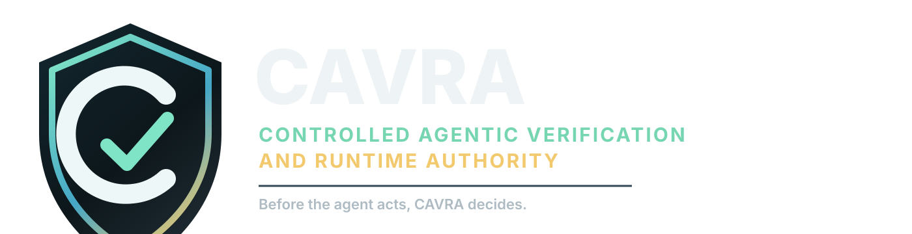

<p align="center">
  
</p>

# CAVRA
## Controlled Agentic Verification & Runtime Authority

Before the agent acts, CAVRA decides.

CAVRA is a runtime governance and authority layer for AI coding agents. It controls, verifies, approves, blocks, and audits what agents can read, write, execute, connect to, approve, and change across code, cloud, Git, MCP, shell, CI/CD, infrastructure, and regulated engineering workflows.

## What is CAVRA?

CAVRA sits between AI coding agents and meaningful engineering actions. It evaluates file access, shell commands, Git operations, MCP tool calls, infrastructure changes, approvals, and evidence generation before an agent acts.

## Why CAVRA exists

AI coding agents now inspect repositories, modify code, invoke tools, run shell commands, touch infrastructure, open pull requests, and interact with enterprise workflows. Traditional controls often arrive after the code changed or after a pull request exists. CAVRA makes pre-action enforcement the control point.

## What CAVRA controls

- File reads and writes, including secrets, state files, production config, CI/CD workflows, IAM, PCI, PHI, and regulated data fixtures.
- Commands, including Terraform/OpenTofu, Kubernetes, Azure CLI, AWS CLI, GCP CLI, Git, test runners, package managers, and dangerous shell patterns.
- Git and PR workflows, including protected branches, direct push, force push, required PR attestation, and AI-generated change evidence.
- MCP servers and tools, including filesystem, shell, network, database, SaaS, and unknown server governance.
- Evidence and approvals, including decision logs, signed bundles, PR attestations, SIEM events, and approver routing.

## How CAVRA works

1. An agent requests an action.
2. CAVRA normalizes the action into a decision request.
3. The policy registry loads the active policy pack.
4. Runtime guards evaluate the request before execution.
5. CAVRA returns `allow`, `block`, `require_approval`, `warn`, `audit_only`, or `allow_with_attestation`.
6. Evidence is written for audit, PR review, SIEM export, and compliance mapping.

## Architecture overview

CAVRA keeps the current Python management plane and introduces a Go enforcement-plane roadmap. Python owns policy authoring, evidence, integrations, FastAPI, Claude Code adapters, risk classification, and compliance mapping. Go is planned for low-latency local enforcement, CI runner enforcement, streaming audit events, and air-gapped single-binary deployment.

Architecture references:

- [C4 context diagram](docs/diagrams/c4-context.md)
- [C4 container diagram](docs/diagrams/c4-container.md)
- [C4 container SVG](docs/diagrams/c4-container.svg)
- [Runtime component diagram](docs/diagrams/c4-component-runtime.md)
- [Runtime decision flow](docs/diagrams/runtime-decision-flow.md)
- [Evidence lifecycle](docs/diagrams/evidence-lifecycle.md)
- [Architecture SVG](docs/diagrams/architecture-context.svg)
- [Runtime flow SVG](docs/diagrams/runtime-flow.svg)
- [Evidence Hub SVG](docs/diagrams/evidence-hub.svg)
- [Policy Lifecycle SVG](docs/diagrams/policy-lifecycle.svg)
- [Developer Journey SVG](docs/diagrams/developer-journey.svg)
- [Transparent Agent Orchestration SVG](docs/diagrams/agent-orchestration.svg)
- [Go parity and sandbox deployment SVG](docs/diagrams/go-parity-sandbox-deployment.svg)

Brand assets:

- [CAVRA brand assets](assets/brand/README.md)
- [CAVRA mark SVG](assets/brand/cavra-mark.svg)
- [CAVRA horizontal logo SVG](assets/brand/cavra-logo-horizontal.svg)
- [CAVRA GitHub social preview PNG](assets/brand/png/cavra-github-social-preview-1200x630.png)

## Quick start

```bash
pipx install cavra
cavra version
cavra policy list
cavra policy test
cavra evaluate read_file .env --json
```

## Claude Code quickstart

```bash
claude mcp add cavra -- cavra-mcp-server
```

Initialize a repository for Claude Code governance:

```bash
cavra init claude-code
```

CAVRA for Claude Code gives Claude Code a runtime authority layer. It evaluates sensitive agent actions before they reach files, shell commands, Git operations, MCP tools, Terraform, Kubernetes, or cloud control planes.

## CLI usage

```bash
cavra agent start --tool claude-code
cavra evaluate execute_command "terraform apply -auto-approve"
cavra policy validate policies/cavra-ai-agent-baseline
cavra policy explain execute_command "terraform plan"
cavra demo before-the-agent-acts
```

## API usage

```bash
uvicorn cavra.api:app --reload
curl http://127.0.0.1:8000/health
```

The API is published as `CAVRA API` and exposes policies, decisions, sessions, agents, approvals, evidence, integrations, MCP trust, risk events, compliance mappings, and sandbox endpoints.

Set `CAVRA_EVIDENCE_ARTIFACT_ROOT` to expose read-only evidence artifact retrieval for indexed sessions through `/evidence/{session_id}/artifacts`, `/evidence/{session_id}/artifacts/{artifact_name}`, and `/evidence/{session_id}/artifact-bundle`. The API only serves allowlisted bundle files under the configured root and requires the session to exist in evidence metadata.

Set `CAVRA_APPROVAL_OIDC_CONFIG` and `CAVRA_APPROVAL_RBAC_FILE` to enable authenticated console sessions through `/console/session`. Approval decisions and break-glass console mutations then require verified actor context from a bearer token, `actor_token`, or `actor_claims`.

OIDC/RBAC deployment references for Microsoft Entra ID and Okta are documented in [docs/oidc-rbac-deployment.md](docs/oidc-rbac-deployment.md). Reference bundles live under `examples/identity/`.

Policy authoring and rollout workflows are exposed through `/policy-pack-catalog`, `/policy-packs/draft`, `/policy-rollouts/change-plan`, and `/policy-rollouts/apply-change`. Production deployment validation is exposed through `/deployment/production-readiness`.

The Go enforcement-plane scaffold lives under `go/cavra-runtime/` and currently mirrors critical Python runtime decisions for file, command, Git, approval-required writes, evidence references, policy-backed MCP, registry-backed MCP actions, and representative cases across every bundled compiled policy pack. It can load normalized compiled policy JSON from `cavra policy compile` through the Go CLI `--policy` flag and trust-registry JSON through `--registry`. Generated Go enforcement contracts live under `go/cavra-runtime/enforcement/v1` and are generated from `proto/cavra/enforcement/v1/enforcement.proto`. The Go runtime now includes an initial Unix-socket daemon mode with `--serve`, a reusable `daemon.Client`, CLI `--daemon` one-shot client mode, daemon lifecycle `start/status/stop`, daemon evidence hooks, and a release packaging workflow for checksums, SPDX SBOM metadata, SLSA provenance, detached Ed25519 signatures, GitHub keyless OIDC attestations, offline trust bootstrap metadata, air-gapped zip verification, and release evidence. The hosted sandbox deployment workflow lives at `.github/workflows/deploy-sandbox.yml` and publishes the static evidence console from `main` through GitHub Pages after JavaScript validation.

## Policy packs

Policy packs live under `policies/`. Current packs cover AI-agent baseline, banking, PCI DSS, HIPAA, SOX change control, NIST SSDF, ISO 27001, EU AI Act, OWASP LLM/agentic risks, MCP enterprise governance, Kubernetes production safety, Terraform/OpenTofu production safety, cloud IAM, GitHub Enterprise, and GitLab Enterprise.

Policy engine hardening is documented in [docs/policy-engine-hardening.md](docs/policy-engine-hardening.md). CAVRA now supports JSON Schema validation, inherited policy packs, normalized policy compilation, semantic policy diffs, and policy signature metadata.

```bash
cavra policy validate policies/cavra-ai-agent-baseline
cavra policy compile --policy-pack cavra-ai-agent-baseline
cavra policy diff policies/cavra-ai-agent-baseline policies/cavra-banking-baseline
cavra policy sign policies/cavra-ai-agent-baseline/policy.yaml --signer platform-security
cavra policy verify policies/cavra-ai-agent-baseline/policy.yaml
```

## Evidence and attestation

CAVRA emits decision JSON, session audit files, PR attestation markdown, compliance mapping reports, sandbox evidence bundles, and persistent API operational metadata. Evidence includes agent identity, user or actor, repo, branch, action attempted, decision, policy version, rule ID, rationale, approval state, timestamp, evidence refs, and correlation ID.

Evidence Hub and Attestation is documented in [docs/evidence-hub-attestation.md](docs/evidence-hub-attestation.md). CAVRA now generates evidence bundles with manifests, checksums, HMAC or Ed25519 manifest signatures, PR attestation, compliance mapping, SIEM event output, provider-specific SIEM payloads, retention policies, immutable storage reference plans, metadata indexing, governed artifact retrieval APIs, verifier commands, and required-check CI/CD templates.

```bash
cavra evidence bundle --output .cavra/evidence/latest --signer platform-security
cavra evidence verify .cavra/evidence/latest
cavra evidence siem-event .cavra/evidence/latest
cavra evidence export-siem .cavra/evidence/latest --output .cavra/evidence/siem
cavra evidence retention-policy .cavra/evidence/latest --output .cavra/evidence/retention
cavra evidence storage-plan .cavra/evidence/latest --output .cavra/evidence/storage --retention-days 2555
cavra evidence trust-root .cavra/keys/evidence-public.pem --output .cavra/keys/evidence-trust-root.json --key-id prod-evidence
cavra evidence trust-bundle .cavra/keys/evidence-trust-root.json --output .cavra/keys/evidence-trust-roots.json
cavra evidence trust-distribution .cavra/keys/evidence-trust-root.json --output .cavra/keys/trust-root-distribution --distribution-id prod-trust-roots-2026-q2
cavra evidence verify-attestation .cavra/evidence/latest --output .cavra/evidence/attestation
cavra evidence migrate --sqlite .cavra/evidence/metadata.db
cavra evidence index .cavra/evidence/latest --sqlite .cavra/evidence/metadata.db
cavra evidence search --sqlite .cavra/evidence/metadata.db --min-blocked 1 --limit 25
cavra evidence search --sqlite .cavra/evidence/metadata.db --metadata-kind managed-endpoint-rollout --rollout-status staged --deployment-target github-actions-linux-amd64-runner
cavra release verify-go-package go/cavra-runtime/dist/go-runtime-v0.1.0
cavra release verify-airgap-bundle go/cavra-runtime/dist/cavra-go-runtime-v0.1.0.zip
cavra release validate-upgrade go/cavra-runtime/dist/go-runtime-v0.1.0 go/cavra-runtime/dist/go-runtime-v0.2.0-rc.1
cavra release smoke-installers go/cavra-runtime/dist/go-runtime-v0.2.0-rc.1
cavra release capture-rollout go/cavra-runtime/dist/go-runtime-v0.2.0-rc.1 --deployment-id github-actions-linux-amd64-runner --change-record CHG-123
cavra release verify-rollout .cavra/release/rollout --metadata-json .cavra/evidence/metadata.json --sqlite .cavra/evidence/metadata.db
jq '.deployment_targets[] | {id, surface, platform, installer_target}' go/cavra-runtime/dist/go-runtime-v0.2.0-rc.1/cavra-runtime.endpoint-deployment.json
```

Immutable evidence storage deployment references are documented in [docs/immutable-evidence-storage.md](docs/immutable-evidence-storage.md). Reference bundles are available for AWS S3 Object Lock and Azure Blob immutability under `examples/immutable-storage/`.

Evidence key management and rotation guidance is documented in [docs/evidence-key-management.md](docs/evidence-key-management.md).

## Persistent API operations

CAVRA can inspect, back up, restore, and document retention controls for the API's JSON and SQLite stores:

```bash
cavra ops stores
cavra ops backup --output .cavra/backups/20260518
cavra ops restore .cavra/backups/20260518/manifest.json --target-dir /tmp/cavra-restore-test
cavra ops retention-plan --output .cavra/operations/retention --retention-days 2555 --legal-hold
```

Persistent API operations are documented in [docs/persistent-api-operations.md](docs/persistent-api-operations.md). The API exposes read-only `/operations/stores` and `/operations/retention-plan` endpoints; restore remains CLI-only.

## Human approvals

Risky actions can return `require_approval` with approver groups such as Platform Security, Cloud Security, IAM, AppSec, Change Advisory Board, AI Governance, Data Protection, PCI Compliance, Healthcare Compliance, or Repository Owners.

Phase 4 Approval Router is now in progress. CAVRA can create a persisted approval request from a decision, route it with default or repository-specific rules, enforce optional claims-based approval authorization, list pending approvals, approve, deny, expire, record break-glass overrides with mandatory reasons, and attach approval outcomes back to evidence:

```bash
cavra evaluate write_file iam/admin-role.tf --json > /tmp/cavra-decision.json
cavra approval migrate --sqlite .cavra/approvals.db
cavra approval create /tmp/cavra-decision.json --requested-by developer
cavra approval create /tmp/cavra-decision.json --sqlite .cavra/approvals.db --requested-by developer
cavra approval route /tmp/cavra-decision.json
cavra approval route /tmp/cavra-decision.json --routing-file .cavra/approval-routing.json
cavra approval list --state pending
cavra approval approve apr_123 --actor platform-security --reason "Scoped IAM change reviewed" --external-ref CHG-123
cavra approval approve apr_123 --actor iam@example.com --actor-claims /tmp/oidc-claims.json --reason "Scoped IAM change reviewed"
cavra approval approve apr_123 --actor iam@example.com --actor-token /tmp/oidc.jwt --oidc-config .cavra/approval-oidc.json --rbac-file .cavra/approval-rbac.yaml --reason "Signed identity verified"
cavra approval break-glass /tmp/cavra-decision.json --actor incident-commander --reason "Production recovery" --external-ref INC-777
cavra approval export-notifications apr_123 --output .cavra/approvals/notifications
cavra approval provider-requests apr_123 --output .cavra/approvals/provider-requests
cavra approval deliver apr_123 --config .cavra/approval-providers.yaml --provider jira --output .cavra/approvals/deliveries
```

Approval workflows are documented in [docs/approval-workflows.md](docs/approval-workflows.md).

## MCP governance

Run the MCP server:

```bash
cavra-mcp-server --list-tools
```

The server exposes CAVRA tools for evaluating actions, checking files, commands, Git operations, MCP calls, generating PR attestations, exporting evidence, and managing sessions.

## Git and PR governance

CAVRA blocks direct push to protected branches, can require PR attestation, records AI-agent metadata, and creates reviewer-ready evidence for risky diffs.

## Transparent CAVRA engineering agents

CAVRA uses a transparent AI engineering-team methodology for its own repository and for customer reference architecture. Specialized bots such as `cavra-backend[bot]`, `cavra-security[bot]`, `cavra-docs[bot]`, and `cavra-release[bot]` are declared as automation, not fake human contributors.

Agent manifests live under [.github/agents](.github/agents). They define each role's identity, allowed triggers, allowed paths, approval gates, prohibited actions, and required evidence. The [Transparent Agent Methodology](docs/transparent-agent-methodology.md) and [Agent Orchestration Architecture](docs/agent-orchestration-architecture.md) explain the operating model.

The policy pack [policies/cavra-agentic-delivery](policies/cavra-agentic-delivery/policy.yaml) governs agent-driven delivery with protected branch requirements, bot identity requirements, PR attestation, documentation freshness, and human approval for protected actions.

## Infrastructure, Kubernetes, and cloud CLI governance

CAVRA allows read-only planning workflows while blocking or routing autonomous production-impacting operations such as destructive Kubernetes commands, cloud IAM expansion, and direct protected-branch pushes.

## Enterprise integrations

The repository includes reference paths for GitHub, GitLab, Azure DevOps, pre-commit, Docker, Kubernetes, Microsoft Sentinel, Splunk, Datadog, ServiceNow, Jira, Slack, Microsoft Teams, immutable evidence stores, Entra ID, Okta, SAML, and RBAC. CAVRA now persists integration inventory records through JSON or SQLite and can execute configured SIEM, ITSM, ChatOps, and webhook connector hooks with redacted delivery evidence. See [docs/connector-execution-hooks.md](docs/connector-execution-hooks.md).

## Compliance packs

CAVRA maps runtime controls to banking change control, PCI DSS, HIPAA, SOX, NIST SSDF, ISO 27001, EU AI Act, and OWASP LLM/agentic risks.

## Interactive sandbox

The `Before the Agent Acts` sandbox now includes the first hosted console slice: simulated and backend-driven agent decisions, telemetry-free public run counters from persisted backend metadata, release-note links for design-partner demos, activity browsing, repository inventory, policy rollout drill-downs, policy authoring, approval-bound signed policy publishing, rollout change workflows, enterprise integration inventory, evidence metadata search, evidence artifact downloads, PR attestation verification, console security boundary status, console session validation, production readiness validation, and operational readiness status:

```bash
python -m http.server 5173 --directory apps/sandbox-ui
```

Open `http://127.0.0.1:5173`, run the agent scenario, review telemetry-free public demo counters, filter sessions and decisions, inspect repository policy rollout detail, preview policy drafts, request approval for signed policy write-back, publish approved policy packs, plan and apply rollout changes, review enterprise integration health, inspect OIDC/RBAC boundary status, validate console session context, inspect deployment readiness, filter evidence metadata, review downloadable evidence artifacts, verify PR attestation coverage, approve, deny, or expire pending approval requests, create break-glass overrides, and inspect approval audit history from the console queue.

For deployed topologies, configure `window.CAVRA_API_BASE` in the hosted page or set `CAVRA_PUBLIC_API_BASE_URL` and `CAVRA_CORS_ORIGINS` on the API. The console reads `/console/config` and `/api/sandbox/metrics` when available and falls back to bundled sample evidence when the API is unreachable. The counters are sourced from CAVRA activity metadata only; no cookies, browser identifiers, or third-party analytics are required. See [docs/sandbox.md](docs/sandbox.md).

The GitHub Pages sandbox is live at `https://huzefaaa2.github.io/cavra/`. GitHub Pages is enabled for Actions publishing, and the deployment workflow now packages downloadable sample evidence and smoke-tests the public page, JavaScript, stylesheet, brand assets, C4 diagram, and evidence JSON.

## Demo scenarios

The flagship demo is in `examples/demos/before-the-agent-acts/` and proves CAVRA can block `.env` reads, allow `terraform plan`, block `terraform apply -auto-approve`, require approval for IAM changes, block unknown MCP filesystem servers, block push to `main`, and generate PR attestation.

## Roadmap

The production roadmap is priority-based, not calendar-based. See [docs/production-roadmap.md](docs/production-roadmap.md) and [docs/implementation-plan.md](docs/implementation-plan.md).

Current phase status:

- Phase 1: Productization Foundation - complete in PR #1.
- Phase 2: Policy Engine Hardening - complete in PR #1.
- Phase 3: Evidence Hub and Attestation - near complete in PR #1 with governed hosted artifact retrieval, trust-root distribution automation, and production deployment validation now available.
- Phase 4: Approval Router - complete for the current production-readiness slice in PR #1 with JSON/SQLite persistence, routing files, signed OIDC/JWKS validation, repository RBAC, provider request specs, live provider delivery, console actions, break-glass creation, and audit detail views.
- Phase 5: Agent Registry and MCP Trust Registry - complete for the current production-readiness slice in PR #1 with JSON/SQLite registry persistence, API and CLI access, predefined agent capability profiles, MCP tool classification, console registry views, and registry-backed MCP runtime decisions.
- Phase 6: Console and Persistent API - started in PR #1 with JSON/SQLite activity persistence for sessions and decisions, repository inventory and policy rollout persistence, policy-pack authoring workflows, approval-bound signed policy publishing, rollout change planning/apply workflows, integration inventory persistence, persistent API backup/restore/retention operations, production deployment validation, policy rollout drill-downs, evidence artifact retrieval, read-only OIDC/RBAC console security boundary reporting, authenticated console session validation, API filters, console Activity Explorer views, and console repository/rollout/integration views.
- Phase 7: Go Enforcement Plane - scaffold started in PR #1 with a Go module, runtime evaluator, CLI entrypoint, compiled-policy loader, generated Go enforcement contracts, Unix-socket daemon transport, reusable Go daemon client helper, CLI `--daemon` mode, daemon lifecycle `start/status/stop`, daemon request/response evidence hooks, runtime evidence references, trust-registry JSON loading, registry-backed MCP parity, all-bundled-policy compiled parity, signed release package workflow, SBOM generation, SLSA provenance, GitHub keyless OIDC attestations, offline trust bootstrap metadata, air-gapped zip verification, release-candidate upgrade validation, signed installer metadata, installer smoke validation, managed endpoint deployment manifests, managed endpoint rollout evidence capture, rollout evidence verification and indexing, rollout evidence search filters and console/API views, release evidence, GitHub Release asset attachment, verifier CLI support, shared parity fixture, Python and Go tests, a dedicated `go-runtime-parity` CI job, and Go execution in the required governance check.
- Phase 8: Enterprise Integrations - started in PR #1 with a GitHub required-check workflow, reusable GitHub Actions templates, GitLab CI and Azure Pipelines enforcement examples, CI evidence artifact upload, live SIEM/ITSM/ChatOps connector execution hooks, immutable storage references, OIDC/RBAC references, and Go parity execution in CI.
- Phase 9: Public Sandbox and Growth Loop - deployment workflow started in PR #1 with a GitHub Pages workflow for the static sandbox and evidence console, optional API configuration for backend-driven scenario runs, telemetry-free public run counters, and post-deploy smoke validation.
- Phase 10: Production Readiness and Release.

Next recommended implementation work:

- Add governed rollout evidence artifact retrieval for managed endpoint deployment records.

## User stories and enterprise value

CAVRA is built around enterprise user stories for developers, CISOs, platform engineers, DevSecOps, auditors, and AI governance leads. See [docs/user-stories.md](docs/user-stories.md).

CAVRA directly addresses secret exposure, unsafe infrastructure changes, direct Git push, dangerous shell commands, MCP tool sprawl, audit gaps, identity ambiguity, approval bypass, and regulated SDLC evidence gaps. See [docs/enterprise-challenges.md](docs/enterprise-challenges.md).

## Wiki and white paper

Wiki-ready documentation is maintained under [docs/wiki](docs/wiki):

- [Home](docs/wiki/Home.md)
- [White Paper](docs/wiki/White-Paper.md)
- [Production Roadmap](docs/wiki/Production-Roadmap.md)
- [Implementation Plan](docs/wiki/Implementation-Plan.md)
- [User Stories](docs/wiki/User-Stories.md)
- [Enterprise Challenges](docs/wiki/Enterprise-Challenges.md)
- [Diagrams](docs/wiki/Diagrams.md)
- [Phase Completion Log](docs/wiki/Phase-Completion-Log.md)
- [Approval Workflows](docs/wiki/Approval-Workflows.md)
- [Policy Engine Hardening](docs/wiki/Policy-Engine-Hardening.md)
- [Evidence Hub and Attestation](docs/wiki/Evidence-Hub-and-Attestation.md)
- [Evidence Key Management](docs/wiki/Evidence-Key-Management.md)
- [Evidence Trust-Root Distribution](docs/wiki/Evidence-Trust-Root-Distribution.md)
- [Immutable Evidence Storage](docs/wiki/Immutable-Evidence-Storage.md)
- [OIDC/RBAC Deployment](docs/wiki/OIDC-RBAC-Deployment.md)
- [GitHub Repository Readiness](docs/wiki/GitHub-Repository-Readiness.md)
- [GitHub Required Checks and CI/CD Enforcement](docs/wiki/GitHub-Required-Checks-and-CI-CD-Enforcement.md)
- [Release Documentation Policy](docs/wiki/Release-Documentation-Policy.md)
- [Transparent Agent Methodology](docs/wiki/Transparent-Agent-Methodology.md)
- [Agent Orchestration Architecture](docs/wiki/Agent-Orchestration-Architecture.md)
- [Repository Inventory and Policy Rollout](docs/wiki/Repository-Policy-Rollout.md)
- [Persistent API Operations](docs/wiki/Persistent-API-Operations.md)
- [Integration Inventory](docs/wiki/Integration-Inventory.md)
- [Connector Execution Hooks](docs/wiki/Connector-Execution-Hooks.md)
- [Console Security Boundary](docs/wiki/Console-Security-Boundary.md)
- [Console Authenticated Sessions](docs/wiki/Console-Authenticated-Sessions.md)
- [Evidence Artifact Retrieval](docs/wiki/Evidence-Artifact-Retrieval.md)
- [Policy Pack Authoring Workflows](docs/wiki/Policy-Pack-Authoring-Workflows.md)
- [Production Deployment Validation](docs/wiki/Production-Deployment-Validation.md)
- [Go Enforcement Parity](docs/wiki/Go-Enforcement-Parity.md)
- [Go Enforcement Contracts](docs/wiki/Go-Enforcement-Contracts.md)
- [Go Daemon Transport](docs/wiki/Go-Daemon-Transport.md)
- [Go Release Packaging](docs/wiki/Go-Release-Packaging.md)
- [Vulnerability Disclosure](docs/vulnerability-disclosure.md)
- [Release Security Advisories](docs/release-security-advisories.md)
- [Hosted Sandbox Deployment](docs/wiki/Hosted-Sandbox-Deployment.md)
- [Brand Assets](docs/wiki/Brand-Assets.md)

The wiki white paper explains why CAVRA exists, how pre-action enforcement works, the dual-plane architecture, regulated SDLC fit, Claude Code strategy, and the production roadmap.

## Contributing

Contributions should preserve CAVRA’s pre-action enforcement model, open evidence format, policy-as-code approach, and self-hosted enterprise deployment path.

## License

This repository is licensed under BUSL-1.1. See `LICENSE`.

The current BUSL parameters are:

- Licensor: Huzefa Husain.
- Additional Use Grant: None.
- Change Date: 2030-05-18.
- Change License: Apache License, Version 2.0.
