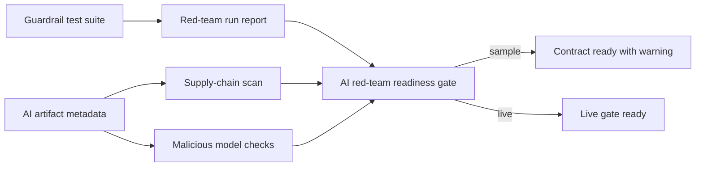

# CAVRA AI Red-Team And Supply-Chain Gates

CAVRA R6.3 adds native AI red-team and AI supply-chain gates. The public contract validates LLM guardrail tests, AI artifact supply-chain metadata, malicious model indicators, and red-team closeout evidence without exporting raw prompts, model weights, training data, private features, or customer records.

## What It Covers

| Gate | Purpose |
| --- | --- |
| Native LLM guardrail tests | Detect prompt injection, secret exfiltration requests, unsafe tool chaining, and unscoped data export attempts. |
| AI supply-chain scan | Require hash-based artifact identity, provenance refs, SBOM refs, safe serialization, pinned dependencies, and no raw model egress. |
| Malicious model checks | Block unsafe serialization, remote-code execution, hidden prompt payloads, and dependency confusion risks. |
| Red-team readiness packet | Tie test suite, run report, supply-chain scan, malicious-model checks, and closeout evidence into one gate. |

## Flow



## Commands

Export reference artifacts:

```bash
python3 scripts/validate_ai_red_team.py \
  --export-dir dist/ai-red-team \
  --output dist/ai-red-team-export.json
```

Run the guardrail suite:

```bash
python3 scripts/validate_ai_red_team.py \
  --suite examples/ai-red-team/guardrail-test-suite.sample.json
```

Validate AI supply-chain metadata:

```bash
python3 scripts/validate_ai_red_team.py \
  --artifact examples/ai-red-team/ai-artifact-metadata.sample.json
```

Run malicious-model checks:

```bash
python3 scripts/validate_ai_red_team.py \
  --malicious-model-checks examples/ai-red-team/ai-artifact-metadata.sample.json
```

Validate live readiness:

```bash
python3 scripts/validate_ai_red_team.py \
  --packet examples/ai-red-team/enterprise-ai-red-team.live.sanitized.example.json \
  --require-live
```

CLI equivalents:

```bash
cavra ai-red-team guardrails
cavra ai-red-team supply-chain --artifact examples/ai-red-team/ai-artifact-metadata.sample.json
cavra ai-red-team malicious-model --artifact examples/ai-red-team/ai-artifact-metadata.sample.json
cavra ai-red-team export --output-dir dist/ai-red-team
cavra ai-red-team readiness examples/ai-red-team/enterprise-ai-red-team.live.sanitized.example.json --require-live
```

## Production Completion Condition

Sample packets prove the public contract only. A live Enterprise deployment is ready when the packet references real guardrail test execution, supply-chain scan evidence, malicious-model scan evidence, CI evidence, and red-team closeout evidence and returns:

```json
{
  "ready_for_live_ai_red_team_gate": true,
  "blocker_count": 0
}
```

Private customer deployments can add deeper scanners and proprietary test cases, but they must preserve the no-raw-prompt/no-raw-model-egress boundary in the public contract.
