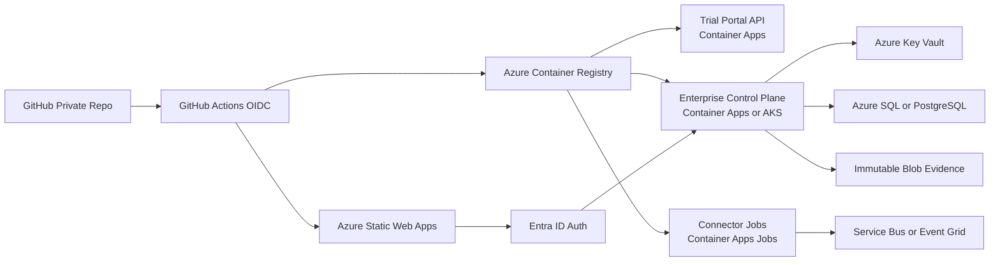

# Azure Trial And Enterprise Deployment

This page describes the public-safe Azure deployment model for CAVRA Trial and
Enterprise Edition. The executable workflows live in the private
`Huzefaaa2/cavra-enterprise` repository because they deploy licensed artifacts,
private control-plane code, tenant stores, connector configuration, report
delivery settings, and AISPM production-readiness validators.

## Deployment Surfaces

Trial deployment includes:

- Trial portal and license request workflow.
- Authenticated evaluator/operator access.
- Time-limited trial licenses.
- Private package/container delivery.
- Trial sandbox and AISPM guided labs.
- Expiry, revocation, audit evidence, and closeout.

Enterprise deployment includes:

- Private Enterprise API/control plane.
- Microsoft Entra ID OIDC/SSO and RBAC.
- Tenant isolation.
- Private policy packs.
- Persistent audit and evidence stores.
- SMTP or report-provider integration.
- Live connectors and runtime workflow validation.
- Final AISPM production readiness gate.

## Azure Reference Architecture



## Private Workflow Set

The private Enterprise repository contains these deployment workflows:

| Workflow | Purpose |
| --- | --- |
| `deploy-azure-trial-api.yml` | Deploys the Trial Access Portal API to Azure Container Apps. |
| `deploy-azure-trial-ui.yml` | Deploys a Trial Static Web Apps front door. |
| `deploy-azure-enterprise-api.yml` | Deploys the private Enterprise control plane and AISPM operator API. |
| `deploy-azure-enterprise-ui.yml` | Deploys an authenticated Enterprise operator UI shell. |
| `deploy-azure-enterprise-connectors.yml` | Deploys connector worker Container Apps Jobs. |
| `validate-azure-aispm-production.yml` | Runs the final AISPM production readiness gate. |

## Azure Services

Trial uses Azure Static Web Apps or App Service, Container Apps, Container
Registry, Key Vault, Azure SQL or PostgreSQL, Application Insights, and Azure
Monitor.

Enterprise uses Container Apps or AKS, Key Vault, Azure SQL or PostgreSQL,
immutable Blob Storage, Service Bus or Event Grid, Front Door/WAF, Private
Endpoints, Monitor, and Application Insights.

## Production Gate

Enterprise AISPM is not production-ready until the private live validators have
run with real production inputs:

- real tenant configuration;
- real connector/provider settings;
- real SMTP or report-provider settings;
- real runtime agent/tool workflows;
- real tenant isolation checks;
- real operating archive/public-sync evidence.

The final completion condition is:

```json
{
  "ready_for_aispm_production": true,
  "blockers": []
}
```

If any blocker remains, production launch is stopped until the source validator
packet is corrected and the final AISPM production gate is rerun.

## Security Boundary

Do not copy private Enterprise workflow secrets, connector payloads, license
keys, tenant data, SMTP credentials, private policy packs, or production
evidence into this public repository or the public wiki.
