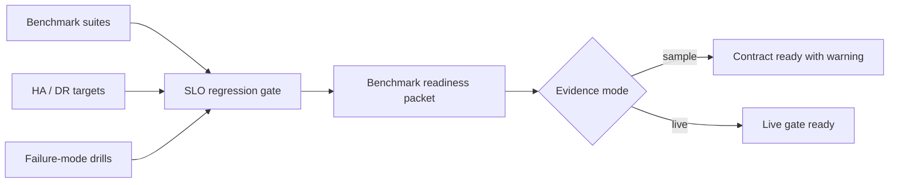

# CAVRA Benchmark And SLO Regression Gates

CAVRA R6.1 adds a repeatable benchmark and SLO regression gate for the public Community contract and the Enterprise live-evidence path. The gate validates latency, throughput, HA/DR assumptions, and failure-mode drills before a production-readiness packet can be accepted.

The public implementation is deterministic by default. It ships reference benchmark evidence that validates the contract shape and a sanitized live packet example that shows the fields an Enterprise deployment must replace with real CI, HA, and drill evidence.

## What The Gate Covers

| Area | Public gate |
| --- | --- |
| Runtime decision latency | `runtime_decision_latency` must meet p95 latency and throughput thresholds. |
| Continuous monitoring replay | `continuous_monitoring_replay` must meet p95 latency and throughput thresholds. |
| Policy lifecycle dry run | `policy_lifecycle_dry_run` must meet p95 latency and throughput thresholds. |
| HA/DR posture | RTO, RPO, API replica floor, worker replica floor, durable delivery, DLQ, replay, and consumer lag metrics must be declared. |
| Failure modes | Event bus outage, store write failure, connector timeout, and policy compile failure drills must pass. |
| Operating evidence | CI run, benchmark report, HA evidence, and failure-drill evidence refs must be present. |

## Gate Flow



## Commands

Export deterministic reference artifacts:

```bash
python3 scripts/validate_benchmark_slo.py \
  --export-dir dist/benchmark-slo \
  --output dist/benchmark-slo-export.json
```

Run a measured local benchmark:

```bash
python3 scripts/validate_benchmark_slo.py \
  --measured \
  --iterations 50 \
  --export-dir dist/benchmark-slo-measured
```

Validate a benchmark report:

```bash
python3 scripts/validate_benchmark_slo.py \
  --report examples/benchmark-slo/generated/benchmark-slo-report.json
```

Validate the sample packet:

```bash
python3 scripts/validate_benchmark_slo.py \
  --packet examples/benchmark-slo/enterprise-benchmark-slo.sample.json
```

Validate a live packet:

```bash
python3 scripts/validate_benchmark_slo.py \
  --packet examples/benchmark-slo/enterprise-benchmark-slo.live.sanitized.example.json \
  --require-live
```

CLI equivalents:

```bash
cavra benchmark export --output-dir dist/benchmark-slo
cavra benchmark run
cavra benchmark readiness examples/benchmark-slo/enterprise-benchmark-slo.sample.json
```

## Artifacts

| Artifact | Purpose |
| --- | --- |
| `src/cavra/benchmark_slo.py` | Benchmark/SLO report builder, gate evaluator, readiness packet builder, validator, and artifact writer. |
| `scripts/validate_benchmark_slo.py` | CI-friendly validator for reports and readiness packets. |
| `examples/benchmark-slo/generated/benchmark-slo-report.json` | Deterministic reference report. |
| `examples/benchmark-slo/generated/benchmark-slo-regression-gate.json` | Reference gate result. |
| `examples/benchmark-slo/enterprise-benchmark-slo.sample.json` | Sample readiness packet, useful for contract validation only. |
| `examples/benchmark-slo/enterprise-benchmark-slo.live.sanitized.example.json` | Sanitized live-style packet showing required Enterprise evidence refs. |
| `.github/workflows/benchmark-slo.yml` | Regression workflow for PR/push/manual validation. |

## Production Completion Condition

R6.1 is complete for the public contract when the deterministic report, sample packet, sanitized live packet, tests, and workflow pass.

An Enterprise deployment is production-ready only when the sanitized references are replaced with real evidence and the live gate returns:

```json
{
  "ready_for_live_benchmark_slo_gate": true,
  "blocker_count": 0
}
```

Live evidence should include the real CI run, benchmark report, HA/DR proof, and failure-drill closeout from the target production tenant environment.
