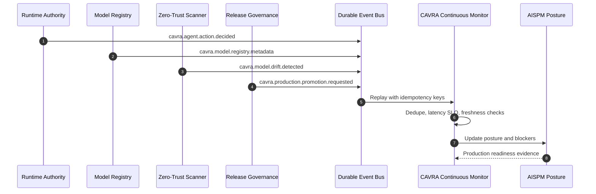

# CAVRA Continuous Monitoring Event Core

CAVRA continuous monitoring turns runtime decisions, model registry updates, drift signals, and production promotions into replayable events. This implements roadmap item R5.3 as a public-safe event contract with replay, dedupe, latency SLO checks, stale assessment detection, readiness packets, CLI commands, CI workflow, and tests.

The public repository implements the contract and validators. Live queue configuration, customer monitor dashboards, and production event-bus evidence remain Enterprise deployment artifacts.

## Event-Driven Posture Loop



## Required Event Types

| Event type | Purpose |
| --- | --- |
| `cavra.agent.action.decided` | Agent action decision from the runtime authority plane. |
| `cavra.model.registry.metadata` | Metadata-only model registration or model version update. |
| `cavra.model.drift.detected` | Drift, risk change, scanner finding, or posture change signal. |
| `cavra.production.promotion.requested` | Production release, model, runtime, or policy promotion signal. |

Every event uses:

- `schema_version: cavra.continuous-monitoring.event.v1`
- `event_id`
- `event_type`
- `source`
- `source_ref`
- `tenant_id`
- `workspace_id`
- `occurred_at`
- `received_at`
- `severity`
- `correlation_id`
- `idempotency_key`
- `payload`

## Event Bus Requirements

The live Enterprise event bus must provide:

- durable delivery;
- dead-letter queue;
- replay;
- idempotency key support;
- consumer lag metrics;
- latency SLO evidence.

Public examples use sanitized references. A production deployment should map these to Azure Service Bus, Event Grid, Kafka, AWS EventBridge/SQS, GCP Pub/Sub, or another durable event backbone.

## CLI Usage

Export deterministic sample artifacts:

```bash
cavra monitor export --output-dir dist/continuous-monitoring
```

Replay an event stream:

```bash
cavra monitor replay \
  examples/continuous-monitoring/generated/continuous-monitoring-events.json \
  --now 2026-07-04T10:15:00+00:00
```

Validate a live readiness packet:

```bash
cavra monitor readiness \
  examples/continuous-monitoring/enterprise-continuous-monitoring.live.sanitized.example.json \
  --require-live
```

Run the standalone validator:

```bash
python scripts/validate_continuous_monitoring.py \
  --events examples/continuous-monitoring/generated/continuous-monitoring-events.json \
  --replay \
  --now 2026-07-04T10:15:00+00:00
```

## Readiness Packets

Sample packet:

- `examples/continuous-monitoring/enterprise-continuous-monitoring.sample.json`

Sanitized live example:

- `examples/continuous-monitoring/enterprise-continuous-monitoring.live.sanitized.example.json`

Generated artifacts:

- `examples/continuous-monitoring/generated/continuous-monitoring-events.json`
- `examples/continuous-monitoring/generated/continuous-monitoring-replay-report.json`
- `examples/continuous-monitoring/generated/continuous-monitoring-readiness-packet.json`

## Completion Gate

The live Enterprise gate is:

```bash
python scripts/validate_continuous_monitoring.py \
  --packet <live-continuous-monitoring-packet.json> \
  --require-live
```

Completion means:

```json
{
  "ready_for_live_continuous_monitoring": true,
  "blocker_count": 0
}
```

## Verification

```bash
python3 -m py_compile src/cavra/continuous_monitoring.py scripts/validate_continuous_monitoring.py
python3 scripts/validate_continuous_monitoring.py --build-sample --export-dir dist/test/continuous-monitoring --now 2026-07-04T10:15:00+00:00
python3 scripts/validate_continuous_monitoring.py --packet examples/continuous-monitoring/enterprise-continuous-monitoring.live.sanitized.example.json --require-live
python3 -m pytest tests/test_continuous_monitoring.py -q
```
