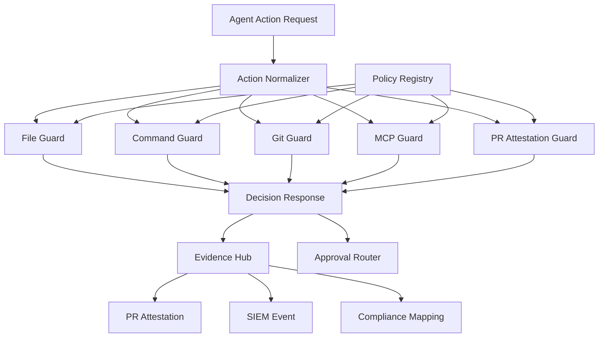

# CAVRA Runtime Component Diagram

```mermaid
flowchart TB
  request[Agent Action Request] --> normalizer[Action Normalizer]
  normalizer --> fileGuard[File Guard]
  normalizer --> commandGuard[Command Guard]
  normalizer --> gitGuard[Git Guard]
  normalizer --> mcpGuard[MCP Guard]
  normalizer --> prGuard[PR Attestation Guard]

  policy[Policy Registry] --> fileGuard
  policy --> commandGuard
  policy --> gitGuard
  policy --> mcpGuard
  policy --> prGuard

  fileGuard --> decision[Decision Response]
  commandGuard --> decision
  gitGuard --> decision
  mcpGuard --> decision
  prGuard --> decision

  decision --> evidence[Evidence Hub]
  decision --> approval[Approval Router]
  evidence --> attestation[PR Attestation]
  evidence --> siem[SIEM Event]
  evidence --> compliance[Compliance Mapping]
```
