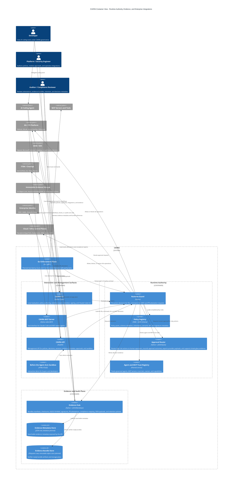

# CAVRA C4 Container Diagram

This container view separates the collaboration surfaces, runtime authority, evidence plane, persistent metadata, and enterprise integrations. It is intentionally grouped so security, platform, audit, and architecture reviewers can read the system without tracing every code module.

## Reading Guide

- Interaction and Management Surfaces are where users, agents, demos, and operators enter CAVRA.
- Runtime Authority is the decision boundary: CAVRA decides before files, commands, Git operations, MCP tools, or infrastructure changes happen.
- Evidence and Audit Plane converts decisions into verifier-ready artifacts, SIEM payloads, metadata, retention controls, and immutable storage plans.
- Planned containers are shown to clarify the production direction without implying that the full enterprise console and Go enforcement plane are complete today. The Approval Router now has an initial JSON/SQLite-backed implementation.
