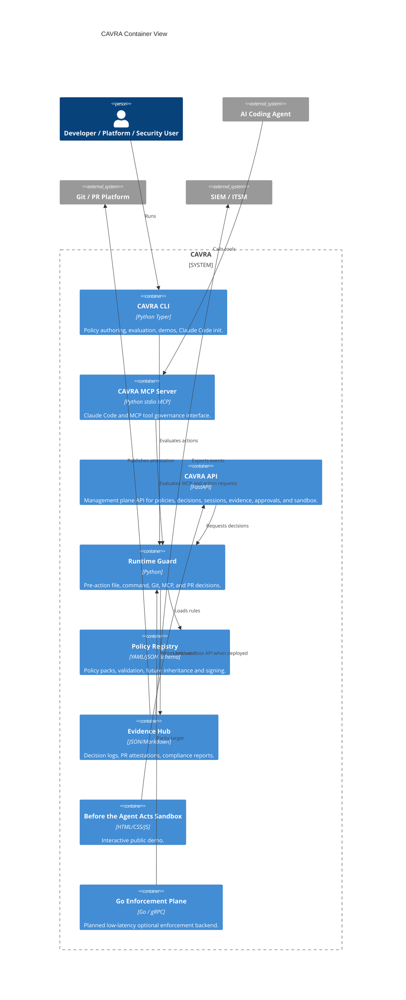

# CAVRA C4 Container Diagram

```mermaid
C4Container
title CAVRA Container View

Person(user, "Developer / Platform / Security User")

System_Boundary(cavra, "CAVRA") {
  Container(cli, "CAVRA CLI", "Python Typer", "Policy authoring, evaluation, demos, Claude Code init.")
  Container(mcpServer, "CAVRA MCP Server", "Python stdio MCP", "Claude Code and MCP tool governance interface.")
  Container(api, "CAVRA API", "FastAPI", "Management plane API for policies, decisions, sessions, evidence, approvals, and sandbox.")
  Container(runtime, "Runtime Guard", "Python", "Pre-action file, command, Git, MCP, and PR decisions.")
  Container(policy, "Policy Registry", "YAML/JSON Schema", "Policy packs, validation, future inheritance and signing.")
  Container(evidence, "Evidence Hub", "JSON/Markdown", "Decision logs, PR attestations, compliance reports.")
  Container(sandbox, "Before the Agent Acts Sandbox", "HTML/CSS/JS", "Interactive public demo.")
  Container(goRuntime, "Go Enforcement Plane", "Go / gRPC", "Planned low-latency optional enforcement backend.")
}

System_Ext(agent, "AI Coding Agent")
System_Ext(git, "Git / PR Platform")
System_Ext(siem, "SIEM / ITSM")

Rel(user, cli, "Runs")
Rel(agent, mcpServer, "Calls tools")
Rel(cli, runtime, "Evaluates actions")
Rel(mcpServer, runtime, "Evaluates MCP and action requests")
Rel(api, runtime, "Requests decisions")
Rel(runtime, policy, "Loads rules")
Rel(runtime, evidence, "Writes evidence")
Rel(evidence, git, "Publishes attestation")
Rel(evidence, siem, "Exports events")
Rel(sandbox, api, "Uses sandbox API when deployed")
Rel(goRuntime, runtime, "Parity target")
```
