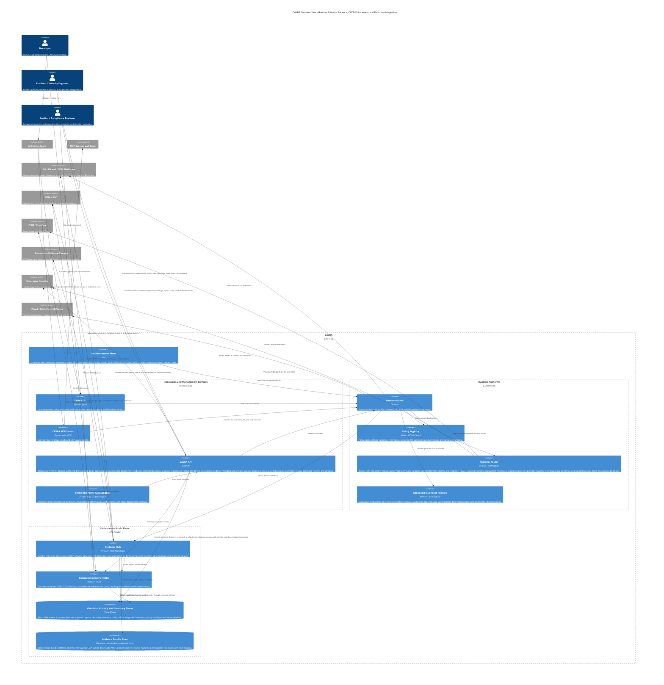

# CAVRA C4 Container Diagram

This container view separates the collaboration surfaces, runtime authority, evidence plane, persistent metadata, and enterprise integrations. It is intentionally grouped so security, platform, audit, and architecture reviewers can read the system without tracing every code module.

## Reading Guide

- Interaction and Management Surfaces are where users, agents, demos, and operators enter CAVRA.
- Runtime Authority is the decision boundary: CAVRA decides before files, commands, Git operations, MCP tools, or infrastructure changes happen.
- Evidence and Audit Plane converts decisions into verifier-ready artifacts, searchable session and decision records, governed artifact downloads, CI/CD required-check artifacts for GitHub, GitLab, and Azure DevOps, policy draft, signed publish, and rollout change metadata, repository inventory, policy rollout state and drill-downs, integration inventory, connector delivery records, security boundary and console session metadata, deployment readiness checks, backup/restore manifests, SIEM payloads, metadata, retention controls, and immutable storage plans.
- Planned containers are shown to clarify the production direction without implying that the full enterprise console is complete today. The Go enforcement plane now has a scaffolded Go module, runtime evaluator, CLI entrypoint, compiled-policy loader, shared parity fixture, Go unit tests, and CI execution, but generated contracts, daemon transport, and signed binary packaging remain future work. The Approval Router now has JSON/SQLite persistence, repository routing files, signed OIDC/JWKS validation, repository RBAC policy checks, console queue actions, console break-glass creation, audit detail views, credential-free provider request specs, and live provider delivery evidence. The Agent and MCP Trust Registry now has JSON/SQLite persistence, predefined agent profiles, MCP tool classifications, console registry views, and registry-backed trust decisions.
