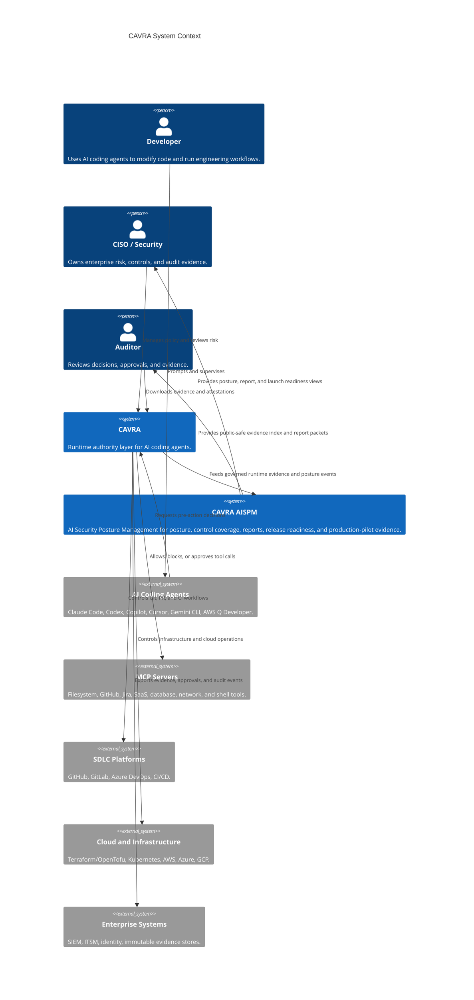

# CAVRA C4 Context Diagram

```mermaid
C4Context
title CAVRA System Context

Person(developer, "Developer", "Uses AI coding agents to modify code and run engineering workflows.")
Person(ciso, "CISO / Security", "Owns enterprise risk, controls, and audit evidence.")
Person(auditor, "Auditor", "Reviews decisions, approvals, and evidence.")

System(cavra, "CAVRA", "Runtime authority layer for AI coding agents.")
System(aispm, "CAVRA AISPM", "AI Security Posture Management for posture, control coverage, reports, release readiness, and production-pilot evidence.")
System_Ext(agent, "AI Coding Agents", "Claude Code, Codex, Copilot, Cursor, Gemini CLI, AWS Q Developer.")
System_Ext(mcp, "MCP Servers", "Filesystem, GitHub, Jira, SaaS, database, network, and shell tools.")
System_Ext(sdlc, "SDLC Platforms", "GitHub, GitLab, Azure DevOps, CI/CD.")
System_Ext(cloud, "Cloud and Infrastructure", "Terraform/OpenTofu, Kubernetes, AWS, Azure, GCP.")
System_Ext(siem, "Enterprise Systems", "SIEM, ITSM, identity, immutable evidence stores.")

Rel(developer, agent, "Prompts and supervises")
Rel(agent, cavra, "Requests pre-action decisions")
Rel(cavra, aispm, "Feeds governed runtime evidence and posture events")
Rel(cavra, mcp, "Allows, blocks, or approves tool calls")
Rel(cavra, sdlc, "Controls Git, PR, and CI workflows")
Rel(cavra, cloud, "Controls infrastructure and cloud operations")
Rel(cavra, siem, "Exports evidence, approvals, and audit events")
Rel(aispm, ciso, "Provides posture, report, and launch readiness views")
Rel(aispm, auditor, "Provides public-safe evidence index and report packets")
Rel(ciso, cavra, "Manages policy and reviews risk")
Rel(auditor, cavra, "Downloads evidence and attestations")
```

User-friendly SVG: `docs/diagrams/architecture-context.svg`.
