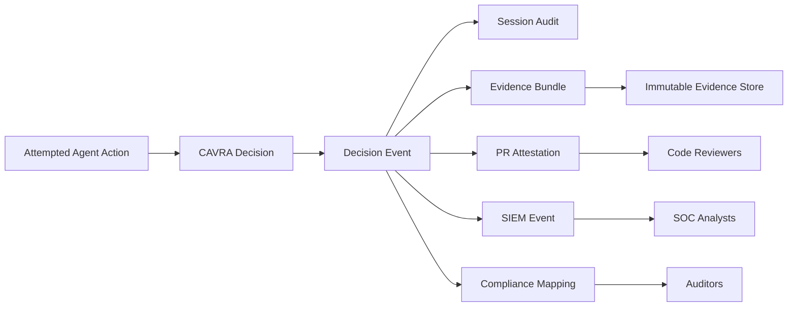

# Evidence Lifecycle

```mermaid
flowchart LR
  action[Attempted Agent Action] --> decision[CAVRA Decision]
  decision --> event[Decision Event]
  event --> session[Session Audit]
  event --> bundle[Evidence Bundle]
  event --> pr[PR Attestation]
  event --> siem[SIEM Event]
  event --> compliance[Compliance Mapping]
  bundle --> immutable[Immutable Evidence Store]
  pr --> reviewers[Code Reviewers]
  siem --> soc[SOC Analysts]
  compliance --> auditors[Auditors]
```
