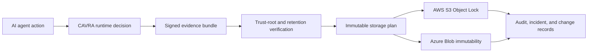

# Immutable Evidence Storage Flow

```mermaid
flowchart LR
  agent[AI agent action] --> runtime[CAVRA runtime decision]
  runtime --> bundle[Signed evidence bundle]
  bundle --> verify[Trust-root and retention verification]
  verify --> plan[Immutable storage plan]
  plan --> aws[AWS S3 Object Lock]
  plan --> azure[Azure Blob immutability]
  aws --> audit[Audit, incident, and change records]
  azure --> audit
```
