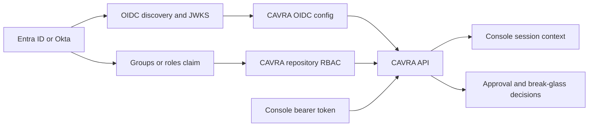

# OIDC/RBAC Deployment Flow

```mermaid
flowchart LR
  idp[Entra ID or Okta] --> discovery[OIDC discovery and JWKS]
  discovery --> config[CAVRA OIDC config]
  idp --> groups[Groups or roles claim]
  groups --> rbac[CAVRA repository RBAC]
  config --> api[CAVRA API]
  rbac --> api
  console[Console bearer token] --> api
  api --> session[Console session context]
  api --> approvals[Approval and break-glass decisions]
```
