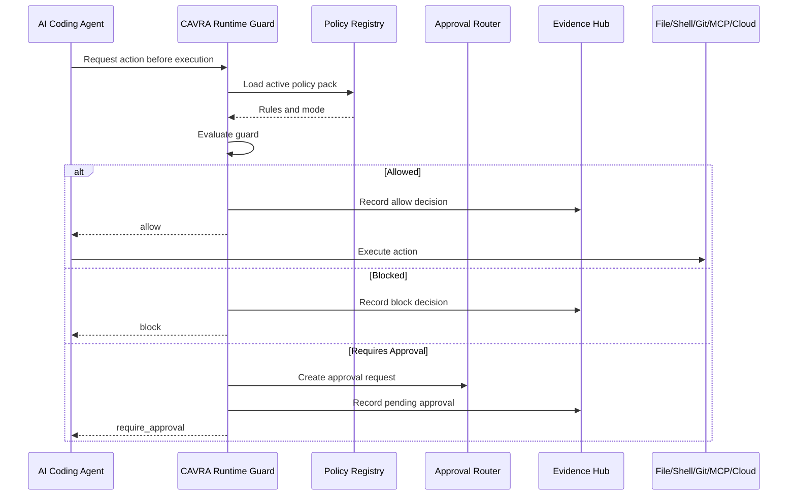

# Runtime Decision Flow

```mermaid
sequenceDiagram
  participant Agent as AI Coding Agent
  participant CAVRA as CAVRA Runtime Guard
  participant Policy as Policy Registry
  participant Approval as Approval Router
  participant Evidence as Evidence Hub
  participant Target as File/Shell/Git/MCP/Cloud

  Agent->>CAVRA: Request action before execution
  CAVRA->>Policy: Load active policy pack
  Policy-->>CAVRA: Rules and mode
  CAVRA->>CAVRA: Evaluate guard
  alt Allowed
    CAVRA->>Evidence: Record allow decision
    CAVRA-->>Agent: allow
    Agent->>Target: Execute action
  else Blocked
    CAVRA->>Evidence: Record block decision
    CAVRA-->>Agent: block
  else Requires Approval
    CAVRA->>Approval: Create approval request
    CAVRA->>Evidence: Record pending approval
    CAVRA-->>Agent: require_approval
  end
```

User-friendly SVG: `docs/diagrams/runtime-flow.svg`.
