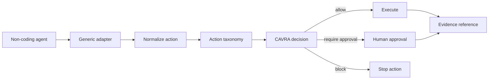

# CAVRA Generic Agent Adapter SDK And Action Taxonomy

CAVRA R6.2 expands runtime authority beyond coding agents. The generic adapter SDK gives non-coding agents a stable way to ask CAVRA for a decision before they mutate business systems, identity systems, model registries, customer communications, workflows, or data stores.

The public contract is intentionally metadata-first. It does not require raw customer data, secrets, prompts, model weights, or private business payloads to leave the customer environment.

## What It Adds

| Layer | Public artifact |
| --- | --- |
| Taxonomy | `cavra.generic-agent-adapter.taxonomy.v1` with domains, effects, risk levels, and action types. |
| Adapter manifest | `cavra.generic-agent-adapter.manifest.v1` declaring supported domains, actions, runtime contract, security boundary, and compatibility. |
| Evaluation report | `cavra.generic-agent-adapter.evaluation-report.v1` with normalized decisions for non-coding sample actions. |
| Readiness packet | `cavra.generic-agent-adapter.readiness.v1` proving taxonomy, manifest, scenario, and evidence refs are present. |
| Validator | `scripts/validate_generic_agent_adapter.py`. |
| CLI | `cavra adapter ...`. |

## Taxonomy Model



The public taxonomy currently covers representative business and AI-governance actions:

| Action type | Domain | Effect | Default |
| --- | --- | --- | --- |
| `knowledge.search` | data | read | allow |
| `ticket.summarize` | support | read | allow |
| `crm.update_record` | sales | write | require approval |
| `customer.email_send` | communications | send | require approval |
| `data.export_dataset` | data | export | require approval |
| `model.promote` | model governance | promote | require approval |
| `identity.grant_role` | identity | grant | block |
| `finance.release_payment` | finance | approve | block |
| `workflow.close_control` | workflow | approve | require approval |

Runtime-native actions such as `read_file`, `write_file`, `execute_command`, `git_operation`, and `mcp_tool_call` are mapped back to `RuntimeGuard`.

## Commands

Export reference artifacts:

```bash
python3 scripts/validate_generic_agent_adapter.py \
  --export-dir dist/generic-agent-adapter \
  --output dist/generic-agent-adapter-export.json
```

Emit taxonomy:

```bash
cavra adapter taxonomy
```

Validate a manifest:

```bash
cavra adapter manifest-validate examples/generic-adapters/reference-business-agent.manifest.json
```

Evaluate non-coding actions:

```bash
cavra adapter evaluate examples/generic-adapters/non-coding-agent-actions.sample.json
```

Validate readiness:

```bash
cavra adapter readiness examples/generic-adapters/enterprise-generic-agent-adapter.sample.json
cavra adapter readiness examples/generic-adapters/enterprise-generic-agent-adapter.live.sanitized.example.json --require-live
```

## Non-Coding Scenario

The sample scenario demonstrates that CAVRA can make decisions outside coding workflows:

| Agent | Action | Decision |
| --- | --- | --- |
| Support copilot | summarize support ticket | allow |
| Revenue copilot | update CRM account | require approval |
| Identity copilot | grant global administrator | block |
| MLOps copilot | promote model to production | require approval |

## Production Completion Condition

Sample packets prove contract shape only. A live Enterprise deployment is ready when the customer-specific packet replaces sanitized references with real CI, taxonomy, adapter test, and non-coding scenario evidence and returns:

```json
{
  "ready_for_live_generic_adapter_sdk": true,
  "blocker_count": 0
}
```

Private adapter packages may add deeper provider-specific controls, but they must keep the same pre-action decision, fail-closed, tenant/workspace scope, and evidence-reference contract.
