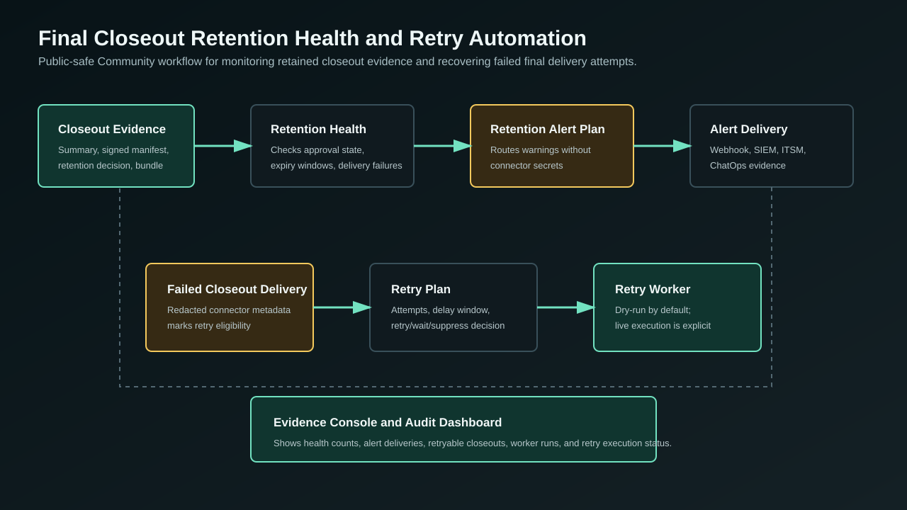

# Go Backend Rollback Drill Final Closeout Health And Retry

This slice completes the final closeout operations loop for promoted Go backend rollback drills. CAVRA now checks retained closeout bundles for retention approval, expiry risk, and failed closeout delivery evidence, then prepares public-safe alerts and retry plans.

## What Changed

- Added closeout retention health reports for artifact bundles, retention decisions, retention expiry windows, and failed closeout deliveries.
- Added retention health alert plans and connector delivery evidence using redacted connector metadata only.
- Added final closeout delivery retry plans, retry worker runs, and retry execution records.
- Added API routes and Evidence Console controls for retention health, retention alert delivery, closeout retry planning, and closeout retry worker dry-runs.
- Updated dashboard metrics so operators can see retention health alerts, alert delivery failures, retryable closeout deliveries, worker runs, and retry execution status.

## API

- `GET /runtime/go-pilot/rollback-drill-notifications/acknowledgements/audit-delivery/final-reporting-closeout-retention-health`
- `POST /runtime/go-pilot/rollback-drill-notifications/acknowledgements/audit-delivery/final-reporting-closeout-retention-health-alerts/deliver`
- `POST /runtime/go-pilot/rollback-drill-notifications/acknowledgements/audit-delivery/final-reporting-release-closeout-summary/delivery-retry-plan`
- `POST /runtime/go-pilot/rollback-drill-notifications/acknowledgements/audit-delivery/final-reporting-release-closeout-summary/delivery-retry-worker-run`

## How To Use

1. Build a final closeout artifact bundle after release readiness, signed archive manifest, closeout summary, and retention approval are recorded.
2. Run retention health from the Evidence Console or API.
3. Send a retention health alert when the health report finds expiring bundles, missing approval, missing retention dates, or failed closeout delivery evidence.
4. Create a closeout delivery retry plan for failed final closeout connector deliveries.
5. Run the retry worker in dry-run mode first, then use an operator-owned or Enterprise connector path for live redelivery.

## User Stories

- As a release manager, I can see whether final closeout evidence is still inside its approved retention window.
- As an auditor, I can verify that retained closeout bundles have approval and expiry evidence.
- As a platform operator, I can identify failed final closeout deliveries and prepare retry execution records.
- As a compliance lead, I can receive a public-safe alert when final closeout evidence retention needs action.

## Enterprise Challenge Solved

Regulated release processes often fail after the final report is generated because evidence delivery, retention expiry, and redelivery attempts are tracked in separate systems. This workflow keeps those signals visible in one operational surface without placing connector secrets, private archive actions, or Enterprise retention enforcement logic in the Community repository.

## Diagram

## Security Boundary

The Community implementation records public-safe metadata only. It does not delete retained bundles, mutate archive stores, store connector credentials, or implement private retention policy enforcement. Those actions remain in operator-owned systems or future Enterprise/SaaS modules.

## Next Recommended Issue

Delivered in [release-governance-final-closeout-operator-guide.md](release-governance-final-closeout-operator-guide.md), [release-governance-final-closeout-release-criteria.md](release-governance-final-closeout-release-criteria.md), and [enterprise/final-closeout-trial.md](enterprise/final-closeout-trial.md). Customer onboarding assets are now delivered. Continue by converting the onboarding package into an interactive public sandbox flow.
