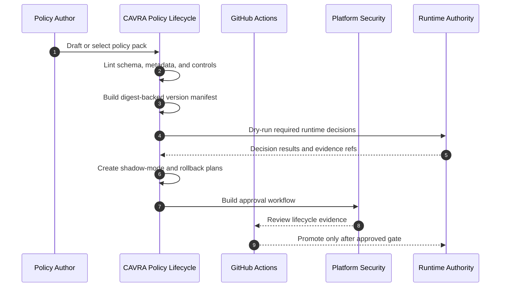

# CAVRA Policy Lifecycle Tooling

CAVRA policy lifecycle tooling turns policy changes into a governed release path. It covers authoring UI contracts, schema and semantic linting, version manifests, shadow mode, dry-run simulation, rollback planning, and approval workflow evidence.

This is the public-safe implementation for roadmap item R5.2. It does not publish customer policy changes by itself. It builds deterministic artifacts that an Enterprise deployment can attach to live approval, UI validation, and production rollout evidence.

## Lifecycle Flow



## What Is Implemented

| Capability | Implementation |
| --- | --- |
| Authoring UI contract | Public JSON contract describing draft editor, lint, semantic diff, simulator, shadow toggle, approval builder, and rollback picker surfaces. |
| Lint report | Validates policy schema, required metadata, control presence, list field shape, and common lifecycle warnings. |
| Version manifest | Emits policy ID, version, digest, previous digest, source reference, Git-version flag, and semantic diff. |
| Shadow mode plan | Creates a non-enforcing rollout plan with evidence references and promotion criteria. |
| Dry-run report | Evaluates required runtime decisions: sensitive read, policy write approval, safe Terraform plan, blocked Terraform apply, protected branch push, and unknown MCP server. |
| Rollback plan | Produces approval-gated rollback steps and a rollback reference to the previous known-good policy. |
| Approval workflow | Builds publish plan, approval decision, required evidence, approver groups, and review checklist. |
| Readiness gate | Validates sample or live lifecycle packets and fails when required controls are missing. |

## CLI Usage

Generate a full lifecycle artifact set:

```bash
cavra policy lifecycle-plan \
  --policy-pack cavra-ai-agent-baseline \
  --output-dir dist/policy-lifecycle
```

Validate a live Enterprise lifecycle readiness packet:

```bash
cavra policy lifecycle-readiness \
  examples/policy-lifecycle/enterprise-policy-lifecycle.live.sanitized.example.json \
  --require-live
```

Run the standalone validator:

```bash
python scripts/validate_policy_lifecycle.py \
  --policy-pack cavra-ai-agent-baseline \
  --export-dir dist/policy-lifecycle \
  --output dist/policy-lifecycle-export.json
```

Validate only lint or dry-run evidence:

```bash
python scripts/validate_policy_lifecycle.py --policy-pack cavra-ai-agent-baseline --lint
python scripts/validate_policy_lifecycle.py --policy-pack cavra-ai-agent-baseline --dry-run
```

## Readiness Packets

Sample packet:

- `examples/policy-lifecycle/enterprise-policy-lifecycle.sample.json`

Sanitized live example:

- `examples/policy-lifecycle/enterprise-policy-lifecycle.live.sanitized.example.json`

Generated artifact examples:

- `examples/policy-lifecycle/generated/policy-lifecycle-plan.json`
- `examples/policy-lifecycle/generated/policy-lint-report.json`
- `examples/policy-lifecycle/generated/policy-version-manifest.json`
- `examples/policy-lifecycle/generated/policy-shadow-mode-plan.json`
- `examples/policy-lifecycle/generated/policy-dry-run-report.json`
- `examples/policy-lifecycle/generated/policy-rollback-plan.json`
- `examples/policy-lifecycle/generated/policy-approval-workflow.json`

## Live Evidence Requirements

A production Enterprise lifecycle packet must use `evidence_mode: "live"` and include:

- the full lifecycle capability set;
- authoring UI validation reference;
- lint report with no blockers;
- digest-backed, Git-versioned policy manifest;
- non-enforcing shadow-mode plan;
- dry-run report with all required cases and no failures;
- approval-gated rollback plan;
- approval workflow with reviewer groups and required evidence;
- CI run, policy review, and UI validation references.

The final gate is:

```bash
python scripts/validate_policy_lifecycle.py \
  --packet <live-policy-lifecycle-packet.json> \
  --require-live
```

The completion condition is `ready_for_live_policy_lifecycle: true` with `blocker_count: 0`.

## Verification

```bash
python3 -m py_compile src/cavra/policy_lifecycle.py scripts/validate_policy_lifecycle.py
python3 scripts/validate_policy_lifecycle.py --policy-pack cavra-ai-agent-baseline --export-dir dist/test/policy-lifecycle
python3 scripts/validate_policy_lifecycle.py --packet examples/policy-lifecycle/enterprise-policy-lifecycle.live.sanitized.example.json --require-live
python3 -m pytest tests/test_policy_lifecycle.py -q
```
