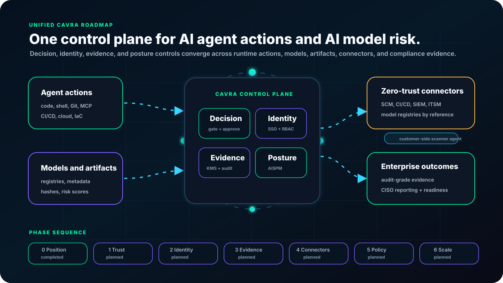

# CAVRA Unified Enterprise Product Enhancement Roadmap

Last updated: 2026-07-07

This roadmap converts the merged product enhancement review into a numbered implementation tracker for CAVRA. It is intentionally written as a product and engineering control document, not as a marketing summary.

## Scope Decision

CAVRA is being planned as a unified AI governance control plane for two governed asset classes:

- **Agent actions:** file writes, shell commands, Git operations, MCP tool calls, CI/CD triggers, cloud operations, infrastructure changes, and production workflow actions.
- **Models and artifacts:** model registry entries, model metadata, deployment packages, AI supply-chain artifacts, assessment findings, drift signals, and compliance evidence.

The common control planes are:

- **Decision plane:** policy evaluation, approvals, action gating, promotion gating, and fail-open/fail-closed behavior.
- **Identity and trust plane:** SSO, RBAC/ABAC, workspaces, tenant boundaries, agent identity, model ownership, and trust roots.
- **Evidence plane:** signed evidence, immutable audit trails, KMS/HSM custody, attestations, and verifier tooling.
- **Posture plane:** AISPM, compliance mapping, executive reporting, red-team results, findings, blockers, and readiness gates.

## Status Legend

| Status | Meaning |
| --- | --- |
| Completed | Implemented or documented, pushed to the relevant repository, and verified for the stated scope. |
| In Progress | Work has started and has an active implementation path. |
| Planned | Accepted requirement, not yet implemented. |
| Blocked | Cannot proceed until a dependency or external input is available. |
| Deferred | Accepted but intentionally moved out of the current delivery window. |

## Phase Dependency Map

| Phase | Focus | Primary Dependencies | Current Status | Exit Condition |
| --- | --- | --- | --- | --- |
| 0 | Positioning and public roadmap | Review agreement, product scope decision | Completed | README, wiki, and product site describe unified agent-action plus model/artifact governance and link to this tracker. |
| 1 | Foundation trust | Phase 0 | Completed | Security governance, maintainer governance, release cadence, API contract, signed release, SBOM, and buyer trust documentation are publishable. |
| 2 | Identity, data, and multi-tenancy | Phase 1 API contract and trust model | In Progress | Enterprise identity, RBAC/ABAC, tenant/workspace isolation, and production data architecture are implemented and tested. |
| 3 | Evidence, audit, and compliance | Phase 1 trust model, Phase 2 tenancy model | Planned | KMS-backed evidence, immutable audit log, and dynamic compliance mapping are production-ready. |
| 4 | Zero-trust scanning and connectors | Phase 2 tenancy, Phase 3 evidence/audit | Planned | Certified connector SDK, priority connectors, and model/artifact scanner agents work without raw model/data egress. |
| 5 | Policy lifecycle and event core | Phase 2 identity/data, Phase 4 connectors | In Progress | Policy authoring, test, shadow, rollback, and event-driven continuous assessment paths are working. |
| 6 | Scale and ecosystem expansion | Phases 1-5 | In Progress | Benchmarks, chaos tests, broader agent adapters, LLM guardrails, supply-chain checks, and red-team automation are validated. |
| 7 | Live customer evidence capture | Phase 6 public-contract closeout | In Progress | Managed and Enterprise deployments can submit sanitized live evidence references without exposing private data. |

## Numbered Enhancement Tracker

| ID | Phase | Problem(s) | Requirement | Dependency | Status | Code/docs status | Tests and verification | GitHub evidence |
| --- | --- | --- | --- | --- | --- | --- | --- | --- |
| R0.1 | 0 | P8, P16, P22 | Document CAVRA as one unified control plane for agent actions and models/artifacts. | None | Completed | README, wiki, and product site updated to state the unified scope. | Markdown link checks and product-site validation. | `README.md`, `docs/product/cavra-unified-enterprise-product-enhancement-roadmap.md`, wiki roadmap, product-site roadmap section. |
| R0.2 | 0 | P1-P22 | Publish this numbered product enhancement roadmap with dependencies and status. | R0.1 | Completed | Roadmap added in public repo and mirrored into GitHub Wiki. | `git diff --check`; wiki page renders as Markdown. | This document and `CAVRA-Unified-Enterprise-Enhancement-Roadmap.md`. |
| R0.3 | 0 | P1-P22 | Add a unified architecture-roadmap diagram for the public repo and wiki. | R0.1 | Completed | Animated SVG added under textbook assets. | SVG is text-readable and motion-safe. | `docs/wiki/assets/textbook/cavra-unified-enterprise-roadmap.svg`. |
| R0.4 | 0 | P22 | Make product website point buyers to the roadmap, trust posture, and implementation sequence. | R0.1, R0.2 | Completed | Product site includes a roadmap section, roadmap nav entry, and links to the repo/wiki tracker. | Product-site Playwright validation. | `apps/product-site` equivalent in `cavra-product-site` repo. |
| R1.1 | 1 | P6, P12 | Harden public security governance: responsible disclosure, supported versions, vulnerability handling, and release security criteria. | R0.2 | Completed | `SECURITY.md`, disclosure docs, advisory docs, release-trust checklist, and governance review gates are present. | `python3 scripts/validate_release_security.py`; `python3 -m pytest tests/test_phase1_trust_governance.py -q`. | `SECURITY.md`, `docs/vulnerability-disclosure.md`, `docs/release-security-advisories.md`, `docs/release-trust-checklist.md`. |
| R1.2 | 1 | P10, P12 | Establish multi-maintainer governance with CODEOWNERS, maintainer onboarding, RFC process, and release cadence. | R1.1 | Completed | CODEOWNERS, maintainer governance, maintainer onboarding, RFC process, release cadence, PR governance prompts, and Phase 1 governance tests are implemented; adding named additional maintainers remains a repository administration action that follows the documented onboarding process. | `python3 -m pytest tests/test_phase1_trust_governance.py -q`; `python3 scripts/validate_release_security.py`; `python3 scripts/validate_openapi_contract.py`; `python3 scripts/validate_release_trust_gate.py`. | `.github/CODEOWNERS`, `.github/pull_request_template.md`, `docs/governance/maintainer-governance.md`, `docs/governance/maintainer-onboarding.md`, `docs/governance/rfc-process.md`, `docs/governance/release-cadence.md`, `tests/test_phase1_trust_governance.py`. |
| R1.3 | 1 | P6, P12 | Produce signed releases, SBOMs, provenance, and repeatable release attestations. | R1.2 | Completed | Community release workflow now runs the release trust gate, generates checksums, SPDX SBOM, SLSA/in-toto provenance, and release-trust evidence for Python packages; Go runtime release and Community attestation workflows retain GitHub keyless attestation controls. | `python3 scripts/validate_release_trust_gate.py`; `python3 scripts/validate_release_security.py`; `python3 scripts/validate_openapi_contract.py`; `python3 -m pytest tests/test_release_trust_gate.py tests/test_phase1_trust_governance.py tests/test_openapi_contract.py -q`. | `scripts/generate_community_release_trust_artifacts.py`, `scripts/validate_release_trust_gate.py`, `.github/workflows/release-community.yml`, `.github/workflows/go-release.yml`, `.github/workflows/attest-community-release.yml`, `docs/release-trust-checklist.md`. |
| R1.4 | 1 | P15 | Publish OpenAPI 3.x contract and API versioning discipline. | R0.1 | Completed | OpenAPI contract export, checked-in JSON contract, API versioning policy, and API contract workflow are implemented. | `python3 scripts/validate_openapi_contract.py`; `python3 -m pytest tests/test_openapi_contract.py -q`. | `openapi/cavra-api.openapi.json`, `scripts/export_openapi_contract.py`, `scripts/validate_openapi_contract.py`, `docs/api-versioning-and-openapi.md`, `.github/workflows/api-contract.yml`. |
| R1.5 | 1 | P22 | Publish CISO and buyer trust documentation: architecture, data flow, encryption, HA, compliance support, and product boundaries. | R0.4 | Completed | Public CISO trust pack and buyer review map are published. | `python3 -m pytest tests/test_phase1_trust_governance.py -q`. | `docs/trust/ciso-enterprise-trust-pack.md`, `docs/procurement-readiness.md`. |
| R2.1 | 2 | P1, P13 | Implement enterprise identity: OIDC/SAML, SCIM, RBAC, ABAC, break-glass, model-owner roles, and security-operator roles. | R1.4 | In Progress | Enterprise identity readiness contract, API endpoints, default policy, SAML bridge contract, SCIM lifecycle contract, RBAC/ABAC role model, break-glass controls, runtime scoped approval enforcement, and public-safe live identity validation packet gate are implemented publicly; live IdP and private SCIM worker evidence still must be supplied by an Enterprise deployment. | `python3 scripts/validate_enterprise_identity_readiness.py`; `python3 scripts/validate_enterprise_live_identity_packet.py --packet .cavra/identity/enterprise-live-identity-validation.json --output dist/enterprise-live-identity-validation-result.json`; `python3 -m pytest tests/test_enterprise_identity.py tests/test_identity_references.py -q`. | `src/cavra/enterprise_identity.py`, `src/cavra/approvals.py`, `scripts/validate_enterprise_identity_readiness.py`, `scripts/validate_enterprise_live_identity_packet.py`, `examples/identity/enterprise-live-identity-validation.sample.json`, `docs/enterprise-identity-access-control.md`, `docs/enterprise-live-identity-validation.md`, `docs/oidc-rbac-deployment.md`, `/identity/enterprise-contract`, `/identity/enterprise-readiness`. |
| R2.2 | 2 | P2, P13 | Implement production multi-tenant persistence with workspaces, Postgres, tenant isolation, and migration path from JSON/SQLite. | R2.1 | In Progress | Tenant/workspace persistence contract, JSON reference store, SQLite reference store, tenant/workspace scope helper, activity decision/session scope binding, approval queue/history scope binding, evidence metadata scope binding, inventory scope binding, integration scope binding, Postgres/RLS public contract, JSON/SQLite import row tests, request-scoped Postgres session adapter, public-safe RLS smoke harness, and isolation tests are implemented; private live Postgres RLS smoke evidence remains. | `python3 scripts/validate_tenant_persistence_readiness.py`; `python3 scripts/validate_postgres_tenant_rls_smoke.py --output dist/test/postgres-rls-smoke-skipped.json`; `python3 -m pytest tests/test_postgres_tenancy.py tests/test_tenancy.py tests/test_activity.py tests/test_approvals.py tests/test_evidence.py tests/test_inventory.py tests/test_integrations.py -q`. | `src/cavra/tenancy.py`, `src/cavra/postgres_tenancy.py`, `src/cavra/activity.py`, `src/cavra/approvals.py`, `src/cavra/evidence.py`, `src/cavra/inventory.py`, `src/cavra/integrations.py`, `migrations/postgres/001_tenant_scoped_operational_stores.sql`, `scripts/validate_tenant_persistence_readiness.py`, `scripts/validate_postgres_tenant_rls_smoke.py`, `tests/test_tenancy.py`, `tests/test_postgres_tenancy.py`, `tests/test_activity.py`, `tests/test_approvals.py`, `tests/test_evidence.py`, `tests/test_inventory.py`, `tests/test_integrations.py`, `docs/tenant-workspace-persistence.md`, `docs/wiki/Tenant-Workspace-Persistence.md`. |
| R2.3 | 2 | P11, P2, P13 | Define HA topology: stateless workers, queues, health checks, backup/DR, RTO/RPO, and data residency. | R2.2 | In Progress | Enterprise HA/DR contract, readiness validator, sample evidence packet, sanitized live example, strict live CI workflow, Azure evidence map runbook, RTO/RPO checks, failover checks, restore checks, health endpoint checks, monitor alert checks, data residency checks, and tests are implemented publicly; private live HA/DR evidence remains. | `python3 scripts/validate_enterprise_ha_readiness.py --packet examples/operations/enterprise-ha-readiness.sample.json --output dist/test/enterprise-ha-readiness-sample.json`; `python3 scripts/validate_enterprise_ha_readiness.py --packet examples/operations/enterprise-ha-readiness.live.sanitized.example.json --require-live`; `python3 -m pytest tests/test_enterprise_ha.py -q`. | `src/cavra/enterprise_ha.py`, `scripts/validate_enterprise_ha_readiness.py`, `examples/operations/enterprise-ha-readiness.sample.json`, `examples/operations/enterprise-ha-readiness.live.sanitized.example.json`, `.github/workflows/enterprise-ha-readiness.yml`, `tests/test_enterprise_ha.py`, `docs/enterprise-ha-dr-readiness.md`, `docs/enterprise-ha-dr-azure-evidence-map.md`, `docs/wiki/Enterprise-HA-DR-Readiness.md`. |
| R3.1 | 3 | P4 | Add KMS/HSM-backed evidence signing, key rotation, custody policy, and independent verifier support. | R2.2 | In Progress | Enterprise evidence custody contract, readiness validator, sample custody packet, sanitized live example, strict live CI workflow, KMS/HSM custody docs, rotation checks, revocation drill checks, trust-root distribution checks, independent verifier checks, and tests are implemented publicly; private live KMS/HSM signer and custody evidence remains. | `python3 scripts/validate_enterprise_evidence_custody.py --packet examples/evidence/enterprise-evidence-custody.sample.json --output dist/test/enterprise-evidence-custody-sample.json`; `python3 scripts/validate_enterprise_evidence_custody.py --packet examples/evidence/enterprise-evidence-custody.live.sanitized.example.json --require-live`; `python3 -m pytest tests/test_evidence_custody.py -q`. | `src/cavra/evidence_custody.py`, `scripts/validate_enterprise_evidence_custody.py`, `examples/evidence/enterprise-evidence-custody.sample.json`, `examples/evidence/enterprise-evidence-custody.live.sanitized.example.json`, `.github/workflows/enterprise-evidence-custody.yml`, `tests/test_evidence_custody.py`, `docs/evidence-kms-hsm-custody.md`, `docs/wiki/Enterprise-KMS-HSM-Evidence-Custody.md`. |
| R3.2 | 3 | P14 | Add immutable, append-only audit log separate from evidence bundles. | R2.2, R3.1 | In Progress | Append-only JSONL audit log, hash-chain verification, optional HMAC signatures, readiness validator, sample audit packet, sanitized live example, strict live CI workflow, immutable audit-log docs, retention checks, tamper drill checks, monitoring checks, auditor/SIEM export checks, and tests are implemented publicly; private live immutable audit-store evidence remains. | `python3 scripts/validate_enterprise_audit_log.py --packet examples/audit/enterprise-audit-log.sample.json --output dist/test/enterprise-audit-log-sample.json`; `python3 scripts/validate_enterprise_audit_log.py --packet examples/audit/enterprise-audit-log.live.sanitized.example.json --require-live`; `python3 -m pytest tests/test_audit_log.py -q`. | `src/cavra/audit_log.py`, `scripts/validate_enterprise_audit_log.py`, `examples/audit/enterprise-audit-log.sample.json`, `examples/audit/enterprise-audit-log.live.sanitized.example.json`, `.github/workflows/enterprise-audit-log.yml`, `tests/test_audit_log.py`, `docs/immutable-append-only-audit-log.md`, `docs/wiki/Enterprise-Immutable-Append-Only-Audit-Log.md`. |
| R3.3 | 3 | P5, P17 | Add compliance mapping packs with clause-level mapping for NIST AI RMF, ISO/IEC 42001, OWASP LLM/GenAI, NIST SSDF, and EU AI Act. | R3.2 | In Progress | Clause-level pack registry, deterministic finding-to-clause report builder, readiness validator, sample packet, sanitized live example, strict live CI workflow, docs, and tests are implemented publicly; customer-specific legal review, approved exceptions, and live auditor evidence remain deployment-specific. | `python3 scripts/validate_enterprise_compliance_packs.py --registry`; `python3 scripts/validate_enterprise_compliance_packs.py --packet examples/compliance/enterprise-compliance-packs.sample.json --output dist/test/enterprise-compliance-packs-sample.json`; `python3 scripts/validate_enterprise_compliance_packs.py --packet examples/compliance/enterprise-compliance-packs.live.sanitized.example.json --require-live`; `python3 scripts/validate_enterprise_compliance_packs.py --findings examples/compliance/sample-findings.json`; `python3 -m pytest tests/test_compliance_packs.py -q`. | `src/cavra/compliance_packs.py`, `scripts/validate_enterprise_compliance_packs.py`, `examples/compliance/enterprise-compliance-packs.sample.json`, `examples/compliance/enterprise-compliance-packs.live.sanitized.example.json`, `examples/compliance/sample-findings.json`, `.github/workflows/enterprise-compliance-packs.yml`, `tests/test_compliance_packs.py`, `docs/enterprise-compliance-mapping-packs.md`, `docs/wiki/Enterprise-Compliance-Mapping-Packs.md`. |
| R3.4 | 3 | P21, P5 | Build auditor, BI, executive, and board-ready reporting exports. | R3.3 | In Progress | Public-safe report export generator, auditor Markdown, BI CSV, executive JSON, board PDF manifest, readiness validator, sample packet, sanitized live example, strict live CI workflow, docs, and tests are implemented publicly; private tenant PDFs, BI workbooks, recipient delivery logs, and evidence-room publication evidence remain Enterprise deployment-specific. | `python3 scripts/validate_enterprise_report_exports.py --export-dir dist/test/enterprise-report-exports --output dist/test/enterprise-report-export-manifest-result.json`; `python3 scripts/validate_enterprise_report_exports.py --packet examples/reports/enterprise-report-exports.sample.json --output dist/test/enterprise-report-exports-sample.json`; `python3 scripts/validate_enterprise_report_exports.py --packet examples/reports/enterprise-report-exports.live.sanitized.example.json --require-live`; `python3 -m pytest tests/test_enterprise_reporting_exports.py -q`. | `src/cavra/enterprise_reporting_exports.py`, `scripts/validate_enterprise_report_exports.py`, `examples/reports/enterprise-report-exports.sample.json`, `examples/reports/enterprise-report-exports.live.sanitized.example.json`, `.github/workflows/enterprise-report-exports.yml`, `tests/test_enterprise_reporting_exports.py`, `docs/enterprise-reporting-exports.md`, `docs/wiki/Enterprise-Reporting-Exports.md`. |
| R4.1 | 4 | P3, P15 | Create public connector/plugin SDK with stable interfaces, certification rules, examples, and compatibility tests. | R1.4 | In Progress | Public connector SDK manifest contract, certification packet builder, compatibility matrix builder, reference webhook manifest, readiness validator, sample packet, sanitized live example, strict live CI workflow, docs, and tests are implemented; provider-specific certified connector implementations and live provider sandbox evidence remain R4.2 / deployment-specific. | `python3 scripts/validate_connector_sdk.py --manifest examples/connectors/webhook-certified/connector-manifest.json`; `python3 scripts/validate_connector_sdk.py --manifest examples/connectors/webhook-certified/connector-manifest.json --certify`; `python3 scripts/validate_connector_sdk.py --matrix examples/connectors/webhook-certified/connector-manifest.json`; `python3 scripts/validate_connector_sdk.py --packet examples/connectors/enterprise-connector-sdk.sample.json`; `python3 scripts/validate_connector_sdk.py --packet examples/connectors/enterprise-connector-sdk.live.sanitized.example.json --require-live`; `python3 -m pytest tests/test_connector_sdk.py -q`. | `src/cavra/connector_sdk.py`, `scripts/validate_connector_sdk.py`, `examples/connectors/webhook-certified/connector-manifest.json`, `examples/connectors/enterprise-connector-sdk.sample.json`, `examples/connectors/enterprise-connector-sdk.live.sanitized.example.json`, `.github/workflows/connector-sdk.yml`, `tests/test_connector_sdk.py`, `docs/connector-sdk-certification.md`, `docs/wiki/Connector-SDK-And-Certification.md`. |
| R4.2 | 4 | P3 | Deliver priority certified connectors: GitHub, GitLab, Azure Repos, GitHub Actions, Jenkins, Splunk, Sentinel, ServiceNow, Jira, Slack, and Teams. | R4.1, R2.1 | In Progress | Public-safe certified connector registry, eleven provider manifests, compatibility matrix generation, request-spec support for SCM/CI/CD providers, sample packet, sanitized live example, strict live CI workflow, docs, and tests are implemented; tenant-specific credentials, provider sandbox logs, and production support evidence remain deployment-specific. | `python3 scripts/validate_priority_connectors.py --registry`; `python3 scripts/validate_priority_connectors.py --manifest-dir examples/connectors/priority-certified`; `python3 scripts/validate_priority_connectors.py --packet examples/connectors/enterprise-priority-connectors.sample.json`; `python3 scripts/validate_priority_connectors.py --packet examples/connectors/enterprise-priority-connectors.live.sanitized.example.json --require-live`; `python3 -m pytest tests/test_certified_connectors.py -q`. | `src/cavra/certified_connectors.py`, `scripts/validate_priority_connectors.py`, `examples/connectors/priority-certified/*.json`, `examples/connectors/enterprise-priority-connectors.sample.json`, `examples/connectors/enterprise-priority-connectors.live.sanitized.example.json`, `.github/workflows/priority-connectors.yml`, `tests/test_certified_connectors.py`, `docs/priority-certified-connectors.md`, `docs/wiki/Priority-Certified-Connectors.md`. |
| R4.3 | 4 | P3, P16, P20 | Add model registry connectors that work by reference: MLflow, SageMaker, Hugging Face, and Weights & Biases. | R4.1, R3.2 | In Progress | Metadata-only model registry connector registry, four provider manifests, compatibility matrix generation, metadata event builder, no-raw-model-egress negative tests, sample packet, sanitized live example, strict live CI workflow, docs, and tests are implemented; customer registry credentials, private owner mapping, and live registry sandbox evidence remain deployment-specific. | `python3 scripts/validate_model_registry_connectors.py --registry`; `python3 scripts/validate_model_registry_connectors.py --manifest-dir examples/model-registries/connectors`; `python3 scripts/validate_model_registry_connectors.py --metadata examples/model-registries/metadata.sample.json`; `! python3 scripts/validate_model_registry_connectors.py --metadata examples/model-registries/metadata.invalid-raw-content.json`; `python3 scripts/validate_model_registry_connectors.py --packet examples/model-registries/enterprise-model-registry-connectors.live.sanitized.example.json --require-live`; `python3 -m pytest tests/test_model_registry_connectors.py -q`. | `src/cavra/model_registry_connectors.py`, `scripts/validate_model_registry_connectors.py`, `examples/model-registries/connectors/*.json`, `examples/model-registries/metadata.sample.json`, `examples/model-registries/metadata.invalid-raw-content.json`, `examples/model-registries/enterprise-model-registry-connectors.sample.json`, `examples/model-registries/enterprise-model-registry-connectors.live.sanitized.example.json`, `.github/workflows/model-registry-connectors.yml`, `tests/test_model_registry_connectors.py`, `docs/model-registry-connectors.md`, `docs/wiki/Model-Registry-Connectors.md`. |
| R4.4 | 4 | P16, P20 | Build zero-trust scanner agent that runs in customer VPC/on-prem and emits metadata, hashes, risk scores, and evidence only. | R4.3, R3.1 | In Progress | Public-safe zero-trust scanner result contract, recursive egress sanitizer, hash-only reference scan, raw-egress negative fixture, sample packet, sanitized live example, strict live CI workflow, docs, and tests are implemented; real customer-side scanner packaging, private network deployment evidence, and production scanner operations remain deployment-specific. | `python3 scripts/validate_zero_trust_scanner.py --scan-result examples/zero-trust-scanner/scan-result.sample.json`; `! python3 scripts/validate_zero_trust_scanner.py --scan-result examples/zero-trust-scanner/scan-result.invalid-raw-egress.json`; `python3 scripts/validate_zero_trust_scanner.py --scan-file examples/zero-trust-scanner/reference-artifact.txt`; `python3 scripts/validate_zero_trust_scanner.py --packet examples/zero-trust-scanner/enterprise-zero-trust-scanner.live.sanitized.example.json --require-live`; `python3 -m pytest tests/test_zero_trust_scanner.py -q`. | `src/cavra/zero_trust_scanner.py`, `scripts/validate_zero_trust_scanner.py`, `examples/zero-trust-scanner/*`, `.github/workflows/zero-trust-scanner.yml`, `tests/test_zero_trust_scanner.py`, `docs/zero-trust-scanner-agent.md`, `docs/wiki/Zero-Trust-Scanner-Agent.md`. |
| R5.1 | 5 | P9 | Add OPA/Rego policy path alongside current policy engine with testable, Git-versioned policies. | R2.1, R4.1 | In Progress | Public OPA/Rego compatibility path is implemented: YAML policy remains source of truth, Rego module/data/input fixtures/manifest export is supported, Python/Rego parity tests cover core runtime decisions, sample and sanitized live readiness packets are validated, CLI commands and strict CI workflow are added; private OPA runtime deployment evidence and customer policy PR evidence remain deployment-specific. | `python3 scripts/validate_opa_rego_policy.py --policy-pack cavra-ai-agent-baseline --export-dir dist/test/opa-rego`; `python3 scripts/validate_opa_rego_policy.py --policy-pack cavra-ai-agent-baseline --parity`; `python3 scripts/validate_opa_rego_policy.py --packet examples/opa-rego/enterprise-opa-rego-policy.live.sanitized.example.json --require-live`; `python3 -m pytest tests/test_opa_rego_policy.py -q`; optional `opa check examples/opa-rego/generated/cavra_policy.rego`. | `src/cavra/opa_rego_policy.py`, `scripts/validate_opa_rego_policy.py`, `examples/opa-rego/*`, `.github/workflows/opa-rego-policy.yml`, `tests/test_opa_rego_policy.py`, `docs/policy-opa-rego-path.md`, `docs/wiki/OPA-Rego-Policy-Path.md`. |
| R5.2 | 5 | P9 | Build policy lifecycle tooling: authoring UI, linting, versioning, shadow mode, dry run, rollback, and approval workflow builder. | R5.1 | In Progress | Public policy lifecycle tooling is implemented: authoring UI contract, lint report, version manifest, shadow-mode plan, dry-run report, rollback plan, approval workflow builder, sample packet, sanitized live example, CLI commands, validator, and strict CI workflow are added; private customer UI screenshots, approval records, and production rollout evidence remain deployment-specific. | `python3 scripts/validate_policy_lifecycle.py --policy-pack cavra-ai-agent-baseline --export-dir dist/test/policy-lifecycle`; `python3 scripts/validate_policy_lifecycle.py --policy-pack cavra-ai-agent-baseline --lint`; `python3 scripts/validate_policy_lifecycle.py --policy-pack cavra-ai-agent-baseline --dry-run`; `python3 scripts/validate_policy_lifecycle.py --packet examples/policy-lifecycle/enterprise-policy-lifecycle.live.sanitized.example.json --require-live`; `python3 -m pytest tests/test_policy_lifecycle.py -q`. | `src/cavra/policy_lifecycle.py`, `scripts/validate_policy_lifecycle.py`, `examples/policy-lifecycle/*`, `.github/workflows/policy-lifecycle.yml`, `tests/test_policy_lifecycle.py`, `docs/policy-lifecycle-tooling.md`, `docs/wiki/Policy-Lifecycle-Tooling.md`. |
| R5.3 | 5 | P18, P11 | Add event-driven continuous monitoring with event bus triggers for agent actions, model registration, drift, and production promotions. | R2.3, R4.4 | In Progress | Public continuous monitoring event core is implemented: required event schemas, deterministic sample event stream, replay/dedupe logic, latency SLO validation, stale assessment checks, readiness packet validation, sanitized live example, CLI commands, validator, docs, and strict CI workflow are added; live customer queue configuration, monitor dashboards, and event-bus evidence remain deployment-specific. | `python3 scripts/validate_continuous_monitoring.py --build-sample --export-dir dist/test/continuous-monitoring --now 2026-07-04T10:15:00+00:00`; `python3 scripts/validate_continuous_monitoring.py --events examples/continuous-monitoring/generated/continuous-monitoring-events.json --replay --now 2026-07-04T10:15:00+00:00`; `python3 scripts/validate_continuous_monitoring.py --packet examples/continuous-monitoring/enterprise-continuous-monitoring.live.sanitized.example.json --require-live`; `python3 -m pytest tests/test_continuous_monitoring.py -q`. | `src/cavra/continuous_monitoring.py`, `scripts/validate_continuous_monitoring.py`, `examples/continuous-monitoring/*`, `.github/workflows/continuous-monitoring.yml`, `tests/test_continuous_monitoring.py`, `docs/continuous-monitoring-event-core.md`, `docs/wiki/Continuous-Monitoring-Event-Core.md`. |
| R6.1 | 6 | P7, P11 | Publish latency, throughput, HA, and failure-mode benchmarks with SLO regression gates. | R2.3, R5.3 | In Progress | Public benchmark/SLO gate is implemented: deterministic reference benchmark report, optional measured local run path, latency/throughput SLO checks, HA SLO targets, failure-mode drill checks, readiness packet validation, sanitized live example, CLI, validator, docs, and strict CI workflow are added; live tenant benchmark runs, production HA evidence, and failure drill recordings remain deployment-specific. | `python3 scripts/validate_benchmark_slo.py --export-dir dist/test/benchmark-slo`; `python3 scripts/validate_benchmark_slo.py --report examples/benchmark-slo/generated/benchmark-slo-report.json`; `python3 scripts/validate_benchmark_slo.py --packet examples/benchmark-slo/enterprise-benchmark-slo.live.sanitized.example.json --require-live`; `python3 -m pytest tests/test_benchmark_slo.py -q`. | `src/cavra/benchmark_slo.py`, `scripts/validate_benchmark_slo.py`, `examples/benchmark-slo/*`, `.github/workflows/benchmark-slo.yml`, `tests/test_benchmark_slo.py`, `docs/benchmark-slo-regression-gates.md`, `docs/wiki/Benchmark-SLO-Regression-Gates.md`. |
| R6.2 | 6 | P8 | Expand beyond coding agents through generic adapter SDK and action taxonomy. | R4.1, R5.1 | In Progress | Public generic adapter SDK and action taxonomy are implemented: canonical domains/effects/risk levels, adapter manifest contract, runtime-compatible action mapping, non-coding sample scenario, readiness packet validation, sanitized live example, CLI, validator, docs, tests, and strict CI workflow are added; provider-specific private adapters and real customer live scenario evidence remain deployment-specific. | `python3 scripts/validate_generic_agent_adapter.py --export-dir dist/test/generic-agent-adapter`; `python3 scripts/validate_generic_agent_adapter.py --manifest examples/generic-adapters/reference-business-agent.manifest.json`; `python3 scripts/validate_generic_agent_adapter.py --actions examples/generic-adapters/non-coding-agent-actions.sample.json`; `python3 scripts/validate_generic_agent_adapter.py --packet examples/generic-adapters/enterprise-generic-agent-adapter.live.sanitized.example.json --require-live`; `python3 -m pytest tests/test_generic_agent_adapter.py -q`. | `src/cavra/generic_agent_adapter.py`, `scripts/validate_generic_agent_adapter.py`, `examples/generic-adapters/*`, `.github/workflows/generic-agent-adapter.yml`, `tests/test_generic_agent_adapter.py`, `docs/generic-agent-adapter-sdk.md`, `docs/wiki/Generic-Agent-Adapter-SDK-And-Action-Taxonomy.md`. |
| R6.3 | 6 | P19, P20, P21 | Add native LLM guardrail testing, AI supply-chain scanning, malicious model checks, and red-team automation. | R4.4, R5.3 | In Progress | Public native AI red-team gate is implemented: required LLM guardrail tests, AI artifact supply-chain metadata validation, malicious model checks, invalid raw/unsafe fixture, readiness packet validation, sanitized live example, CLI, validator, docs, tests, and strict CI workflow are added; private customer-specific prompt suites, proprietary scanner plugins, and live red-team closeout evidence remain deployment-specific. | `python3 scripts/validate_ai_red_team.py --export-dir dist/test/ai-red-team`; `python3 scripts/validate_ai_red_team.py --suite examples/ai-red-team/guardrail-test-suite.sample.json`; `python3 scripts/validate_ai_red_team.py --artifact examples/ai-red-team/ai-artifact-metadata.sample.json`; `! python3 scripts/validate_ai_red_team.py --artifact examples/ai-red-team/ai-artifact-metadata.invalid.json`; `python3 scripts/validate_ai_red_team.py --packet examples/ai-red-team/enterprise-ai-red-team.live.sanitized.example.json --require-live`; `python3 -m pytest tests/test_ai_red_team.py -q`. | `src/cavra/ai_red_team.py`, `scripts/validate_ai_red_team.py`, `examples/ai-red-team/*`, `.github/workflows/ai-red-team.yml`, `tests/test_ai_red_team.py`, `docs/ai-red-team-and-supply-chain-gates.md`, `docs/wiki/AI-Red-Team-And-Supply-Chain-Gates.md`. |
| R6.4 | 6 | P16, P22, P3 | Publish zero-trust quickstart demo and reference deployments for Docker Compose, Helm, Terraform, Azure, and customer-side scanner operation. | R4.4, R6.1 | In Progress | Public zero-trust reference deployment contract is implemented: Docker Compose, Helm chart, Terraform Azure skeleton, Azure Container Apps Bicep, scanner operation runbook, quickstart demo, readiness packet validation, sanitized live example, CLI, validator, docs, tests, and strict CI workflow are added; private customer deployment proof and live environment smoke artifacts remain deployment-specific. | `python3 scripts/validate_zero_trust_reference_deployments.py --catalog examples/reference-deployments/zero-trust-reference-deployments.json --repo-root .`; `python3 scripts/validate_zero_trust_reference_deployments.py --packet examples/reference-deployments/zero-trust-reference-deployments.live.sanitized.example.json --repo-root . --require-live`; `python3 -m pytest tests/test_zero_trust_reference_deployments.py -q`. | `src/cavra/zero_trust_reference_deployments.py`, `scripts/validate_zero_trust_reference_deployments.py`, `examples/reference-deployments/zero-trust/*`, `.github/workflows/zero-trust-reference-deployments.yml`, `tests/test_zero_trust_reference_deployments.py`, `docs/zero-trust-reference-deployments.md`, `docs/wiki/Zero-Trust-Reference-Deployments.md`. |
| R6.5 | 6 | P7, P8, P11, P16, P19, P20, P21, P22 | Publish Phase 6 public-contract closeout rollup and separate public readiness from customer live evidence. | R6.1, R6.2, R6.3, R6.4 | Completed | Phase 6 rollup gate is implemented: it derives readiness from all R6 live-sanitized packets, validates public artifacts and workflows, emits checked-in rollup packet/result, exposes CLI and validator paths, and reports customer live evidence warnings without blocking public-contract release readiness. | `python3 scripts/validate_phase6_rollup.py --packet examples/phase6-rollup/phase6-ecosystem-rollup.json --repo-root .`; `python3 -m pytest tests/test_phase6_rollup.py -q`. | `src/cavra/phase6_rollup.py`, `scripts/validate_phase6_rollup.py`, `examples/phase6-rollup/*`, `.github/workflows/phase6-rollup.yml`, `tests/test_phase6_rollup.py`, `docs/phase6-ecosystem-rollup.md`, `docs/wiki/Phase-6-Ecosystem-Expansion-Rollup.md`. |
| R7.1 | 7 | P7, P11, P13, P16, P21, P22 | Add customer-live evidence intake packet for Managed and Enterprise deployment closeout without exposing private data. | R6.5 | Completed | Public customer-live evidence intake contract is implemented: sanitized profile refs, platform/evidence/connector/policy/Phase 6/AISPM evidence sections, redaction controls, attestation refs, sample/live sanitized examples, CLI, validator, docs, tests, and strict CI workflow are added; actual customer evidence references remain deployment-specific. | `python3 scripts/validate_customer_live_evidence.py --packet examples/customer-live-evidence/customer-live-evidence.live.sanitized.example.json --require-live`; `python3 -m pytest tests/test_customer_live_evidence.py -q`. | `src/cavra/customer_live_evidence.py`, `scripts/validate_customer_live_evidence.py`, `examples/customer-live-evidence/*`, `.github/workflows/customer-live-evidence.yml`, `tests/test_customer_live_evidence.py`, `docs/customer-live-evidence-intake.md`, `docs/wiki/Customer-Live-Evidence-Intake.md`. |
| R7.2 | 7 | P7, P11, P16, P21, P22 | Add customer evidence-room closeout index for Managed and Enterprise live readiness review. | R7.1 | Completed | Public customer evidence-room closeout contract is implemented: sanitized evidence-room sections, publication controls, source intake validation binding, sample/live sanitized examples, CLI, validator, docs, tests, and strict CI workflow are added; actual evidence-room publication remains deployment-specific. | `python3 scripts/validate_customer_evidence_room.py --index examples/customer-evidence-room/customer-evidence-room.live.sanitized.example.json --require-live`; `python3 -m pytest tests/test_customer_evidence_room.py -q`. | `src/cavra/customer_evidence_room.py`, `scripts/validate_customer_evidence_room.py`, `examples/customer-evidence-room/*`, `.github/workflows/customer-evidence-room.yml`, `tests/test_customer_evidence_room.py`, `docs/customer-evidence-room-closeout.md`, `docs/wiki/Customer-Evidence-Room-Closeout.md`. |
| R7.3 | 7 | P7, P11, P16, P21, P22 | Add customer closeout handoff packet for release announcement and operating-review startup. | R7.2 | Completed | Public customer closeout handoff contract is implemented: evidence-room readiness binding, release/customer-success/security owner refs, announcement and support refs, operating-review cadence refs, known exclusions, handoff controls, sample/live sanitized examples, CLI, validator, docs, tests, and strict CI workflow are added; actual announcement delivery remains deployment-specific. | `python3 scripts/validate_customer_closeout_handoff.py --packet examples/customer-closeout-handoff/customer-closeout-handoff.live.sanitized.example.json --require-live`; `python3 -m pytest tests/test_customer_closeout_handoff.py -q`. | `src/cavra/customer_closeout_handoff.py`, `scripts/validate_customer_closeout_handoff.py`, `examples/customer-closeout-handoff/*`, `.github/workflows/customer-closeout-handoff.yml`, `tests/test_customer_closeout_handoff.py`, `docs/customer-closeout-handoff.md`, `docs/wiki/Customer-Closeout-Handoff.md`. |
| R7.4 | 7 | P7, P11, P16, P21, P22 | Add customer operating review cadence for recurring post-closeout health. | R7.3 | Completed | Public customer operating review contract is implemented: closeout handoff binding, owner refs, success metrics, evidence freshness, support/SLA health, AISPM posture, open exclusions, renewal checkpoint refs, review controls, sample/live sanitized examples, CLI, validator, docs, tests, and strict CI workflow are added; actual operating-review evidence remains deployment-specific. | `python3 scripts/validate_customer_operating_review.py --packet examples/customer-operating-review/customer-operating-review.live.sanitized.example.json --require-live`; `python3 -m pytest tests/test_customer_operating_review.py -q`. | `src/cavra/customer_operating_review.py`, `scripts/validate_customer_operating_review.py`, `examples/customer-operating-review/*`, `.github/workflows/customer-operating-review.yml`, `tests/test_customer_operating_review.py`, `docs/customer-operating-review.md`, `docs/wiki/Customer-Operating-Review.md`. |
| R7.5 | 7 | P7, P11, P16, P21, P22 | Add customer renewal and expansion readiness for post-operating-review lifecycle. | R7.4 | Completed | Public customer renewal and expansion contract is implemented: operating-review binding, account/customer-success/commercial/security/sponsor refs, value realization, adoption depth, posture continuity, unresolved risk, expansion candidates, commercial handoff refs, renewal controls, sample/live sanitized examples, CLI, validator, docs, tests, and strict CI workflow are added; actual commercial terms remain deployment-specific. | `python3 scripts/validate_customer_renewal_expansion.py --packet examples/customer-renewal-expansion/customer-renewal-expansion.live.sanitized.example.json --require-live`; `python3 -m pytest tests/test_customer_renewal_expansion.py -q`. | `src/cavra/customer_renewal_expansion.py`, `scripts/validate_customer_renewal_expansion.py`, `examples/customer-renewal-expansion/*`, `.github/workflows/customer-renewal-expansion.yml`, `tests/test_customer_renewal_expansion.py`, `docs/customer-renewal-expansion.md`, `docs/wiki/Customer-Renewal-And-Expansion-Readiness.md`. |
| R7.6 | 7 | P7, P11, P16, P21, P22 | Add customer renewal outcome closeout for the post-renewal lifecycle archive and next-success-plan handoff. | R7.5 | Completed | Public customer renewal outcome closeout contract is implemented: renewal readiness binding, account/customer-success/commercial/security/executive/finance refs, renewal decision refs, expansion decision refs, risk closeout, value confirmation, contract handoff, lifecycle archive, next success plan, sample/live sanitized examples, CLI, validator, docs, tests, and strict CI workflow are added; actual commercial terms and customer-specific outcome evidence remain deployment-specific. | `python3 scripts/validate_customer_renewal_outcome.py --packet examples/customer-renewal-outcome/customer-renewal-outcome.live.sanitized.example.json --require-live`; `python3 -m pytest tests/test_customer_renewal_outcome.py tests/test_customer_renewal_expansion.py -q`; `python3 -m ruff check src/cavra/customer_renewal_outcome.py scripts/validate_customer_renewal_outcome.py tests/test_customer_renewal_outcome.py src/cavra/cli.py`. | `src/cavra/customer_renewal_outcome.py`, `scripts/validate_customer_renewal_outcome.py`, `examples/customer-renewal-outcome/*`, `.github/workflows/customer-renewal-outcome.yml`, `tests/test_customer_renewal_outcome.py`, `docs/customer-renewal-outcome-closeout.md`, `docs/wiki/Customer-Renewal-Outcome-Closeout.md`. |
| R7.7 | 7 | P7, P11, P16, P21, P22 | Add customer lifecycle executive rollup across all Phase 7 customer lifecycle packets. | R7.6 | Completed | Public customer lifecycle executive rollup contract is implemented: R7.1-R7.6 readiness aggregation, executive owner refs, implementation closeout, operating health, value realization, risk/security, renewal outcome, expansion plan, next lifecycle checkpoint, sample/live sanitized examples, CLI, validator, docs, tests, and strict CI workflow are added; customer names, private notes, pricing, contract values, and raw evidence remain deployment-specific. | `python3 scripts/validate_customer_lifecycle_rollup.py --packet examples/customer-lifecycle-rollup/customer-lifecycle-rollup.live.sanitized.example.json --require-live`; `python3 -m pytest tests/test_customer_lifecycle_rollup.py tests/test_customer_renewal_outcome.py -q`; `python3 -m ruff check src/cavra/customer_lifecycle_rollup.py scripts/validate_customer_lifecycle_rollup.py tests/test_customer_lifecycle_rollup.py src/cavra/cli.py`. | `src/cavra/customer_lifecycle_rollup.py`, `scripts/validate_customer_lifecycle_rollup.py`, `examples/customer-lifecycle-rollup/*`, `.github/workflows/customer-lifecycle-rollup.yml`, `tests/test_customer_lifecycle_rollup.py`, `docs/customer-lifecycle-executive-rollup.md`, `docs/wiki/Customer-Lifecycle-Executive-Rollup.md`. |
| R7.8 | 7 | P7, P11, P16, P21, P22 | Add customer lifecycle archive manifest for final immutable archive, retention, verifier, and audit handoff refs. | R7.7 | Completed | Public customer lifecycle archive manifest contract is implemented: lifecycle rollup binding, archive owner refs, archive sections, retention policy refs, verifier refs, audit handoff controls, sample/live sanitized examples, CLI, validator, docs, tests, and strict CI workflow are added; customer names, private notes, raw evidence, pricing, contract values, and raw contracts remain deployment-specific. | `python3 scripts/validate_customer_lifecycle_archive.py --packet examples/customer-lifecycle-archive/customer-lifecycle-archive.live.sanitized.example.json --require-live`; `python3 -m pytest tests/test_customer_lifecycle_archive.py tests/test_customer_lifecycle_rollup.py -q`; `python3 -m ruff check src/cavra/customer_lifecycle_archive.py scripts/validate_customer_lifecycle_archive.py tests/test_customer_lifecycle_archive.py src/cavra/cli.py`. | `src/cavra/customer_lifecycle_archive.py`, `scripts/validate_customer_lifecycle_archive.py`, `examples/customer-lifecycle-archive/*`, `.github/workflows/customer-lifecycle-archive.yml`, `tests/test_customer_lifecycle_archive.py`, `docs/customer-lifecycle-archive-manifest.md`, `docs/wiki/Customer-Lifecycle-Archive-Manifest.md`. |
| R7.9 | 7 | P7, P11, P16, P21, P22 | Add customer lifecycle public status summary for final customer-facing success communication. | R7.8 | Completed | Public customer lifecycle status contract is implemented: archive manifest binding, customer-safe deployment/security/evidence/operating/renewal/next-step sections, support refs, publication controls, sample/live sanitized examples, CLI, validator, docs, tests, and strict CI workflow are added; customer names, emails, private notes, raw evidence, pricing, contract values, and commercial terms remain deployment-specific. | `python3 scripts/validate_customer_lifecycle_status.py --packet examples/customer-lifecycle-status/customer-lifecycle-status.live.sanitized.example.json --require-live`; `python3 -m pytest tests/test_customer_lifecycle_status.py tests/test_customer_lifecycle_archive.py -q`; `python3 -m ruff check src/cavra/customer_lifecycle_status.py scripts/validate_customer_lifecycle_status.py tests/test_customer_lifecycle_status.py src/cavra/cli.py`. | `src/cavra/customer_lifecycle_status.py`, `scripts/validate_customer_lifecycle_status.py`, `examples/customer-lifecycle-status/*`, `.github/workflows/customer-lifecycle-status.yml`, `tests/test_customer_lifecycle_status.py`, `docs/customer-lifecycle-public-status.md`, `docs/wiki/Customer-Lifecycle-Public-Status.md`. |
| R7.10 | 7 | P7, P11, P16, P21, P22 | Add customer lifecycle final release seal for final public-contract phase closeout. | R7.9 | Completed | Public customer lifecycle final release seal contract is implemented: lifecycle public status binding, release/customer-success/security/support/communications/archive owner refs, sealed component inventory across R7.1-R7.9, release publication refs, final controls, customer-safe completion statement, sample/live sanitized examples, CLI, validator, docs, tests, and strict CI workflow are added; customer names, emails, private notes, raw evidence, pricing, contract values, renewal amounts, raw contracts, legal terms, and commercial terms remain deployment-specific. | `python3 scripts/validate_customer_lifecycle_final_seal.py --packet examples/customer-lifecycle-final-seal/customer-lifecycle-final-seal.live.sanitized.example.json --require-live`; `python3 -m pytest tests/test_customer_lifecycle_final_seal.py tests/test_customer_lifecycle_status.py -q`; `python3 -m ruff check src/cavra/customer_lifecycle_final_seal.py scripts/validate_customer_lifecycle_final_seal.py tests/test_customer_lifecycle_final_seal.py src/cavra/cli.py`. | `src/cavra/customer_lifecycle_final_seal.py`, `scripts/validate_customer_lifecycle_final_seal.py`, `examples/customer-lifecycle-final-seal/*`, `.github/workflows/customer-lifecycle-final-seal.yml`, `tests/test_customer_lifecycle_final_seal.py`, `docs/customer-lifecycle-final-release-seal.md`, `docs/wiki/Customer-Lifecycle-Final-Release-Seal.md`. |
| R7.11 | 7 | P7, P11, P16, P21, P22 | Add customer lifecycle verification index for machine-readable Phase 7 closeout. | R7.10 | Completed | Public customer lifecycle verification index is implemented: R7.1-R7.10 gate inventory, live sanitized example/result checks, readiness-key checks, validator/workflow/test/docs/wiki artifact checks, customer-safe validator commands, sample/live sanitized examples, CLI, validator, docs, tests, and strict CI workflow are added; customer identities, raw evidence, private notes, pricing, contract values, renewal amounts, raw contracts, legal terms, and commercial terms remain deployment-specific. | `python3 scripts/validate_customer_lifecycle_verification_index.py --index examples/customer-lifecycle-verification-index/customer-lifecycle-verification-index.live.sanitized.example.json --repo-root . --require-live`; `python3 -m pytest tests/test_customer_lifecycle_verification_index.py tests/test_customer_lifecycle_final_seal.py -q`; `python3 -m ruff check src/cavra/customer_lifecycle_verification_index.py scripts/validate_customer_lifecycle_verification_index.py tests/test_customer_lifecycle_verification_index.py src/cavra/cli.py`. | `src/cavra/customer_lifecycle_verification_index.py`, `scripts/validate_customer_lifecycle_verification_index.py`, `examples/customer-lifecycle-verification-index/*`, `.github/workflows/customer-lifecycle-verification-index.yml`, `tests/test_customer_lifecycle_verification_index.py`, `docs/customer-lifecycle-verification-index.md`, `docs/wiki/Customer-Lifecycle-Verification-Index.md`. |
| R7.12 | 7 | P7, P11, P16, P21, P22 | Add customer lifecycle closeout announcement packet for final public-safe release communication. | R7.11 | Completed | Public customer lifecycle closeout announcement contract is implemented: verification-index binding, release/customer-success/security/support/communications owner refs, customer-safe announcement sections, release-note refs, operator-handoff refs, announcement controls, sample/live sanitized examples, CLI, validator, docs, tests, and strict CI workflow are added; customer identities, raw evidence, private notes, pricing, contract values, renewal amounts, raw contracts, legal terms, and commercial terms remain deployment-specific. | `python3 scripts/validate_customer_lifecycle_announcement.py --packet examples/customer-lifecycle-announcement/customer-lifecycle-announcement.live.sanitized.example.json --repo-root . --require-live`; `python3 -m pytest tests/test_customer_lifecycle_announcement.py tests/test_customer_lifecycle_verification_index.py -q`; `python3 -m ruff check src/cavra/customer_lifecycle_announcement.py scripts/validate_customer_lifecycle_announcement.py tests/test_customer_lifecycle_announcement.py src/cavra/cli.py`. | `src/cavra/customer_lifecycle_announcement.py`, `scripts/validate_customer_lifecycle_announcement.py`, `examples/customer-lifecycle-announcement/*`, `.github/workflows/customer-lifecycle-announcement.yml`, `tests/test_customer_lifecycle_announcement.py`, `docs/customer-lifecycle-announcement.md`, `docs/wiki/Customer-Lifecycle-Closeout-Announcement.md`. |
| R7.13 | 7 | P7, P11, P16, P21, P22 | Add customer lifecycle retrospective packet for internal-safe lessons learned and Phase 8 inputs. | R7.12 | Completed | Public customer lifecycle retrospective contract is implemented: closeout-announcement binding, program/customer-success/security/support/product owner refs, lessons learned sections, operational gap summary, follow-up actions, Phase 8 input refs, retrospective controls, sample/live sanitized examples, CLI, validator, docs, tests, and strict CI workflow are added; customer identities, raw evidence, private notes, pricing, contract values, renewal amounts, raw contracts, legal terms, and commercial terms remain deployment-specific. | `python3 scripts/validate_customer_lifecycle_retrospective.py --packet examples/customer-lifecycle-retrospective/customer-lifecycle-retrospective.live.sanitized.example.json --repo-root . --require-live`; `python3 -m pytest tests/test_customer_lifecycle_retrospective.py tests/test_customer_lifecycle_announcement.py -q`; `python3 -m ruff check src/cavra/customer_lifecycle_retrospective.py scripts/validate_customer_lifecycle_retrospective.py tests/test_customer_lifecycle_retrospective.py src/cavra/cli.py`. | `src/cavra/customer_lifecycle_retrospective.py`, `scripts/validate_customer_lifecycle_retrospective.py`, `examples/customer-lifecycle-retrospective/*`, `.github/workflows/customer-lifecycle-retrospective.yml`, `tests/test_customer_lifecycle_retrospective.py`, `docs/customer-lifecycle-retrospective.md`, `docs/wiki/Customer-Lifecycle-Retrospective.md`. |
| R7.14 | 7 | P7, P11, P16, P21, P22 | Add customer lifecycle Phase 8 backlog packet for structured next-phase planning. | R7.13 | Completed | Public customer lifecycle Phase 8 backlog contract is implemented: retrospective binding, program/product/security/support owner refs, prioritized telemetry/support/analytics backlog items, dependency refs, acceptance gates, backlog controls, sample/live sanitized examples, CLI, validator, docs, tests, and strict CI workflow are added; customer identities, raw evidence, private notes, pricing, contract values, renewal amounts, raw contracts, legal terms, and commercial terms remain deployment-specific. | `python3 scripts/validate_customer_lifecycle_phase8_backlog.py --packet examples/customer-lifecycle-phase8-backlog/customer-lifecycle-phase8-backlog.live.sanitized.example.json --repo-root . --require-live`; `python3 -m pytest tests/test_customer_lifecycle_phase8_backlog.py tests/test_customer_lifecycle_retrospective.py -q`; `python3 -m ruff check src/cavra/customer_lifecycle_phase8_backlog.py scripts/validate_customer_lifecycle_phase8_backlog.py tests/test_customer_lifecycle_phase8_backlog.py src/cavra/cli.py`. | `src/cavra/customer_lifecycle_phase8_backlog.py`, `scripts/validate_customer_lifecycle_phase8_backlog.py`, `examples/customer-lifecycle-phase8-backlog/*`, `.github/workflows/customer-lifecycle-phase8-backlog.yml`, `tests/test_customer_lifecycle_phase8_backlog.py`, `docs/customer-lifecycle-phase8-backlog.md`, `docs/wiki/Customer-Lifecycle-Phase-8-Backlog.md`. |
| R7.15 | 7 | P7, P11, P16, P21, P22 | Add customer lifecycle Phase 8 kickoff readiness packet for next-phase execution start. | R7.14 | Completed | Public customer lifecycle Phase 8 kickoff contract is implemented: Phase 8 backlog binding, program/product/engineering/security/support owner refs, kickoff agenda, first sprint plan, readiness gates, communication plan, kickoff controls, sample/live sanitized examples, CLI, validator, docs, tests, and strict CI workflow are added; customer identities, raw evidence, private notes, pricing, contract values, renewal amounts, raw contracts, legal terms, and commercial terms remain deployment-specific. | `python3 scripts/validate_customer_lifecycle_phase8_kickoff.py --packet examples/customer-lifecycle-phase8-kickoff/customer-lifecycle-phase8-kickoff.live.sanitized.example.json --repo-root . --require-live`; `python3 -m pytest tests/test_customer_lifecycle_phase8_kickoff.py tests/test_customer_lifecycle_phase8_backlog.py -q`; `python3 -m ruff check src/cavra/customer_lifecycle_phase8_kickoff.py scripts/validate_customer_lifecycle_phase8_kickoff.py tests/test_customer_lifecycle_phase8_kickoff.py src/cavra/cli.py`. | `src/cavra/customer_lifecycle_phase8_kickoff.py`, `scripts/validate_customer_lifecycle_phase8_kickoff.py`, `examples/customer-lifecycle-phase8-kickoff/*`, `.github/workflows/customer-lifecycle-phase8-kickoff.yml`, `tests/test_customer_lifecycle_phase8_kickoff.py`, `docs/customer-lifecycle-phase8-kickoff.md`, `docs/wiki/Customer-Lifecycle-Phase-8-Kickoff.md`. |
| R7.16 | 7 | P7, P11, P16, P21, P22 | Add customer lifecycle Phase 8 Sprint 1 checkpoint packet for first-sprint progress and blocker triage. | R7.15 | Completed | Public customer lifecycle Phase 8 Sprint 1 checkpoint contract is implemented: Phase 8 kickoff binding, program/product/engineering/security/support owner refs, telemetry/support/analytics progress items, blocker review, evidence summary, next checkpoint plan, checkpoint controls, sample/live sanitized examples, CLI, validator, docs, tests, and strict CI workflow are added; customer identities, raw evidence, private notes, pricing, contract values, renewal amounts, raw contracts, legal terms, and commercial terms remain deployment-specific. | `python3 scripts/validate_customer_lifecycle_phase8_sprint1_checkpoint.py --packet examples/customer-lifecycle-phase8-sprint1-checkpoint/customer-lifecycle-phase8-sprint1-checkpoint.live.sanitized.example.json --repo-root . --require-live`; `python3 -m pytest tests/test_customer_lifecycle_phase8_sprint1_checkpoint.py tests/test_customer_lifecycle_phase8_kickoff.py -q`; `python3 -m ruff check src/cavra/customer_lifecycle_phase8_sprint1_checkpoint.py scripts/validate_customer_lifecycle_phase8_sprint1_checkpoint.py tests/test_customer_lifecycle_phase8_sprint1_checkpoint.py src/cavra/cli.py`. | `src/cavra/customer_lifecycle_phase8_sprint1_checkpoint.py`, `scripts/validate_customer_lifecycle_phase8_sprint1_checkpoint.py`, `examples/customer-lifecycle-phase8-sprint1-checkpoint/*`, `.github/workflows/customer-lifecycle-phase8-sprint1-checkpoint.yml`, `tests/test_customer_lifecycle_phase8_sprint1_checkpoint.py`, `docs/customer-lifecycle-phase8-sprint1-checkpoint.md`, `docs/wiki/Customer-Lifecycle-Phase-8-Sprint-1-Checkpoint.md`. |
| R7.17 | 7 | P7, P11, P16, P21, P22 | Add customer lifecycle Phase 8 telemetry depth readiness packet for runtime telemetry schema, fixture, and CI coverage. | R7.16 | Completed | Public customer lifecycle Phase 8 telemetry depth contract is implemented: Sprint 1 checkpoint binding, program/security/engineering/analytics owner refs, telemetry schema fields, live sanitized fixture, CI gate coverage, evidence refs, controls, sample/live sanitized examples, CLI, validator, docs, tests, and strict CI workflow are added; customer identities, raw evidence, private notes, pricing, contract values, renewal amounts, raw contracts, legal terms, secrets, tokens, and commercial terms remain deployment-specific. | `python3 scripts/validate_customer_lifecycle_phase8_telemetry_depth.py --packet examples/customer-lifecycle-phase8-telemetry-depth/customer-lifecycle-phase8-telemetry-depth.live.sanitized.example.json --repo-root . --require-live`; `python3 -m pytest tests/test_customer_lifecycle_phase8_telemetry_depth.py tests/test_customer_lifecycle_phase8_sprint1_checkpoint.py -q`; `python3 -m ruff check src/cavra/customer_lifecycle_phase8_telemetry_depth.py scripts/validate_customer_lifecycle_phase8_telemetry_depth.py tests/test_customer_lifecycle_phase8_telemetry_depth.py src/cavra/cli.py`. | `src/cavra/customer_lifecycle_phase8_telemetry_depth.py`, `scripts/validate_customer_lifecycle_phase8_telemetry_depth.py`, `examples/customer-lifecycle-phase8-telemetry-depth/*`, `.github/workflows/customer-lifecycle-phase8-telemetry-depth.yml`, `tests/test_customer_lifecycle_phase8_telemetry_depth.py`, `docs/customer-lifecycle-phase8-telemetry-depth.md`, `docs/wiki/Customer-Lifecycle-Phase-8-Telemetry-Depth.md`. |
| R7.18 | 7 | P7, P11, P16, P21, P22 | Add customer lifecycle Phase 8 support automation readiness packet for support checkpoint schema, escalation refs, and trigger validation. | R7.16 | Completed | Public customer lifecycle Phase 8 support automation contract is implemented: Sprint 1 checkpoint binding, program/support/engineering/customer-success/security owner refs, support checkpoint schema fields, automation trigger contract, escalation matrix refs, CI gate coverage, evidence refs, controls, sample/live sanitized examples, CLI, validator, docs, tests, and strict CI workflow are added; customer identities, raw evidence, private notes, pricing, contract values, renewal amounts, raw contracts, legal terms, secrets, tokens, and commercial terms remain deployment-specific. | `python3 scripts/validate_customer_lifecycle_phase8_support_automation.py --packet examples/customer-lifecycle-phase8-support-automation/customer-lifecycle-phase8-support-automation.live.sanitized.example.json --repo-root . --require-live`; `python3 -m pytest tests/test_customer_lifecycle_phase8_support_automation.py tests/test_customer_lifecycle_phase8_sprint1_checkpoint.py -q`; `python3 -m ruff check src/cavra/customer_lifecycle_phase8_support_automation.py scripts/validate_customer_lifecycle_phase8_support_automation.py tests/test_customer_lifecycle_phase8_support_automation.py src/cavra/cli.py`. | `src/cavra/customer_lifecycle_phase8_support_automation.py`, `scripts/validate_customer_lifecycle_phase8_support_automation.py`, `examples/customer-lifecycle-phase8-support-automation/*`, `.github/workflows/customer-lifecycle-phase8-support-automation.yml`, `tests/test_customer_lifecycle_phase8_support_automation.py`, `docs/customer-lifecycle-phase8-support-automation.md`, `docs/wiki/Customer-Lifecycle-Phase-8-Support-Automation.md`. |
| R7.19 | 7 | P7, P11, P16, P21, P22 | Add customer lifecycle Phase 8 lifecycle analytics readiness packet for analytics input contract, dashboard-safe outputs, and lifecycle summaries. | R7.16 | Completed | Public customer lifecycle Phase 8 lifecycle analytics contract is implemented: Sprint 1 checkpoint binding, program/analytics/security/customer-success/product owner refs, analytics input contract, dashboard-safe posture/adoption/cadence/trend/executive output refs, lifecycle summary refs, CI gate coverage, evidence refs, controls, sample/live sanitized examples, CLI, validator, docs, tests, and strict CI workflow are added; customer identities, raw evidence, private notes, pricing, contract values, renewal amounts, raw contracts, legal terms, secrets, tokens, and commercial terms remain deployment-specific. | `python3 scripts/validate_customer_lifecycle_phase8_lifecycle_analytics.py --packet examples/customer-lifecycle-phase8-lifecycle-analytics/customer-lifecycle-phase8-lifecycle-analytics.live.sanitized.example.json --repo-root . --require-live`; `python3 -m pytest tests/test_customer_lifecycle_phase8_lifecycle_analytics.py tests/test_customer_lifecycle_phase8_sprint1_checkpoint.py -q`; `python3 -m ruff check src/cavra/customer_lifecycle_phase8_lifecycle_analytics.py scripts/validate_customer_lifecycle_phase8_lifecycle_analytics.py tests/test_customer_lifecycle_phase8_lifecycle_analytics.py src/cavra/cli.py`. | `src/cavra/customer_lifecycle_phase8_lifecycle_analytics.py`, `scripts/validate_customer_lifecycle_phase8_lifecycle_analytics.py`, `examples/customer-lifecycle-phase8-lifecycle-analytics/*`, `.github/workflows/customer-lifecycle-phase8-lifecycle-analytics.yml`, `tests/test_customer_lifecycle_phase8_lifecycle_analytics.py`, `docs/customer-lifecycle-phase8-lifecycle-analytics.md`, `docs/wiki/Customer-Lifecycle-Phase-8-Lifecycle-Analytics.md`. |
| R7.20 | 7 | P7, P11, P16, P21, P22 | Add customer lifecycle Phase 8 customer health review readiness packet that combines telemetry depth, support automation, and lifecycle analytics. | R7.17, R7.18, R7.19 | Completed | Public customer lifecycle Phase 8 customer health review contract is implemented: telemetry depth/support automation/lifecycle analytics bindings, input gate results, program/customer-success/support/analytics/security owner refs, health review contract refs, dashboard refs, CI gate coverage, evidence refs, controls, sample/live sanitized examples, CLI, validator, docs, tests, and strict CI workflow are added; customer identities, raw evidence, private support details, customer-specific dashboards, pricing, contract values, renewal amounts, raw contracts, legal terms, secrets, tokens, and commercial terms remain deployment-specific. | `python3 scripts/validate_customer_lifecycle_phase8_customer_health_review.py --packet examples/customer-lifecycle-phase8-customer-health-review/customer-lifecycle-phase8-customer-health-review.live.sanitized.example.json --repo-root . --require-live`; `python3 -m pytest tests/test_customer_lifecycle_phase8_customer_health_review.py tests/test_customer_lifecycle_phase8_telemetry_depth.py tests/test_customer_lifecycle_phase8_support_automation.py tests/test_customer_lifecycle_phase8_lifecycle_analytics.py -q`; `python3 -m ruff check src/cavra/customer_lifecycle_phase8_customer_health_review.py scripts/validate_customer_lifecycle_phase8_customer_health_review.py tests/test_customer_lifecycle_phase8_customer_health_review.py src/cavra/cli.py`. | `src/cavra/customer_lifecycle_phase8_customer_health_review.py`, `scripts/validate_customer_lifecycle_phase8_customer_health_review.py`, `examples/customer-lifecycle-phase8-customer-health-review/*`, `.github/workflows/customer-lifecycle-phase8-customer-health-review.yml`, `tests/test_customer_lifecycle_phase8_customer_health_review.py`, `docs/customer-lifecycle-phase8-customer-health-review.md`, `docs/wiki/Customer-Lifecycle-Phase-8-Customer-Health-Review.md`. |
| R7.21 | 7 | P7, P11, P16, P21, P22 | Add customer lifecycle Phase 8 executive health rollup readiness packet for customer-safe executive decision, trend, risk, support, adoption, and next-action summaries. | R7.20 | Completed | Public customer lifecycle Phase 8 executive health rollup contract is implemented: customer health review binding, executive/program/customer-success/security/support owner refs, decision/trend/risk posture/support status/adoption status/next-action readiness refs, executive brief refs, CI gate coverage, evidence refs, controls, sample/live sanitized examples, CLI, validator, docs, tests, and strict CI workflow are added; customer identities, raw evidence, private support details, customer-specific risks, private health scores, pricing, contract values, renewal amounts, raw contracts, legal terms, secrets, tokens, and commercial terms remain deployment-specific. | `python3 scripts/validate_customer_lifecycle_phase8_executive_health_rollup.py --packet examples/customer-lifecycle-phase8-executive-health-rollup/customer-lifecycle-phase8-executive-health-rollup.live.sanitized.example.json --repo-root . --require-live`; `python3 -m pytest tests/test_customer_lifecycle_phase8_executive_health_rollup.py tests/test_customer_lifecycle_phase8_customer_health_review.py -q`; `python3 -m ruff check src/cavra/customer_lifecycle_phase8_executive_health_rollup.py scripts/validate_customer_lifecycle_phase8_executive_health_rollup.py tests/test_customer_lifecycle_phase8_executive_health_rollup.py src/cavra/cli.py`. | `src/cavra/customer_lifecycle_phase8_executive_health_rollup.py`, `scripts/validate_customer_lifecycle_phase8_executive_health_rollup.py`, `examples/customer-lifecycle-phase8-executive-health-rollup/*`, `.github/workflows/customer-lifecycle-phase8-executive-health-rollup.yml`, `tests/test_customer_lifecycle_phase8_executive_health_rollup.py`, `docs/customer-lifecycle-phase8-executive-health-rollup.md`, `docs/wiki/Customer-Lifecycle-Phase-8-Executive-Health-Rollup.md`. |
| R7.22 | 7 | P7, P11, P16, P21, P22 | Add customer lifecycle Phase 8 executive action plan readiness packet for owner-backed action refs, due windows, acceptance refs, and follow-up commitments. | R7.21 | Completed | Public customer lifecycle Phase 8 executive action plan contract is implemented: executive health rollup binding, executive/program/customer-success/support/security/product owner refs, action plan contract refs, risk/support/adoption/next-checkpoint action commitment refs, due-window refs, acceptance refs, CI gate coverage, evidence refs, controls, sample/live sanitized examples, CLI, validator, docs, tests, and strict CI workflow are added; customer identities, raw evidence, private action details, customer-specific commitments, pricing, contract values, renewal amounts, raw contracts, legal terms, secrets, tokens, and commercial terms remain deployment-specific. | `python3 scripts/validate_customer_lifecycle_phase8_executive_action_plan.py --packet examples/customer-lifecycle-phase8-executive-action-plan/customer-lifecycle-phase8-executive-action-plan.live.sanitized.example.json --repo-root . --require-live`; `python3 -m pytest tests/test_customer_lifecycle_phase8_executive_action_plan.py tests/test_customer_lifecycle_phase8_executive_health_rollup.py -q`; `python3 -m ruff check src/cavra/customer_lifecycle_phase8_executive_action_plan.py scripts/validate_customer_lifecycle_phase8_executive_action_plan.py tests/test_customer_lifecycle_phase8_executive_action_plan.py src/cavra/cli.py`. | `src/cavra/customer_lifecycle_phase8_executive_action_plan.py`, `scripts/validate_customer_lifecycle_phase8_executive_action_plan.py`, `examples/customer-lifecycle-phase8-executive-action-plan/*`, `.github/workflows/customer-lifecycle-phase8-executive-action-plan.yml`, `tests/test_customer_lifecycle_phase8_executive_action_plan.py`, `docs/customer-lifecycle-phase8-executive-action-plan.md`, `docs/wiki/Customer-Lifecycle-Phase-8-Executive-Action-Plan.md`. |
| R7.23 | 7 | P7, P11, P16, P21, P22 | Add customer lifecycle Phase 8 action follow-up checkpoint readiness packet for status refs, blocker refs, owner follow-up refs, and review cadence. | R7.22 | Completed | Public customer lifecycle Phase 8 action follow-up checkpoint contract is implemented: executive action plan binding, executive/program/customer-success/support/security/product owner refs, checkpoint plan/status register/blocker register/owner follow-up/review cadence/escalation path refs, risk/support/adoption/next-review status refs, risk/support/adoption/executive-escalation blocker refs, CI gate coverage, evidence refs, controls, sample/live sanitized examples, CLI, validator, docs, tests, and strict CI workflow are added; customer identities, raw status records, raw blocker details, private support details, customer-specific risks, pricing, contract values, renewal amounts, raw contracts, legal terms, secrets, tokens, and commercial terms remain deployment-specific. | `python3 scripts/validate_customer_lifecycle_phase8_action_followup_checkpoint.py --packet examples/customer-lifecycle-phase8-action-followup-checkpoint/customer-lifecycle-phase8-action-followup-checkpoint.live.sanitized.example.json --repo-root . --require-live`; `python3 -m pytest tests/test_customer_lifecycle_phase8_action_followup_checkpoint.py tests/test_customer_lifecycle_phase8_executive_action_plan.py -q`; `python3 -m ruff check src/cavra/customer_lifecycle_phase8_action_followup_checkpoint.py scripts/validate_customer_lifecycle_phase8_action_followup_checkpoint.py tests/test_customer_lifecycle_phase8_action_followup_checkpoint.py src/cavra/cli.py`. | `src/cavra/customer_lifecycle_phase8_action_followup_checkpoint.py`, `scripts/validate_customer_lifecycle_phase8_action_followup_checkpoint.py`, `examples/customer-lifecycle-phase8-action-followup-checkpoint/*`, `.github/workflows/customer-lifecycle-phase8-action-followup-checkpoint.yml`, `tests/test_customer_lifecycle_phase8_action_followup_checkpoint.py`, `docs/customer-lifecycle-phase8-action-followup-checkpoint.md`, `docs/wiki/Customer-Lifecycle-Phase-8-Action-Follow-up-Checkpoint.md`. |
| R7.24 | 7 | P7, P11, P16, P21, P22 | Add customer lifecycle Phase 8 executive follow-up closeout readiness packet for closeout refs, escalation outcomes, acceptance evidence, and next-cycle handoff. | R7.23 | Completed | Public customer lifecycle Phase 8 executive follow-up closeout contract is implemented: action follow-up checkpoint binding, executive/program/customer-success/support/security/product owner refs, closeout plan/acceptance evidence/escalation outcome/residual risk/next-cycle handoff/decision record refs, risk/support/adoption/executive-escalation resolution refs, next-cycle backlog/owner transition/cadence reset/evidence archive handoff refs, CI gate coverage, evidence refs, controls, sample/live sanitized examples, CLI, validator, docs, tests, and strict CI workflow are added; customer identities, raw acceptance records, raw resolution details, private support details, customer-specific risks, pricing, contract values, renewal amounts, raw contracts, legal terms, secrets, tokens, and commercial terms remain deployment-specific. | `python3 scripts/validate_customer_lifecycle_phase8_executive_followup_closeout.py --packet examples/customer-lifecycle-phase8-executive-followup-closeout/customer-lifecycle-phase8-executive-followup-closeout.live.sanitized.example.json --repo-root . --require-live`; `python3 -m pytest tests/test_customer_lifecycle_phase8_executive_followup_closeout.py tests/test_customer_lifecycle_phase8_action_followup_checkpoint.py -q`; `python3 -m ruff check src/cavra/customer_lifecycle_phase8_executive_followup_closeout.py scripts/validate_customer_lifecycle_phase8_executive_followup_closeout.py tests/test_customer_lifecycle_phase8_executive_followup_closeout.py src/cavra/cli.py`. | `src/cavra/customer_lifecycle_phase8_executive_followup_closeout.py`, `scripts/validate_customer_lifecycle_phase8_executive_followup_closeout.py`, `examples/customer-lifecycle-phase8-executive-followup-closeout/*`, `.github/workflows/customer-lifecycle-phase8-executive-followup-closeout.yml`, `tests/test_customer_lifecycle_phase8_executive_followup_closeout.py`, `docs/customer-lifecycle-phase8-executive-followup-closeout.md`, `docs/wiki/Customer-Lifecycle-Phase-8-Executive-Follow-up-Closeout.md`. |
| R7.25 | 7 | P7, P11, P16, P21, P22 | Add customer lifecycle Phase 8 next-cycle readiness index packet for backlog refs, owner readiness refs, cadence refs, evidence archive refs, and release decision gates. | R7.24 | Completed | Public customer lifecycle Phase 8 next-cycle readiness index contract is implemented: executive follow-up closeout binding, executive/program/customer-success/support/security/product owner refs, readiness index/backlog/owner readiness/cadence/evidence archive/release decision gate refs, backlog/owner/cadence/evidence archive/release gate readiness refs, next-cycle go/risk acceptance/evidence archive/readiness review decision gate refs, CI gate coverage, evidence refs, controls, sample/live sanitized examples, CLI, validator, docs, tests, and strict CI workflow are added; customer identities, raw scores, raw readiness details, customer health scores, private risk decisions, pricing, contract values, renewal amounts, raw contracts, legal terms, secrets, tokens, and commercial terms remain deployment-specific. | `python3 scripts/validate_customer_lifecycle_phase8_next_cycle_readiness_index.py --packet examples/customer-lifecycle-phase8-next-cycle-readiness-index/customer-lifecycle-phase8-next-cycle-readiness-index.live.sanitized.example.json --repo-root . --require-live`; `python3 -m pytest tests/test_customer_lifecycle_phase8_next_cycle_readiness_index.py tests/test_customer_lifecycle_phase8_executive_followup_closeout.py -q`; `python3 -m ruff check src/cavra/customer_lifecycle_phase8_next_cycle_readiness_index.py scripts/validate_customer_lifecycle_phase8_next_cycle_readiness_index.py tests/test_customer_lifecycle_phase8_next_cycle_readiness_index.py src/cavra/cli.py`. | `src/cavra/customer_lifecycle_phase8_next_cycle_readiness_index.py`, `scripts/validate_customer_lifecycle_phase8_next_cycle_readiness_index.py`, `examples/customer-lifecycle-phase8-next-cycle-readiness-index/*`, `.github/workflows/customer-lifecycle-phase8-next-cycle-readiness-index.yml`, `tests/test_customer_lifecycle_phase8_next_cycle_readiness_index.py`, `docs/customer-lifecycle-phase8-next-cycle-readiness-index.md`, `docs/wiki/Customer-Lifecycle-Phase-8-Next-Cycle-Readiness-Index.md`. |
| R7.26 | 7 | P7, P11, P16, P21, P22 | Add customer lifecycle Phase 8 public operating scorecard packet for sanitized public status refs, trend refs, release decision refs, evidence archive refs, and executive summary refs. | R7.25 | Completed | Public customer lifecycle Phase 8 public operating scorecard contract is implemented: next-cycle readiness index binding, executive/program/customer-success/support/security/product owner refs, scorecard/public-status/trend-summary/release-decision/evidence-archive/executive-summary/publication-channel refs, operating/release/evidence/customer-success/support/security status refs, posture/adoption/support/lifecycle trend refs, publish-go/hold-reason/refresh-cadence/evidence-archive decision refs, executive summary refs, CI gate coverage, publication evidence refs, controls, sample/live sanitized examples, CLI, validator, docs, tests, and strict CI workflow are added; customer identities, raw scorecards, raw dashboards, raw status records, raw trends, customer health scores, pricing, contract values, renewal amounts, raw contracts, legal terms, secrets, tokens, and commercial terms remain deployment-specific. | `python3 scripts/validate_customer_lifecycle_phase8_public_operating_scorecard.py --packet examples/customer-lifecycle-phase8-public-operating-scorecard/customer-lifecycle-phase8-public-operating-scorecard.live.sanitized.example.json --repo-root . --require-live`; `python3 -m pytest tests/test_customer_lifecycle_phase8_public_operating_scorecard.py tests/test_customer_lifecycle_phase8_next_cycle_readiness_index.py -q`; `python3 -m ruff check src/cavra/customer_lifecycle_phase8_public_operating_scorecard.py scripts/validate_customer_lifecycle_phase8_public_operating_scorecard.py tests/test_customer_lifecycle_phase8_public_operating_scorecard.py src/cavra/cli.py`. | `src/cavra/customer_lifecycle_phase8_public_operating_scorecard.py`, `scripts/validate_customer_lifecycle_phase8_public_operating_scorecard.py`, `examples/customer-lifecycle-phase8-public-operating-scorecard/*`, `.github/workflows/customer-lifecycle-phase8-public-operating-scorecard.yml`, `tests/test_customer_lifecycle_phase8_public_operating_scorecard.py`, `docs/customer-lifecycle-phase8-public-operating-scorecard.md`, `docs/wiki/Customer-Lifecycle-Phase-8-Public-Operating-Scorecard.md`. |
| R7.27 | 7 | P7, P11, P16, P21, P22 | Add customer lifecycle Phase 8 public scorecard publication closeout packet for publication refs, announcement refs, evidence archive refs, refresh cadence refs, rollback refs, and post-publication audit controls. | R7.26 | Completed | Public customer lifecycle Phase 8 public scorecard publication closeout contract is implemented: public operating scorecard binding, executive/communications/customer-success/support/security/product owner refs, publication/scorecard/announcement/evidence-archive/refresh-cadence/rollback-plan/post-publication-audit refs, published scorecard/status page/release notes/stakeholder notification refs, announcement refs, immutable archive refs, refresh cadence refs, hold/rollback refs, post-publication audit refs, CI gate coverage, closeout evidence refs, controls, sample/live sanitized examples, CLI, validator, docs, tests, and strict CI workflow are added; customer identities, raw scorecards, raw dashboards, raw publication records, raw announcements, raw audit evidence, customer health scores, pricing, contract values, renewal amounts, raw contracts, legal terms, secrets, tokens, and commercial terms remain deployment-specific. | `python3 scripts/validate_customer_lifecycle_phase8_public_scorecard_publication_closeout.py --packet examples/customer-lifecycle-phase8-public-scorecard-publication-closeout/customer-lifecycle-phase8-public-scorecard-publication-closeout.live.sanitized.example.json --repo-root . --require-live`; `python3 -m pytest tests/test_customer_lifecycle_phase8_public_scorecard_publication_closeout.py tests/test_customer_lifecycle_phase8_public_operating_scorecard.py -q`; `python3 -m ruff check src/cavra/customer_lifecycle_phase8_public_scorecard_publication_closeout.py scripts/validate_customer_lifecycle_phase8_public_scorecard_publication_closeout.py tests/test_customer_lifecycle_phase8_public_scorecard_publication_closeout.py src/cavra/cli.py`. | `src/cavra/customer_lifecycle_phase8_public_scorecard_publication_closeout.py`, `scripts/validate_customer_lifecycle_phase8_public_scorecard_publication_closeout.py`, `examples/customer-lifecycle-phase8-public-scorecard-publication-closeout/*`, `.github/workflows/customer-lifecycle-phase8-public-scorecard-publication-closeout.yml`, `tests/test_customer_lifecycle_phase8_public_scorecard_publication_closeout.py`, `docs/customer-lifecycle-phase8-public-scorecard-publication-closeout.md`, `docs/wiki/Customer-Lifecycle-Phase-8-Public-Scorecard-Publication-Closeout.md`. |
| R7.28 | 7 | P7, P11, P16, P21, P22 | Add customer lifecycle Phase 8 public scorecard refresh checkpoint packet for refresh cadence, stale-scorecard detection, owner follow-up, update publication refs, and audit-ready refresh evidence. | R7.27 | Completed | Public customer lifecycle Phase 8 public scorecard refresh checkpoint contract is implemented: public scorecard publication closeout binding, executive/communications/customer-success/support/security/product owner refs, refresh checkpoint/source publication/refresh cadence/staleness detection/owner follow-up/update publication/refresh audit refs, cadence refs, stale-scorecard refs, owner follow-up refs, update publication refs, refresh audit refs, CI gate coverage, refresh evidence refs, controls, sample/live sanitized examples, CLI, validator, docs, tests, and strict CI workflow are added; customer identities, raw scorecards, raw dashboards, raw refresh records, raw follow-up details, raw publication records, raw audit evidence, customer health scores, pricing, contract values, renewal amounts, raw contracts, legal terms, secrets, tokens, and commercial terms remain deployment-specific. | `python3 scripts/validate_customer_lifecycle_phase8_public_scorecard_refresh_checkpoint.py --packet examples/customer-lifecycle-phase8-public-scorecard-refresh-checkpoint/customer-lifecycle-phase8-public-scorecard-refresh-checkpoint.live.sanitized.example.json --repo-root . --require-live`; `python3 -m pytest tests/test_customer_lifecycle_phase8_public_scorecard_refresh_checkpoint.py tests/test_customer_lifecycle_phase8_public_scorecard_publication_closeout.py -q`; `python3 -m ruff check src/cavra/customer_lifecycle_phase8_public_scorecard_refresh_checkpoint.py scripts/validate_customer_lifecycle_phase8_public_scorecard_refresh_checkpoint.py tests/test_customer_lifecycle_phase8_public_scorecard_refresh_checkpoint.py src/cavra/cli.py`. | `src/cavra/customer_lifecycle_phase8_public_scorecard_refresh_checkpoint.py`, `scripts/validate_customer_lifecycle_phase8_public_scorecard_refresh_checkpoint.py`, `examples/customer-lifecycle-phase8-public-scorecard-refresh-checkpoint/*`, `.github/workflows/customer-lifecycle-phase8-public-scorecard-refresh-checkpoint.yml`, `tests/test_customer_lifecycle_phase8_public_scorecard_refresh_checkpoint.py`, `docs/customer-lifecycle-phase8-public-scorecard-refresh-checkpoint.md`, `docs/wiki/Customer-Lifecycle-Phase-8-Public-Scorecard-Refresh-Checkpoint.md`. |
| R7.29 | 7 | P7, P11, P16, P21, P22 | Add customer lifecycle Phase 8 public scorecard refresh closeout packet for refreshed scorecard publication, notification refs, archive snapshot refs, stale-scorecard resolution refs, and refresh audit closeout controls. | R7.28 | Completed | Public customer lifecycle Phase 8 public scorecard refresh closeout contract is implemented: public scorecard refresh checkpoint binding, executive/communications/customer-success/support/security/product owner refs, refresh closeout/source refresh checkpoint/updated scorecard publication/notification/archive snapshot/stale resolution/refresh audit closeout refs, updated scorecard publication refs, notification refs, archive snapshot refs, stale resolution refs, refresh audit closeout refs, CI gate coverage, closeout evidence refs, controls, sample/live sanitized examples, CLI, validator, docs, tests, and strict CI workflow are added; customer identities, raw scorecards, raw dashboards, raw refresh records, raw notifications, raw publication records, raw resolutions, raw audit evidence, customer health scores, pricing, contract values, renewal amounts, raw contracts, legal terms, secrets, tokens, and commercial terms remain deployment-specific. | `python3 scripts/validate_customer_lifecycle_phase8_public_scorecard_refresh_closeout.py --packet examples/customer-lifecycle-phase8-public-scorecard-refresh-closeout/customer-lifecycle-phase8-public-scorecard-refresh-closeout.live.sanitized.example.json --repo-root . --require-live`; `python3 -m pytest tests/test_customer_lifecycle_phase8_public_scorecard_refresh_closeout.py tests/test_customer_lifecycle_phase8_public_scorecard_refresh_checkpoint.py -q`; `python3 -m ruff check src/cavra/customer_lifecycle_phase8_public_scorecard_refresh_closeout.py scripts/validate_customer_lifecycle_phase8_public_scorecard_refresh_closeout.py tests/test_customer_lifecycle_phase8_public_scorecard_refresh_closeout.py src/cavra/cli.py`. | `src/cavra/customer_lifecycle_phase8_public_scorecard_refresh_closeout.py`, `scripts/validate_customer_lifecycle_phase8_public_scorecard_refresh_closeout.py`, `examples/customer-lifecycle-phase8-public-scorecard-refresh-closeout/*`, `.github/workflows/customer-lifecycle-phase8-public-scorecard-refresh-closeout.yml`, `tests/test_customer_lifecycle_phase8_public_scorecard_refresh_closeout.py`, `docs/customer-lifecycle-phase8-public-scorecard-refresh-closeout.md`, `docs/wiki/Customer-Lifecycle-Phase-8-Public-Scorecard-Refresh-Closeout.md`. |
| R7.30 | 7 | P7, P11, P16, P21, P22 | Add customer lifecycle Phase 8 public scorecard operating loop index packet that binds publication closeout, refresh checkpoint, refresh closeout, cadence, loop health, archives, governance review, and next-cycle triggers into a recurring public operating model. | R7.29 | Completed | Public customer lifecycle Phase 8 public scorecard operating loop index contract is implemented: public scorecard refresh closeout binding, executive/communications/customer-success/support/security/product owner refs, operating loop/source refresh closeout/publication closeout/refresh checkpoint/refresh closeout/cadence/loop-health/next-cycle trigger/governance refs, dependency refs, cadence refs, loop health refs, archive refs, next-cycle trigger refs, governance review refs, CI gate coverage, loop evidence refs, controls, sample/live sanitized examples, CLI, validator, docs, tests, and strict CI workflow are added; customer identities, raw scorecards, raw dashboards, raw loop records, raw dependency records, raw governance notes, raw trigger records, customer health scores, pricing, contract values, renewal amounts, raw contracts, legal terms, secrets, tokens, and commercial terms remain deployment-specific. | `python3 scripts/validate_customer_lifecycle_phase8_public_scorecard_operating_loop_index.py --packet examples/customer-lifecycle-phase8-public-scorecard-operating-loop-index/customer-lifecycle-phase8-public-scorecard-operating-loop-index.live.sanitized.example.json --repo-root . --require-live`; `python3 -m pytest tests/test_customer_lifecycle_phase8_public_scorecard_operating_loop_index.py tests/test_customer_lifecycle_phase8_public_scorecard_refresh_closeout.py -q`; `python3 -m ruff check src/cavra/customer_lifecycle_phase8_public_scorecard_operating_loop_index.py scripts/validate_customer_lifecycle_phase8_public_scorecard_operating_loop_index.py tests/test_customer_lifecycle_phase8_public_scorecard_operating_loop_index.py src/cavra/cli.py`. | `src/cavra/customer_lifecycle_phase8_public_scorecard_operating_loop_index.py`, `scripts/validate_customer_lifecycle_phase8_public_scorecard_operating_loop_index.py`, `examples/customer-lifecycle-phase8-public-scorecard-operating-loop-index/*`, `.github/workflows/customer-lifecycle-phase8-public-scorecard-operating-loop-index.yml`, `tests/test_customer_lifecycle_phase8_public_scorecard_operating_loop_index.py`, `docs/customer-lifecycle-phase8-public-scorecard-operating-loop-index.md`, `docs/wiki/Customer-Lifecycle-Phase-8-Public-Scorecard-Operating-Loop-Index.md`. |
| R7.31 | 7 | P7, P11, P16, P21, P22 | Add customer lifecycle Phase 8 public scorecard executive summary closeout packet for public-safe executive summary refs, audience refs, approval refs, publication refs, archive refs, and redaction controls. | R7.30 | Completed | Public customer lifecycle Phase 8 public scorecard executive summary closeout contract is implemented: public scorecard operating loop index binding, executive/communications/customer-success/security/product/legal owner refs, executive summary closeout/source operating loop index/summary publication/audience alignment/approval/archive/redaction refs, summary refs, audience refs, approval refs, publication refs, archive refs, redaction refs, CI gate coverage, executive summary evidence refs, controls, sample/live sanitized examples, CLI, validator, docs, tests, and strict CI workflow are added; customer identities, raw scorecards, raw dashboards, raw decisions, raw summaries, raw approvals, raw audience records, customer health scores, pricing, contract values, renewal amounts, raw contracts, legal terms, secrets, tokens, and commercial terms remain deployment-specific. | `python3 scripts/validate_customer_lifecycle_phase8_public_scorecard_executive_summary_closeout.py --packet examples/customer-lifecycle-phase8-public-scorecard-executive-summary-closeout/customer-lifecycle-phase8-public-scorecard-executive-summary-closeout.live.sanitized.example.json --repo-root . --require-live`; `python3 -m pytest tests/test_customer_lifecycle_phase8_public_scorecard_executive_summary_closeout.py tests/test_customer_lifecycle_phase8_public_scorecard_operating_loop_index.py -q`; `python3 -m ruff check src/cavra/customer_lifecycle_phase8_public_scorecard_executive_summary_closeout.py scripts/validate_customer_lifecycle_phase8_public_scorecard_executive_summary_closeout.py tests/test_customer_lifecycle_phase8_public_scorecard_executive_summary_closeout.py src/cavra/cli.py`. | `src/cavra/customer_lifecycle_phase8_public_scorecard_executive_summary_closeout.py`, `scripts/validate_customer_lifecycle_phase8_public_scorecard_executive_summary_closeout.py`, `examples/customer-lifecycle-phase8-public-scorecard-executive-summary-closeout/*`, `.github/workflows/customer-lifecycle-phase8-public-scorecard-executive-summary-closeout.yml`, `tests/test_customer_lifecycle_phase8_public_scorecard_executive_summary_closeout.py`, `docs/customer-lifecycle-phase8-public-scorecard-executive-summary-closeout.md`, `docs/wiki/Customer-Lifecycle-Phase-8-Public-Scorecard-Executive-Summary-Closeout.md`. |
| R7.32 | 7 | P7, P11, P16, P21, P22 | Add customer lifecycle Phase 8 public scorecard distribution readiness packet for public-safe distribution channels, subscriber/audience refs, release notification refs, website/wiki/README linkage refs, archive refs, and redaction controls. | R7.31 | Completed | Public customer lifecycle Phase 8 public scorecard distribution readiness contract is implemented: public scorecard executive summary closeout binding, executive/communications/customer-success/security/product/web owner refs, distribution readiness/source executive summary closeout/channel plan/audience subscription/release notification/website linkage/archive/redaction refs, channel refs, audience refs, notification refs, linkage refs, archive refs, redaction refs, CI gate coverage, distribution evidence refs, controls, sample/live sanitized examples, CLI, validator, docs, tests, and strict CI workflow are added; customer identities, raw scorecards, raw summaries, raw subscribers, raw channels, raw notifications, raw distribution records, customer health scores, pricing, contract values, renewal amounts, raw contracts, legal terms, secrets, tokens, and commercial terms remain deployment-specific. | `python3 scripts/validate_customer_lifecycle_phase8_public_scorecard_distribution_readiness.py --packet examples/customer-lifecycle-phase8-public-scorecard-distribution-readiness/customer-lifecycle-phase8-public-scorecard-distribution-readiness.live.sanitized.example.json --repo-root . --require-live`; `python3 -m pytest tests/test_customer_lifecycle_phase8_public_scorecard_distribution_readiness.py tests/test_customer_lifecycle_phase8_public_scorecard_executive_summary_closeout.py -q`; `python3 -m ruff check src/cavra/customer_lifecycle_phase8_public_scorecard_distribution_readiness.py scripts/validate_customer_lifecycle_phase8_public_scorecard_distribution_readiness.py tests/test_customer_lifecycle_phase8_public_scorecard_distribution_readiness.py src/cavra/cli.py`. | `src/cavra/customer_lifecycle_phase8_public_scorecard_distribution_readiness.py`, `scripts/validate_customer_lifecycle_phase8_public_scorecard_distribution_readiness.py`, `examples/customer-lifecycle-phase8-public-scorecard-distribution-readiness/*`, `.github/workflows/customer-lifecycle-phase8-public-scorecard-distribution-readiness.yml`, `tests/test_customer_lifecycle_phase8_public_scorecard_distribution_readiness.py`, `docs/customer-lifecycle-phase8-public-scorecard-distribution-readiness.md`, `docs/wiki/Customer-Lifecycle-Phase-8-Public-Scorecard-Distribution-Readiness.md`. |
| R7.33 | 7 | P7, P11, P16, P21, P22 | Add customer lifecycle Phase 8 public scorecard distribution closeout packet for published channel refs, notification delivery refs, link-check refs, archive snapshot refs, redaction closeout refs, and audit handoff controls. | R7.32 | Completed | Public customer lifecycle Phase 8 public scorecard distribution closeout contract is implemented: public scorecard distribution readiness binding, executive/communications/customer-success/security/product/web/release-manager owner refs, distribution closeout/source distribution readiness/published channel closeout/notification delivery closeout/link-check closeout/archive snapshot closeout/redaction closeout/audit handoff refs, published channel refs, notification delivery refs, link-check refs, archive snapshot refs, redaction closeout refs, audit handoff refs, CI gate coverage, closeout evidence refs, controls, sample/live sanitized examples, CLI, validator, docs, tests, and strict CI workflow are added; customer identities, recipient emails, raw scorecards, raw summaries, raw subscribers, raw channels, raw notifications, raw delivery records, raw link checks, raw distribution records, customer health scores, pricing, contract values, renewal amounts, raw contracts, legal terms, secrets, tokens, and commercial terms remain deployment-specific. | `python3 scripts/validate_customer_lifecycle_phase8_public_scorecard_distribution_closeout.py --packet examples/customer-lifecycle-phase8-public-scorecard-distribution-closeout/customer-lifecycle-phase8-public-scorecard-distribution-closeout.live.sanitized.example.json --repo-root . --require-live`; `python3 -m pytest tests/test_customer_lifecycle_phase8_public_scorecard_distribution_closeout.py tests/test_customer_lifecycle_phase8_public_scorecard_distribution_readiness.py -q`; `python3 -m ruff check src/cavra/customer_lifecycle_phase8_public_scorecard_distribution_closeout.py scripts/validate_customer_lifecycle_phase8_public_scorecard_distribution_closeout.py tests/test_customer_lifecycle_phase8_public_scorecard_distribution_closeout.py src/cavra/cli.py`. | `src/cavra/customer_lifecycle_phase8_public_scorecard_distribution_closeout.py`, `scripts/validate_customer_lifecycle_phase8_public_scorecard_distribution_closeout.py`, `examples/customer-lifecycle-phase8-public-scorecard-distribution-closeout/*`, `.github/workflows/customer-lifecycle-phase8-public-scorecard-distribution-closeout.yml`, `tests/test_customer_lifecycle_phase8_public_scorecard_distribution_closeout.py`, `docs/customer-lifecycle-phase8-public-scorecard-distribution-closeout.md`, `docs/wiki/Customer-Lifecycle-Phase-8-Public-Scorecard-Distribution-Closeout.md`. |
| R7.34 | 7 | P7, P11, P16, P21, P22 | Add customer lifecycle Phase 8 public scorecard distribution audit index packet that binds distribution readiness, distribution closeout, publication snapshots, delivery proofs, link audits, redaction scans, archive handoff, and next-review refs into one audit-ready index. | R7.33 | Completed | Public customer lifecycle Phase 8 public scorecard distribution audit index contract is implemented: public scorecard distribution closeout binding, retained distribution readiness result, executive/communications/customer-success/security/product/web/compliance/audit owner refs, audit index/source distribution readiness/source distribution closeout/publication snapshot index/delivery proof index/link-check index/redaction scan index/archive handoff index/next review refs, dependency refs, publication snapshot refs, delivery proof refs, link audit refs, redaction scan refs, archive handoff refs, next-review refs, CI gate coverage, audit index evidence refs, controls, sample/live sanitized examples, CLI, validator, docs, tests, and strict CI workflow are added; customer identities, recipient emails, raw scorecards, raw summaries, raw subscribers, raw channels, raw notifications, raw delivery records, raw proofs, raw link checks, raw distribution records, raw audit records, customer health scores, pricing, contract values, renewal amounts, raw contracts, legal terms, secrets, tokens, and commercial terms remain deployment-specific. | `python3 scripts/validate_customer_lifecycle_phase8_public_scorecard_distribution_audit_index.py --packet examples/customer-lifecycle-phase8-public-scorecard-distribution-audit-index/customer-lifecycle-phase8-public-scorecard-distribution-audit-index.live.sanitized.example.json --repo-root . --require-live`; `python3 -m pytest tests/test_customer_lifecycle_phase8_public_scorecard_distribution_audit_index.py tests/test_customer_lifecycle_phase8_public_scorecard_distribution_closeout.py -q`; `python3 -m ruff check src/cavra/customer_lifecycle_phase8_public_scorecard_distribution_audit_index.py scripts/validate_customer_lifecycle_phase8_public_scorecard_distribution_audit_index.py tests/test_customer_lifecycle_phase8_public_scorecard_distribution_audit_index.py src/cavra/cli.py`. | `src/cavra/customer_lifecycle_phase8_public_scorecard_distribution_audit_index.py`, `scripts/validate_customer_lifecycle_phase8_public_scorecard_distribution_audit_index.py`, `examples/customer-lifecycle-phase8-public-scorecard-distribution-audit-index/*`, `.github/workflows/customer-lifecycle-phase8-public-scorecard-distribution-audit-index.yml`, `tests/test_customer_lifecycle_phase8_public_scorecard_distribution_audit_index.py`, `docs/customer-lifecycle-phase8-public-scorecard-distribution-audit-index.md`, `docs/wiki/Customer-Lifecycle-Phase-8-Public-Scorecard-Distribution-Audit-Index.md`. |
| R7.35 | 7 | P7, P11, P16, P21, P22 | Add customer lifecycle Phase 8 public scorecard audit review closeout packet for owner acknowledgements, residual findings, remediation refs, next refresh cadence, final audit archive refs, release notes, and closeout controls. | R7.34 | Completed | Public customer lifecycle Phase 8 public scorecard audit review closeout contract is implemented: public scorecard distribution audit index binding, executive/communications/customer-success/security/product/web/compliance/audit/release-manager owner refs, audit review closeout/source distribution audit index/owner acknowledgement/residual findings/remediation plan/next refresh cadence/final audit archive/release notes refs, owner acknowledgement refs, residual finding refs, remediation refs, refresh cadence refs, final archive refs, release note refs, CI gate coverage, audit review evidence refs, controls, sample/live sanitized examples, CLI, validator, docs, tests, and strict CI workflow are added; customer identities, recipient emails, raw acknowledgements, raw audit findings, raw remediation details, raw review notes, raw scorecards, raw status, customer health scores, pricing, contract values, renewal amounts, raw contracts, legal terms, secrets, tokens, and commercial terms remain deployment-specific. | `python3 scripts/validate_customer_lifecycle_phase8_public_scorecard_audit_review_closeout.py --packet examples/customer-lifecycle-phase8-public-scorecard-audit-review-closeout/customer-lifecycle-phase8-public-scorecard-audit-review-closeout.live.sanitized.example.json --repo-root . --require-live`; `python3 -m pytest tests/test_customer_lifecycle_phase8_public_scorecard_audit_review_closeout.py tests/test_customer_lifecycle_phase8_public_scorecard_distribution_audit_index.py -q`; `python3 -m ruff check src/cavra/customer_lifecycle_phase8_public_scorecard_audit_review_closeout.py scripts/validate_customer_lifecycle_phase8_public_scorecard_audit_review_closeout.py tests/test_customer_lifecycle_phase8_public_scorecard_audit_review_closeout.py src/cavra/cli.py`. | `src/cavra/customer_lifecycle_phase8_public_scorecard_audit_review_closeout.py`, `scripts/validate_customer_lifecycle_phase8_public_scorecard_audit_review_closeout.py`, `examples/customer-lifecycle-phase8-public-scorecard-audit-review-closeout/*`, `.github/workflows/customer-lifecycle-phase8-public-scorecard-audit-review-closeout.yml`, `tests/test_customer_lifecycle_phase8_public_scorecard_audit_review_closeout.py`, `docs/customer-lifecycle-phase8-public-scorecard-audit-review-closeout.md`, `docs/wiki/Customer-Lifecycle-Phase-8-Public-Scorecard-Audit-Review-Closeout.md`. |
| R7.36 | 7 | P7, P11, P16, P21, P22 | Add customer lifecycle Phase 8 public scorecard continuous monitoring readiness packet for scorecard health, link health, archive freshness, redaction posture, alert routing, review cadence, and escalation readiness refs. | R7.35 | Completed | Public customer lifecycle Phase 8 public scorecard continuous monitoring readiness contract is implemented: public scorecard audit review closeout binding, executive/communications/customer-success/security/product/web/compliance/audit/operations owner refs, continuous monitoring readiness/source audit review closeout/scorecard health monitor/link health monitor/archive freshness monitor/redaction posture monitor/alert routing/review cadence/escalation readiness refs, scorecard health refs, link health refs, archive freshness refs, redaction posture refs, alert routing refs, review cadence refs, escalation readiness refs, CI gate coverage, monitoring evidence refs, controls, sample/live sanitized examples, CLI, validator, docs, tests, and strict CI workflow are added; customer identities, recipient emails, raw monitor payloads, raw alert payloads, raw scorecard health, raw link checks, raw redaction scans, raw archive records, customer health scores, pricing, contract values, renewal amounts, raw contracts, legal terms, secrets, tokens, and commercial terms remain deployment-specific. | `python3 scripts/validate_customer_lifecycle_phase8_public_scorecard_continuous_monitoring_readiness.py --packet examples/customer-lifecycle-phase8-public-scorecard-continuous-monitoring-readiness/customer-lifecycle-phase8-public-scorecard-continuous-monitoring-readiness.live.sanitized.example.json --repo-root . --require-live`; `python3 -m pytest tests/test_customer_lifecycle_phase8_public_scorecard_continuous_monitoring_readiness.py tests/test_customer_lifecycle_phase8_public_scorecard_audit_review_closeout.py -q`; `python3 -m ruff check src/cavra/customer_lifecycle_phase8_public_scorecard_continuous_monitoring_readiness.py scripts/validate_customer_lifecycle_phase8_public_scorecard_continuous_monitoring_readiness.py tests/test_customer_lifecycle_phase8_public_scorecard_continuous_monitoring_readiness.py src/cavra/cli.py`. | `src/cavra/customer_lifecycle_phase8_public_scorecard_continuous_monitoring_readiness.py`, `scripts/validate_customer_lifecycle_phase8_public_scorecard_continuous_monitoring_readiness.py`, `examples/customer-lifecycle-phase8-public-scorecard-continuous-monitoring-readiness/*`, `.github/workflows/customer-lifecycle-phase8-public-scorecard-continuous-monitoring-readiness.yml`, `tests/test_customer_lifecycle_phase8_public_scorecard_continuous_monitoring_readiness.py`, `docs/customer-lifecycle-phase8-public-scorecard-continuous-monitoring-readiness.md`, `docs/wiki/Customer-Lifecycle-Phase-8-Public-Scorecard-Continuous-Monitoring-Readiness.md`. |
| R7.37 | 7 | P7, P11, P16, P21, P22 | Add customer lifecycle Phase 8 public scorecard monitoring activation closeout packet proving monitors are active, alert routes are live, review cadence has started, the first monitor snapshot is archived, and escalation ownership is accepted. | R7.36 | Completed | Public customer lifecycle Phase 8 public scorecard monitoring activation closeout contract is implemented: public scorecard continuous monitoring readiness binding, executive/communications/customer-success/security/product/web/compliance/audit/operations owner refs, monitoring activation closeout/source continuous monitoring readiness/scorecard health activation/link health activation/archive freshness activation/redaction posture activation/alert route activation/review cadence start/first monitor snapshot/escalation ownership acceptance refs, activated monitor refs, alert route refs, cadence start refs, first snapshot refs, escalation acceptance refs, operational closeout refs, CI gate coverage, activation evidence refs, controls, sample/live sanitized examples, CLI, validator, docs, tests, and strict CI workflow are added; customer identities, recipient emails, raw monitor payloads, raw alert payloads, raw on-call rosters, raw runbooks, raw routes, raw snapshots, raw scorecard health, raw link checks, pricing, contract values, renewal amounts, raw contracts, legal terms, secrets, tokens, and commercial terms remain deployment-specific. | `python3 scripts/validate_customer_lifecycle_phase8_public_scorecard_monitoring_activation_closeout.py --packet examples/customer-lifecycle-phase8-public-scorecard-monitoring-activation-closeout/customer-lifecycle-phase8-public-scorecard-monitoring-activation-closeout.live.sanitized.example.json --repo-root . --require-live`; `python3 -m pytest tests/test_customer_lifecycle_phase8_public_scorecard_monitoring_activation_closeout.py tests/test_customer_lifecycle_phase8_public_scorecard_continuous_monitoring_readiness.py -q`; `python3 -m ruff check src/cavra/customer_lifecycle_phase8_public_scorecard_monitoring_activation_closeout.py scripts/validate_customer_lifecycle_phase8_public_scorecard_monitoring_activation_closeout.py tests/test_customer_lifecycle_phase8_public_scorecard_monitoring_activation_closeout.py src/cavra/cli.py`. | `src/cavra/customer_lifecycle_phase8_public_scorecard_monitoring_activation_closeout.py`, `scripts/validate_customer_lifecycle_phase8_public_scorecard_monitoring_activation_closeout.py`, `examples/customer-lifecycle-phase8-public-scorecard-monitoring-activation-closeout/*`, `.github/workflows/customer-lifecycle-phase8-public-scorecard-monitoring-activation-closeout.yml`, `tests/test_customer_lifecycle_phase8_public_scorecard_monitoring_activation_closeout.py`, `docs/customer-lifecycle-phase8-public-scorecard-monitoring-activation-closeout.md`, `docs/wiki/Customer-Lifecycle-Phase-8-Public-Scorecard-Monitoring-Activation-Closeout.md`. |
| R7.38 | 7 | P7, P11, P16, P21, P22 | Add customer lifecycle Phase 8 public scorecard monitoring first-cycle review packet proving the first active monitoring cycle completed, findings were triaged, alerts reviewed, snapshots archived, public status refreshed, follow-up owners assigned, and the next cycle scheduled. | R7.37 | Completed | Public customer lifecycle Phase 8 public scorecard monitoring first-cycle review contract is implemented: public scorecard monitoring activation closeout binding, executive/communications/customer-success/security/product/web/compliance/audit/operations owner refs, first-cycle review/source monitoring activation closeout/cycle window/findings triage/alert review/snapshot archive/public status refresh/follow-up owner assignment/next-cycle schedule refs, cycle window refs, findings triage refs, alert review refs, snapshot archive refs, public status refresh refs, follow-up owner refs, next-cycle schedule refs, CI gate coverage, first-cycle evidence refs, controls, sample/live sanitized examples, CLI, validator, docs, tests, and strict CI workflow are added; customer identities, recipient emails, raw monitor payloads, raw alert payloads, raw triage notes, raw findings, raw cycle records, raw public status records, raw snapshots, pricing, contract values, renewal amounts, raw contracts, legal terms, secrets, tokens, and commercial terms remain deployment-specific. | `python3 scripts/validate_customer_lifecycle_phase8_public_scorecard_monitoring_first_cycle_review.py --packet examples/customer-lifecycle-phase8-public-scorecard-monitoring-first-cycle-review/customer-lifecycle-phase8-public-scorecard-monitoring-first-cycle-review.live.sanitized.example.json --repo-root . --require-live`; `python3 -m pytest tests/test_customer_lifecycle_phase8_public_scorecard_monitoring_first_cycle_review.py tests/test_customer_lifecycle_phase8_public_scorecard_monitoring_activation_closeout.py -q`; `python3 -m ruff check src/cavra/customer_lifecycle_phase8_public_scorecard_monitoring_first_cycle_review.py scripts/validate_customer_lifecycle_phase8_public_scorecard_monitoring_first_cycle_review.py tests/test_customer_lifecycle_phase8_public_scorecard_monitoring_first_cycle_review.py src/cavra/cli.py`. | `src/cavra/customer_lifecycle_phase8_public_scorecard_monitoring_first_cycle_review.py`, `scripts/validate_customer_lifecycle_phase8_public_scorecard_monitoring_first_cycle_review.py`, `examples/customer-lifecycle-phase8-public-scorecard-monitoring-first-cycle-review/*`, `.github/workflows/customer-lifecycle-phase8-public-scorecard-monitoring-first-cycle-review.yml`, `tests/test_customer_lifecycle_phase8_public_scorecard_monitoring_first_cycle_review.py`, `docs/customer-lifecycle-phase8-public-scorecard-monitoring-first-cycle-review.md`, `docs/wiki/Customer-Lifecycle-Phase-8-Public-Scorecard-Monitoring-First-Cycle-Review.md`. |
| R7.39 | 7 | P7, P11, P16, P21, P22 | Add customer lifecycle Phase 8 public scorecard monitoring drift remediation closeout packet proving first-cycle drift items were registered, remediated or accepted, public-safe status was updated, remediation evidence archived, and next-cycle blockers cleared. | R7.38 | Completed | Public customer lifecycle Phase 8 public scorecard monitoring drift remediation closeout contract is implemented: public scorecard monitoring first-cycle review binding, executive/communications/customer-success/security/product/web/compliance/audit/operations owner refs, drift remediation closeout/source first-cycle review/drift register/remediation disposition/accepted risk/public status update/next-cycle blocker clearance/remediation archive/owner acknowledgement refs, drift register refs, remediation disposition refs, accepted risk refs, public status update refs, blocker clearance refs, remediation archive refs, owner acknowledgement refs, CI gate coverage, drift remediation evidence refs, controls, sample/live sanitized examples, CLI, validator, docs, tests, and strict CI workflow are added; customer identities, recipient emails, raw drift records, raw remediation notes, raw accepted-risk records, raw findings, raw public status records, pricing, contract values, renewal amounts, raw contracts, legal terms, secrets, tokens, and commercial terms remain deployment-specific. | `python3 scripts/validate_customer_lifecycle_phase8_public_scorecard_monitoring_drift_remediation_closeout.py --packet examples/customer-lifecycle-phase8-public-scorecard-monitoring-drift-remediation-closeout/customer-lifecycle-phase8-public-scorecard-monitoring-drift-remediation-closeout.live.sanitized.example.json --repo-root . --require-live`; `python3 -m pytest tests/test_customer_lifecycle_phase8_public_scorecard_monitoring_drift_remediation_closeout.py tests/test_customer_lifecycle_phase8_public_scorecard_monitoring_first_cycle_review.py -q`; `python3 -m ruff check src/cavra/customer_lifecycle_phase8_public_scorecard_monitoring_drift_remediation_closeout.py scripts/validate_customer_lifecycle_phase8_public_scorecard_monitoring_drift_remediation_closeout.py tests/test_customer_lifecycle_phase8_public_scorecard_monitoring_drift_remediation_closeout.py src/cavra/cli.py`. | `src/cavra/customer_lifecycle_phase8_public_scorecard_monitoring_drift_remediation_closeout.py`, `scripts/validate_customer_lifecycle_phase8_public_scorecard_monitoring_drift_remediation_closeout.py`, `examples/customer-lifecycle-phase8-public-scorecard-monitoring-drift-remediation-closeout/*`, `.github/workflows/customer-lifecycle-phase8-public-scorecard-monitoring-drift-remediation-closeout.yml`, `tests/test_customer_lifecycle_phase8_public_scorecard_monitoring_drift_remediation_closeout.py`, `docs/customer-lifecycle-phase8-public-scorecard-monitoring-drift-remediation-closeout.md`, `docs/wiki/Customer-Lifecycle-Phase-8-Public-Scorecard-Monitoring-Drift-Remediation-Closeout.md`. |
| R7.40 | 7 | P7, P11, P16, P21, P22 | Add customer lifecycle Phase 8 public scorecard monitoring second-cycle readiness packet proving the remediated public scorecard state is ready for the next monitoring cycle, accepted risks are bounded, public-safe surfaces are current, monitoring inputs are prepared, blockers are clear, and owners acknowledged readiness. | R7.39 | Completed | Public customer lifecycle Phase 8 public scorecard monitoring second-cycle readiness contract is implemented: public scorecard monitoring drift remediation closeout binding, executive/communications/customer-success/security/product/web/compliance/audit/operations owner refs, second-cycle readiness/source drift remediation closeout/remediated state/accepted-risk boundary/public-surface currency/monitoring input/next-cycle blocker status/second-cycle schedule/owner-readiness acknowledgement refs, remediated state refs, accepted-risk boundary refs, public-surface currency refs, monitoring-input refs, next-cycle blocker refs, schedule refs, owner-readiness acknowledgement refs, CI gate coverage, second-cycle readiness evidence refs, controls, sample/live sanitized examples, CLI, validator, docs, tests, and strict CI workflow are added; customer identities, recipient emails, raw drift records, raw remediation notes, raw accepted-risk records, raw monitoring inputs, raw schedules, raw public status records, pricing, contract values, renewal amounts, raw contracts, legal terms, secrets, tokens, and commercial terms remain deployment-specific. | `python3 scripts/validate_customer_lifecycle_phase8_public_scorecard_monitoring_second_cycle_readiness.py --packet examples/customer-lifecycle-phase8-public-scorecard-monitoring-second-cycle-readiness/customer-lifecycle-phase8-public-scorecard-monitoring-second-cycle-readiness.live.sanitized.example.json --repo-root . --require-live`; `python3 -m pytest tests/test_customer_lifecycle_phase8_public_scorecard_monitoring_second_cycle_readiness.py tests/test_customer_lifecycle_phase8_public_scorecard_monitoring_drift_remediation_closeout.py -q`; `python3 -m ruff check src/cavra/customer_lifecycle_phase8_public_scorecard_monitoring_second_cycle_readiness.py scripts/validate_customer_lifecycle_phase8_public_scorecard_monitoring_second_cycle_readiness.py tests/test_customer_lifecycle_phase8_public_scorecard_monitoring_second_cycle_readiness.py src/cavra/cli.py`. | `src/cavra/customer_lifecycle_phase8_public_scorecard_monitoring_second_cycle_readiness.py`, `scripts/validate_customer_lifecycle_phase8_public_scorecard_monitoring_second_cycle_readiness.py`, `examples/customer-lifecycle-phase8-public-scorecard-monitoring-second-cycle-readiness/*`, `.github/workflows/customer-lifecycle-phase8-public-scorecard-monitoring-second-cycle-readiness.yml`, `tests/test_customer_lifecycle_phase8_public_scorecard_monitoring_second_cycle_readiness.py`, `docs/customer-lifecycle-phase8-public-scorecard-monitoring-second-cycle-readiness.md`, `docs/wiki/Customer-Lifecycle-Phase-8-Public-Scorecard-Monitoring-Second-Cycle-Readiness.md`. |
| R7.41 | 7 | P7, P11, P16, P21, P22 | Add customer lifecycle Phase 8 public scorecard monitoring second-cycle activation closeout packet proving the second monitoring cycle has started, first signals are captured, monitors ran, alert routes are checked, activation evidence is archived, and owners accepted the activation state. | R7.40 | Completed | Public customer lifecycle Phase 8 public scorecard monitoring second-cycle activation closeout contract is implemented: public scorecard monitoring second-cycle readiness binding, executive/communications/customer-success/security/product/web/compliance/audit/operations owner refs, second-cycle activation closeout/source second-cycle readiness/cycle start/initial signal capture/monitor run/alert route check/evidence archive/owner activation acknowledgement refs, cycle start refs, initial signal refs, monitor-run refs, alert-route check refs, activation archive refs, owner activation acknowledgement refs, CI gate coverage, second-cycle activation evidence refs, controls, sample/live sanitized examples, CLI, validator, docs, tests, and strict CI workflow are added; customer identities, recipient emails, raw monitor payloads, raw alert payloads, raw on-call rosters, raw escalation records, raw signals, raw monitor runs, pricing, contract values, renewal amounts, raw contracts, legal terms, secrets, tokens, and commercial terms remain deployment-specific. | `python3 scripts/validate_customer_lifecycle_phase8_public_scorecard_monitoring_second_cycle_activation_closeout.py --packet examples/customer-lifecycle-phase8-public-scorecard-monitoring-second-cycle-activation-closeout/customer-lifecycle-phase8-public-scorecard-monitoring-second-cycle-activation-closeout.live.sanitized.example.json --repo-root . --require-live`; `python3 -m pytest tests/test_customer_lifecycle_phase8_public_scorecard_monitoring_second_cycle_activation_closeout.py tests/test_customer_lifecycle_phase8_public_scorecard_monitoring_second_cycle_readiness.py -q`; `python3 -m ruff check src/cavra/customer_lifecycle_phase8_public_scorecard_monitoring_second_cycle_activation_closeout.py scripts/validate_customer_lifecycle_phase8_public_scorecard_monitoring_second_cycle_activation_closeout.py tests/test_customer_lifecycle_phase8_public_scorecard_monitoring_second_cycle_activation_closeout.py src/cavra/cli.py`. | `src/cavra/customer_lifecycle_phase8_public_scorecard_monitoring_second_cycle_activation_closeout.py`, `scripts/validate_customer_lifecycle_phase8_public_scorecard_monitoring_second_cycle_activation_closeout.py`, `examples/customer-lifecycle-phase8-public-scorecard-monitoring-second-cycle-activation-closeout/*`, `.github/workflows/customer-lifecycle-phase8-public-scorecard-monitoring-second-cycle-activation-closeout.yml`, `tests/test_customer_lifecycle_phase8_public_scorecard_monitoring_second_cycle_activation_closeout.py`, `docs/customer-lifecycle-phase8-public-scorecard-monitoring-second-cycle-activation-closeout.md`, `docs/wiki/Customer-Lifecycle-Phase-8-Public-Scorecard-Monitoring-Second-Cycle-Activation-Closeout.md`. |
| R7.42 | 7 | P7, P11, P16, P21, P22 | Add customer lifecycle Phase 8 public scorecard monitoring second-cycle first review packet proving the activated second cycle completed its first review window, findings were triaged, signals were reviewed, snapshots archived, public status refreshed, follow-up owners assigned, and the next review scheduled. | R7.41 | Completed | Public customer lifecycle Phase 8 public scorecard monitoring second-cycle first review contract is implemented: public scorecard monitoring second-cycle activation closeout binding, executive/communications/customer-success/security/product/web/compliance/audit/operations owner refs, second-cycle first review/source second-cycle activation closeout/review window/findings triage/signal review/snapshot archive/public status refresh/follow-up owner assignment/next review schedule refs, review window refs, findings triage refs, signal review refs, snapshot archive refs, public status refresh refs, follow-up owner refs, next-review schedule refs, CI gate coverage, second-cycle first-review evidence refs, controls, sample/live sanitized examples, CLI, validator, docs, tests, and strict CI workflow are added; customer identities, recipient emails, raw review minutes, raw findings, raw signals, raw snapshots, raw public status records, pricing, contract values, renewal amounts, raw contracts, legal terms, secrets, tokens, and commercial terms remain deployment-specific. | `python3 scripts/validate_customer_lifecycle_phase8_public_scorecard_monitoring_second_cycle_first_review.py --packet examples/customer-lifecycle-phase8-public-scorecard-monitoring-second-cycle-first-review/customer-lifecycle-phase8-public-scorecard-monitoring-second-cycle-first-review.live.sanitized.example.json --repo-root . --require-live`; `python3 -m pytest tests/test_customer_lifecycle_phase8_public_scorecard_monitoring_second_cycle_first_review.py tests/test_customer_lifecycle_phase8_public_scorecard_monitoring_second_cycle_activation_closeout.py -q`; `python3 -m ruff check src/cavra/customer_lifecycle_phase8_public_scorecard_monitoring_second_cycle_first_review.py scripts/validate_customer_lifecycle_phase8_public_scorecard_monitoring_second_cycle_first_review.py tests/test_customer_lifecycle_phase8_public_scorecard_monitoring_second_cycle_first_review.py src/cavra/cli.py`. | `src/cavra/customer_lifecycle_phase8_public_scorecard_monitoring_second_cycle_first_review.py`, `scripts/validate_customer_lifecycle_phase8_public_scorecard_monitoring_second_cycle_first_review.py`, `examples/customer-lifecycle-phase8-public-scorecard-monitoring-second-cycle-first-review/*`, `.github/workflows/customer-lifecycle-phase8-public-scorecard-monitoring-second-cycle-first-review.yml`, `tests/test_customer_lifecycle_phase8_public_scorecard_monitoring_second_cycle_first_review.py`, `docs/customer-lifecycle-phase8-public-scorecard-monitoring-second-cycle-first-review.md`, `docs/wiki/Customer-Lifecycle-Phase-8-Public-Scorecard-Monitoring-Second-Cycle-First-Review.md`. |
| R7.43 | 7 | P7, P11, P16, P21, P22 | Add customer lifecycle Phase 8 public scorecard monitoring second-cycle drift remediation closeout packet proving second-cycle first-review drift was registered, remediated or accepted, public-safe status was updated, remediation evidence archived, owners acknowledged closeout, and next-cycle blockers were cleared. | R7.42 | Completed | Public customer lifecycle Phase 8 public scorecard monitoring second-cycle drift remediation closeout contract is implemented: public scorecard monitoring second-cycle first review binding, executive/communications/customer-success/security/product/web/compliance/audit/operations owner refs, second-cycle drift remediation closeout/source second-cycle first review/drift register/remediation disposition/accepted risk/public status update/next-cycle blocker clearance/remediation archive/owner acknowledgement refs, drift register refs, remediation disposition refs, accepted risk refs, public status update refs, blocker clearance refs, remediation archive refs, owner acknowledgement refs, CI gate coverage, drift remediation evidence refs, controls, sample/live sanitized examples, CLI, validator, docs, tests, and strict CI workflow are added; customer identities, recipient emails, raw review minutes, raw drift records, raw remediation notes, raw findings, raw accepted-risk records, raw public status records, pricing, contract values, renewal amounts, raw contracts, legal terms, secrets, tokens, and commercial terms remain deployment-specific. | `python3 scripts/validate_customer_lifecycle_phase8_public_scorecard_monitoring_second_cycle_drift_remediation_closeout.py --packet examples/customer-lifecycle-phase8-public-scorecard-monitoring-second-cycle-drift-remediation-closeout/customer-lifecycle-phase8-public-scorecard-monitoring-second-cycle-drift-remediation-closeout.live.sanitized.example.json --repo-root . --require-live`; `python3 -m pytest tests/test_customer_lifecycle_phase8_public_scorecard_monitoring_second_cycle_drift_remediation_closeout.py tests/test_customer_lifecycle_phase8_public_scorecard_monitoring_second_cycle_first_review.py -q`; `python3 -m ruff check src/cavra/customer_lifecycle_phase8_public_scorecard_monitoring_second_cycle_drift_remediation_closeout.py scripts/validate_customer_lifecycle_phase8_public_scorecard_monitoring_second_cycle_drift_remediation_closeout.py tests/test_customer_lifecycle_phase8_public_scorecard_monitoring_second_cycle_drift_remediation_closeout.py src/cavra/cli.py`. | `src/cavra/customer_lifecycle_phase8_public_scorecard_monitoring_second_cycle_drift_remediation_closeout.py`, `scripts/validate_customer_lifecycle_phase8_public_scorecard_monitoring_second_cycle_drift_remediation_closeout.py`, `examples/customer-lifecycle-phase8-public-scorecard-monitoring-second-cycle-drift-remediation-closeout/*`, `.github/workflows/customer-lifecycle-phase8-public-scorecard-monitoring-second-cycle-drift-remediation-closeout.yml`, `tests/test_customer_lifecycle_phase8_public_scorecard_monitoring_second_cycle_drift_remediation_closeout.py`, `docs/customer-lifecycle-phase8-public-scorecard-monitoring-second-cycle-drift-remediation-closeout.md`, `docs/wiki/Customer-Lifecycle-Phase-8-Public-Scorecard-Monitoring-Second-Cycle-Drift-Remediation-Closeout.md`. |
| R7.44 | 7 | P7, P11, P16, P21, P22 | Add customer lifecycle Phase 8 public scorecard monitoring third-cycle readiness packet proving the second-cycle remediation closeout state is ready for a third monitoring cycle, accepted risks remain bounded, public-safe surfaces are current, monitoring inputs are prepared, third-cycle blockers are clear, and owners acknowledged readiness. | R7.43 | Completed | Public customer lifecycle Phase 8 public scorecard monitoring third-cycle readiness contract is implemented: public scorecard monitoring second-cycle drift remediation closeout binding, executive/communications/customer-success/security/product/web/compliance/audit/operations owner refs, third-cycle readiness/source second-cycle drift remediation closeout/remediated state/accepted-risk boundary/public-surface currency/monitoring input/third-cycle blocker status/third-cycle schedule/owner-readiness acknowledgement refs, remediated state refs, accepted-risk boundary refs, public-surface currency refs, monitoring-input refs, third-cycle blocker refs, schedule refs, owner-readiness acknowledgement refs, CI gate coverage, third-cycle readiness evidence refs, controls, sample/live sanitized examples, validator, docs, tests, and strict CI workflow are added; customer identities, recipient emails, raw review minutes, raw drift records, raw remediation notes, raw accepted-risk records, raw monitoring inputs, raw schedules, raw public status records, pricing, contract values, renewal amounts, raw contracts, legal terms, secrets, tokens, and commercial terms remain deployment-specific. | `python3 scripts/validate_customer_lifecycle_phase8_public_scorecard_monitoring_third_cycle_readiness.py --packet examples/customer-lifecycle-phase8-public-scorecard-monitoring-third-cycle-readiness/customer-lifecycle-phase8-public-scorecard-monitoring-third-cycle-readiness.live.sanitized.example.json --repo-root . --require-live`; `python3 -m pytest tests/test_customer_lifecycle_phase8_public_scorecard_monitoring_third_cycle_readiness.py tests/test_customer_lifecycle_phase8_public_scorecard_monitoring_second_cycle_drift_remediation_closeout.py -q`; `python3 -m ruff check src/cavra/customer_lifecycle_phase8_public_scorecard_monitoring_third_cycle_readiness.py scripts/validate_customer_lifecycle_phase8_public_scorecard_monitoring_third_cycle_readiness.py tests/test_customer_lifecycle_phase8_public_scorecard_monitoring_third_cycle_readiness.py`. | `src/cavra/customer_lifecycle_phase8_public_scorecard_monitoring_third_cycle_readiness.py`, `scripts/validate_customer_lifecycle_phase8_public_scorecard_monitoring_third_cycle_readiness.py`, `examples/customer-lifecycle-phase8-public-scorecard-monitoring-third-cycle-readiness/*`, `.github/workflows/customer-lifecycle-phase8-public-scorecard-monitoring-third-cycle-readiness.yml`, `tests/test_customer_lifecycle_phase8_public_scorecard_monitoring_third_cycle_readiness.py`, `docs/customer-lifecycle-phase8-public-scorecard-monitoring-third-cycle-readiness.md`, `docs/wiki/Customer-Lifecycle-Phase-8-Public-Scorecard-Monitoring-Third-Cycle-Readiness.md`. |
| R7.45 | 7 | P7, P11, P16, P21, P22 | Add customer lifecycle Phase 8 public scorecard monitoring third-cycle activation closeout packet proving the third monitoring cycle started, first signals were captured, monitors ran, alert routes were checked, activation evidence was archived, and owners accepted the activation state. | R7.44 | Completed | Public customer lifecycle Phase 8 public scorecard monitoring third-cycle activation closeout contract is implemented: public scorecard monitoring third-cycle readiness binding, executive/communications/customer-success/security/product/web/compliance/audit/operations owner refs, third-cycle activation closeout/source third-cycle readiness/cycle start/initial signal capture/monitor run/alert route check/evidence archive/owner activation acknowledgement refs, cycle-start refs, initial-signal refs, monitor-run refs, alert-route check refs, activation archive refs, owner activation acknowledgement refs, CI gate coverage, third-cycle activation evidence refs, controls, sample/live sanitized examples, validator, docs, tests, and strict CI workflow are added; customer identities, recipient emails, raw monitor payloads, raw alert payloads, raw on-call rosters, raw escalation records, raw signals, raw monitor runs, pricing, contract values, renewal amounts, raw contracts, legal terms, secrets, tokens, and commercial terms remain deployment-specific. | `python3 scripts/validate_customer_lifecycle_phase8_public_scorecard_monitoring_third_cycle_activation_closeout.py --packet examples/customer-lifecycle-phase8-public-scorecard-monitoring-third-cycle-activation-closeout/customer-lifecycle-phase8-public-scorecard-monitoring-third-cycle-activation-closeout.live.sanitized.example.json --repo-root . --require-live`; `python3 -m pytest tests/test_customer_lifecycle_phase8_public_scorecard_monitoring_third_cycle_activation_closeout.py tests/test_customer_lifecycle_phase8_public_scorecard_monitoring_third_cycle_readiness.py -q`; `python3 -m ruff check src/cavra/customer_lifecycle_phase8_public_scorecard_monitoring_third_cycle_activation_closeout.py scripts/validate_customer_lifecycle_phase8_public_scorecard_monitoring_third_cycle_activation_closeout.py tests/test_customer_lifecycle_phase8_public_scorecard_monitoring_third_cycle_activation_closeout.py`. | `src/cavra/customer_lifecycle_phase8_public_scorecard_monitoring_third_cycle_activation_closeout.py`, `scripts/validate_customer_lifecycle_phase8_public_scorecard_monitoring_third_cycle_activation_closeout.py`, `examples/customer-lifecycle-phase8-public-scorecard-monitoring-third-cycle-activation-closeout/*`, `.github/workflows/customer-lifecycle-phase8-public-scorecard-monitoring-third-cycle-activation-closeout.yml`, `tests/test_customer_lifecycle_phase8_public_scorecard_monitoring_third_cycle_activation_closeout.py`, `docs/customer-lifecycle-phase8-public-scorecard-monitoring-third-cycle-activation-closeout.md`, `docs/wiki/Customer-Lifecycle-Phase-8-Public-Scorecard-Monitoring-Third-Cycle-Activation-Closeout.md`. |
| R7.46 | 7 | P7, P11, P16, P21, P22 | Add customer lifecycle Phase 8 public scorecard monitoring third-cycle first review packet proving the activated third cycle completed its first formal review window, findings were triaged, signals reviewed, snapshots archived, public status refreshed, follow-up owners assigned, and next review scheduled. | R7.45 | Completed | Public customer lifecycle Phase 8 public scorecard monitoring third-cycle first review contract is implemented with source third-cycle activation closeout binding, owner refs, review-window refs, findings-triage refs, signal-review refs, snapshot-archive refs, public-status-refresh refs, follow-up owner refs, next-review schedule refs, CI gate coverage, evidence refs, controls, sample/live sanitized examples, validator, docs, tests, and strict CI workflow; private customer details and commercial terms remain deployment-specific. | `python3 scripts/validate_customer_lifecycle_phase8_public_scorecard_monitoring_third_cycle_first_review.py --packet examples/customer-lifecycle-phase8-public-scorecard-monitoring-third-cycle-first-review/customer-lifecycle-phase8-public-scorecard-monitoring-third-cycle-first-review.live.sanitized.example.json --repo-root . --require-live`; `python3 -m pytest tests/test_customer_lifecycle_phase8_public_scorecard_monitoring_third_cycle_first_review.py tests/test_customer_lifecycle_phase8_public_scorecard_monitoring_third_cycle_activation_closeout.py -q`; `python3 -m ruff check src/cavra/customer_lifecycle_phase8_public_scorecard_monitoring_third_cycle_first_review.py scripts/validate_customer_lifecycle_phase8_public_scorecard_monitoring_third_cycle_first_review.py tests/test_customer_lifecycle_phase8_public_scorecard_monitoring_third_cycle_first_review.py`. | `src/cavra/customer_lifecycle_phase8_public_scorecard_monitoring_third_cycle_first_review.py`, `scripts/validate_customer_lifecycle_phase8_public_scorecard_monitoring_third_cycle_first_review.py`, `examples/customer-lifecycle-phase8-public-scorecard-monitoring-third-cycle-first-review/*`, `.github/workflows/customer-lifecycle-phase8-public-scorecard-monitoring-third-cycle-first-review.yml`, `tests/test_customer_lifecycle_phase8_public_scorecard_monitoring_third_cycle_first_review.py`, `docs/customer-lifecycle-phase8-public-scorecard-monitoring-third-cycle-first-review.md`, `docs/wiki/Customer-Lifecycle-Phase-8-Public-Scorecard-Monitoring-Third-Cycle-First-Review.md`. |
| R7.47 | 7 | P7, P11, P16, P21, P22 | Add customer lifecycle Phase 8 public scorecard monitoring third-cycle drift remediation closeout packet proving third-cycle first-review drift was registered, remediated or accepted, public-safe status updated, remediation evidence archived, owners acknowledged closeout, and fourth-cycle blockers cleared. | R7.46 | Completed | Public customer lifecycle Phase 8 public scorecard monitoring third-cycle drift remediation closeout contract is implemented with source third-cycle first review binding, owner refs, drift-register refs, remediation-disposition refs, accepted-risk refs, public-status update refs, blocker-clearance refs, remediation archive refs, owner acknowledgement refs, CI gate coverage, evidence refs, controls, sample/live sanitized examples, validator, docs, tests, and strict CI workflow; raw drift, remediation notes, accepted-risk details, and commercial terms remain deployment-specific. | `python3 scripts/validate_customer_lifecycle_phase8_public_scorecard_monitoring_third_cycle_drift_remediation_closeout.py --packet examples/customer-lifecycle-phase8-public-scorecard-monitoring-third-cycle-drift-remediation-closeout/customer-lifecycle-phase8-public-scorecard-monitoring-third-cycle-drift-remediation-closeout.live.sanitized.example.json --repo-root . --require-live`; `python3 -m pytest tests/test_customer_lifecycle_phase8_public_scorecard_monitoring_third_cycle_drift_remediation_closeout.py tests/test_customer_lifecycle_phase8_public_scorecard_monitoring_third_cycle_first_review.py -q`; `python3 -m ruff check src/cavra/customer_lifecycle_phase8_public_scorecard_monitoring_third_cycle_drift_remediation_closeout.py scripts/validate_customer_lifecycle_phase8_public_scorecard_monitoring_third_cycle_drift_remediation_closeout.py tests/test_customer_lifecycle_phase8_public_scorecard_monitoring_third_cycle_drift_remediation_closeout.py`. | `src/cavra/customer_lifecycle_phase8_public_scorecard_monitoring_third_cycle_drift_remediation_closeout.py`, `scripts/validate_customer_lifecycle_phase8_public_scorecard_monitoring_third_cycle_drift_remediation_closeout.py`, `examples/customer-lifecycle-phase8-public-scorecard-monitoring-third-cycle-drift-remediation-closeout/*`, `.github/workflows/customer-lifecycle-phase8-public-scorecard-monitoring-third-cycle-drift-remediation-closeout.yml`, `tests/test_customer_lifecycle_phase8_public_scorecard_monitoring_third_cycle_drift_remediation_closeout.py`, `docs/customer-lifecycle-phase8-public-scorecard-monitoring-third-cycle-drift-remediation-closeout.md`, `docs/wiki/Customer-Lifecycle-Phase-8-Public-Scorecard-Monitoring-Third-Cycle-Drift-Remediation-Closeout.md`. |
| R7.48 | 7 | P7, P11, P16, P21, P22 | Add customer lifecycle Phase 8 public scorecard monitoring fourth-cycle readiness packet proving third-cycle remediation closeout state is ready for a fourth monitoring cycle, accepted risks are bounded, public-safe surfaces current, monitoring inputs prepared, fourth-cycle blockers clear, and owners acknowledged readiness. | R7.47 | Completed | Public customer lifecycle Phase 8 public scorecard monitoring fourth-cycle readiness contract is implemented with source third-cycle drift remediation closeout binding, owner refs, remediated-state refs, accepted-risk boundary refs, public-surface currency refs, monitoring-input refs, fourth-cycle blocker refs, schedule refs, owner-readiness refs, CI gate coverage, evidence refs, controls, sample/live sanitized examples, validator, docs, tests, and strict CI workflow; raw monitoring inputs, schedules, accepted-risk details, and commercial terms remain deployment-specific. | `python3 scripts/validate_customer_lifecycle_phase8_public_scorecard_monitoring_fourth_cycle_readiness.py --packet examples/customer-lifecycle-phase8-public-scorecard-monitoring-fourth-cycle-readiness/customer-lifecycle-phase8-public-scorecard-monitoring-fourth-cycle-readiness.live.sanitized.example.json --repo-root . --require-live`; `python3 -m pytest tests/test_customer_lifecycle_phase8_public_scorecard_monitoring_fourth_cycle_readiness.py tests/test_customer_lifecycle_phase8_public_scorecard_monitoring_third_cycle_drift_remediation_closeout.py -q`; `python3 -m ruff check src/cavra/customer_lifecycle_phase8_public_scorecard_monitoring_fourth_cycle_readiness.py scripts/validate_customer_lifecycle_phase8_public_scorecard_monitoring_fourth_cycle_readiness.py tests/test_customer_lifecycle_phase8_public_scorecard_monitoring_fourth_cycle_readiness.py`. | `src/cavra/customer_lifecycle_phase8_public_scorecard_monitoring_fourth_cycle_readiness.py`, `scripts/validate_customer_lifecycle_phase8_public_scorecard_monitoring_fourth_cycle_readiness.py`, `examples/customer-lifecycle-phase8-public-scorecard-monitoring-fourth-cycle-readiness/*`, `.github/workflows/customer-lifecycle-phase8-public-scorecard-monitoring-fourth-cycle-readiness.yml`, `tests/test_customer_lifecycle_phase8_public_scorecard_monitoring_fourth_cycle_readiness.py`, `docs/customer-lifecycle-phase8-public-scorecard-monitoring-fourth-cycle-readiness.md`, `docs/wiki/Customer-Lifecycle-Phase-8-Public-Scorecard-Monitoring-Fourth-Cycle-Readiness.md`. |
| R7.49 | 7 | P7, P11, P16, P21, P22 | Add customer lifecycle Phase 8 public scorecard monitoring fourth-cycle activation closeout packet proving the fourth monitoring cycle started, first signals were captured, monitors ran, alert routes were checked, activation evidence was archived, and owners accepted the activation state. | R7.48 | Completed | Public customer lifecycle Phase 8 public scorecard monitoring fourth-cycle activation closeout contract is implemented with source fourth-cycle readiness binding, owner refs, cycle-start refs, initial-signal refs, monitor-run refs, alert-route check refs, activation archive refs, owner activation acknowledgement refs, CI gate coverage, evidence refs, controls, sample/live sanitized examples, validator, docs, tests, and strict CI workflow; raw signals, monitor runs, alert routes, and commercial terms remain deployment-specific. | `python3 scripts/validate_customer_lifecycle_phase8_public_scorecard_monitoring_fourth_cycle_activation_closeout.py --packet examples/customer-lifecycle-phase8-public-scorecard-monitoring-fourth-cycle-activation-closeout/customer-lifecycle-phase8-public-scorecard-monitoring-fourth-cycle-activation-closeout.live.sanitized.example.json --repo-root . --require-live`; `python3 -m pytest tests/test_customer_lifecycle_phase8_public_scorecard_monitoring_fourth_cycle_activation_closeout.py tests/test_customer_lifecycle_phase8_public_scorecard_monitoring_fourth_cycle_readiness.py -q`; `python3 -m ruff check src/cavra/customer_lifecycle_phase8_public_scorecard_monitoring_fourth_cycle_activation_closeout.py scripts/validate_customer_lifecycle_phase8_public_scorecard_monitoring_fourth_cycle_activation_closeout.py tests/test_customer_lifecycle_phase8_public_scorecard_monitoring_fourth_cycle_activation_closeout.py`. | `src/cavra/customer_lifecycle_phase8_public_scorecard_monitoring_fourth_cycle_activation_closeout.py`, `scripts/validate_customer_lifecycle_phase8_public_scorecard_monitoring_fourth_cycle_activation_closeout.py`, `examples/customer-lifecycle-phase8-public-scorecard-monitoring-fourth-cycle-activation-closeout/*`, `.github/workflows/customer-lifecycle-phase8-public-scorecard-monitoring-fourth-cycle-activation-closeout.yml`, `tests/test_customer_lifecycle_phase8_public_scorecard_monitoring_fourth_cycle_activation_closeout.py`, `docs/customer-lifecycle-phase8-public-scorecard-monitoring-fourth-cycle-activation-closeout.md`, `docs/wiki/Customer-Lifecycle-Phase-8-Public-Scorecard-Monitoring-Fourth-Cycle-Activation-Closeout.md`. |
| R7.50 | 7 | P7, P11, P16, P21, P22 | Add customer lifecycle Phase 8 public scorecard monitoring fourth-cycle first review packet proving the activated fourth cycle completed its first formal review window, findings were triaged, signals reviewed, snapshots archived, public status refreshed, follow-up owners assigned, and next review scheduled. | R7.49 | Completed | Public customer lifecycle Phase 8 public scorecard monitoring fourth-cycle first review contract is implemented with source fourth-cycle activation closeout binding, owner refs, review-window refs, findings-triage refs, signal-review refs, snapshot-archive refs, public-status-refresh refs, follow-up owner refs, next-review schedule refs, CI gate coverage, evidence refs, controls, sample/live sanitized examples, validator, docs, tests, and strict CI workflow; raw review minutes, findings, signals, snapshots, public-status records, and commercial terms remain deployment-specific. | `python3 scripts/validate_customer_lifecycle_phase8_public_scorecard_monitoring_fourth_cycle_first_review.py --packet examples/customer-lifecycle-phase8-public-scorecard-monitoring-fourth-cycle-first-review/customer-lifecycle-phase8-public-scorecard-monitoring-fourth-cycle-first-review.live.sanitized.example.json --repo-root . --require-live`; `python3 -m pytest tests/test_customer_lifecycle_phase8_public_scorecard_monitoring_fourth_cycle_first_review.py tests/test_customer_lifecycle_phase8_public_scorecard_monitoring_fourth_cycle_activation_closeout.py -q`; `python3 -m ruff check src/cavra/customer_lifecycle_phase8_public_scorecard_monitoring_fourth_cycle_first_review.py scripts/validate_customer_lifecycle_phase8_public_scorecard_monitoring_fourth_cycle_first_review.py tests/test_customer_lifecycle_phase8_public_scorecard_monitoring_fourth_cycle_first_review.py`. | `src/cavra/customer_lifecycle_phase8_public_scorecard_monitoring_fourth_cycle_first_review.py`, `scripts/validate_customer_lifecycle_phase8_public_scorecard_monitoring_fourth_cycle_first_review.py`, `examples/customer-lifecycle-phase8-public-scorecard-monitoring-fourth-cycle-first-review/*`, `.github/workflows/customer-lifecycle-phase8-public-scorecard-monitoring-fourth-cycle-first-review.yml`, `tests/test_customer_lifecycle_phase8_public_scorecard_monitoring_fourth_cycle_first_review.py`, `docs/customer-lifecycle-phase8-public-scorecard-monitoring-fourth-cycle-first-review.md`, `docs/wiki/Customer-Lifecycle-Phase-8-Public-Scorecard-Monitoring-Fourth-Cycle-First-Review.md`. |
| R7.51 | 7 | P7, P11, P16, P21, P22 | Add customer lifecycle Phase 8 public scorecard monitoring fourth-cycle drift remediation closeout packet proving fourth-cycle first-review drift was registered, remediated or accepted, public-safe status updated, remediation evidence archived, owners acknowledged closeout, and next-cycle blockers cleared. | R7.50 | Completed | Public customer lifecycle Phase 8 public scorecard monitoring fourth-cycle drift remediation closeout contract is implemented with source fourth-cycle first review binding, owner refs, drift-register refs, remediation-disposition refs, accepted-risk refs, public-status update refs, blocker-clearance refs, remediation archive refs, owner acknowledgement refs, CI gate coverage, evidence refs, controls, sample/live sanitized examples, validator, docs, tests, and strict CI workflow; raw drift, remediation notes, accepted-risk details, public-status records, and commercial terms remain deployment-specific. | `python3 scripts/validate_customer_lifecycle_phase8_public_scorecard_monitoring_fourth_cycle_drift_remediation_closeout.py --packet examples/customer-lifecycle-phase8-public-scorecard-monitoring-fourth-cycle-drift-remediation-closeout/customer-lifecycle-phase8-public-scorecard-monitoring-fourth-cycle-drift-remediation-closeout.live.sanitized.example.json --repo-root . --require-live`; `python3 -m pytest tests/test_customer_lifecycle_phase8_public_scorecard_monitoring_fourth_cycle_drift_remediation_closeout.py tests/test_customer_lifecycle_phase8_public_scorecard_monitoring_fourth_cycle_first_review.py -q`; `python3 -m ruff check src/cavra/customer_lifecycle_phase8_public_scorecard_monitoring_fourth_cycle_drift_remediation_closeout.py scripts/validate_customer_lifecycle_phase8_public_scorecard_monitoring_fourth_cycle_drift_remediation_closeout.py tests/test_customer_lifecycle_phase8_public_scorecard_monitoring_fourth_cycle_drift_remediation_closeout.py`. | `src/cavra/customer_lifecycle_phase8_public_scorecard_monitoring_fourth_cycle_drift_remediation_closeout.py`, `scripts/validate_customer_lifecycle_phase8_public_scorecard_monitoring_fourth_cycle_drift_remediation_closeout.py`, `examples/customer-lifecycle-phase8-public-scorecard-monitoring-fourth-cycle-drift-remediation-closeout/*`, `.github/workflows/customer-lifecycle-phase8-public-scorecard-monitoring-fourth-cycle-drift-remediation-closeout.yml`, `tests/test_customer_lifecycle_phase8_public_scorecard_monitoring_fourth_cycle_drift_remediation_closeout.py`, `docs/customer-lifecycle-phase8-public-scorecard-monitoring-fourth-cycle-drift-remediation-closeout.md`, `docs/wiki/Customer-Lifecycle-Phase-8-Public-Scorecard-Monitoring-Fourth-Cycle-Drift-Remediation-Closeout.md`. |
| R7.52 | 7 | P7, P11, P16, P21, P22 | Add customer lifecycle Phase 8 public scorecard monitoring fifth-cycle readiness packet proving fourth-cycle remediation closeout state is ready for a fifth monitoring cycle, accepted risks are bounded, public-safe surfaces current, monitoring inputs prepared, fifth-cycle blockers clear, and owners acknowledged readiness. | R7.51 | Completed | Public customer lifecycle Phase 8 public scorecard monitoring fifth-cycle readiness contract is implemented with source fourth-cycle drift remediation closeout binding, owner refs, remediated-state refs, accepted-risk boundary refs, public-surface currency refs, monitoring-input refs, fifth-cycle blocker refs, schedule refs, owner-readiness refs, CI gate coverage, evidence refs, controls, sample/live sanitized examples, validator, docs, tests, and strict CI workflow; raw monitoring inputs, schedules, accepted-risk details, drift records, and commercial terms remain deployment-specific. | `python3 scripts/validate_customer_lifecycle_phase8_public_scorecard_monitoring_fifth_cycle_readiness.py --packet examples/customer-lifecycle-phase8-public-scorecard-monitoring-fifth-cycle-readiness/customer-lifecycle-phase8-public-scorecard-monitoring-fifth-cycle-readiness.live.sanitized.example.json --repo-root . --require-live`; `python3 -m pytest tests/test_customer_lifecycle_phase8_public_scorecard_monitoring_fifth_cycle_readiness.py tests/test_customer_lifecycle_phase8_public_scorecard_monitoring_fourth_cycle_drift_remediation_closeout.py -q`; `python3 -m ruff check src/cavra/customer_lifecycle_phase8_public_scorecard_monitoring_fifth_cycle_readiness.py scripts/validate_customer_lifecycle_phase8_public_scorecard_monitoring_fifth_cycle_readiness.py tests/test_customer_lifecycle_phase8_public_scorecard_monitoring_fifth_cycle_readiness.py`. | `src/cavra/customer_lifecycle_phase8_public_scorecard_monitoring_fifth_cycle_readiness.py`, `scripts/validate_customer_lifecycle_phase8_public_scorecard_monitoring_fifth_cycle_readiness.py`, `examples/customer-lifecycle-phase8-public-scorecard-monitoring-fifth-cycle-readiness/*`, `.github/workflows/customer-lifecycle-phase8-public-scorecard-monitoring-fifth-cycle-readiness.yml`, `tests/test_customer_lifecycle_phase8_public_scorecard_monitoring_fifth_cycle_readiness.py`, `docs/customer-lifecycle-phase8-public-scorecard-monitoring-fifth-cycle-readiness.md`, `docs/wiki/Customer-Lifecycle-Phase-8-Public-Scorecard-Monitoring-Fifth-Cycle-Readiness.md`. |
| R7.53 | 7 | P7, P11, P16, P21, P22 | Add customer lifecycle Phase 8 public scorecard monitoring fifth-cycle activation closeout packet proving the fifth monitoring cycle started, first signals were captured, monitors ran, alert routes were checked, activation evidence was archived, and owners accepted the activation state. | R7.52 | Completed | Public customer lifecycle Phase 8 public scorecard monitoring fifth-cycle activation closeout contract is implemented with source fifth-cycle readiness binding, owner refs, cycle-start refs, initial-signal refs, monitor-run refs, alert-route check refs, activation archive refs, owner activation acknowledgement refs, CI gate coverage, evidence refs, controls, sample/live sanitized examples, validator, docs, tests, and strict CI workflow; raw signals, monitor runs, alert routes, on-call rosters, and commercial terms remain deployment-specific. | `python3 scripts/validate_customer_lifecycle_phase8_public_scorecard_monitoring_fifth_cycle_activation_closeout.py --packet examples/customer-lifecycle-phase8-public-scorecard-monitoring-fifth-cycle-activation-closeout/customer-lifecycle-phase8-public-scorecard-monitoring-fifth-cycle-activation-closeout.live.sanitized.example.json --repo-root . --require-live`; `python3 -m pytest tests/test_customer_lifecycle_phase8_public_scorecard_monitoring_fifth_cycle_activation_closeout.py tests/test_customer_lifecycle_phase8_public_scorecard_monitoring_fifth_cycle_readiness.py -q`; `python3 -m ruff check src/cavra/customer_lifecycle_phase8_public_scorecard_monitoring_fifth_cycle_activation_closeout.py scripts/validate_customer_lifecycle_phase8_public_scorecard_monitoring_fifth_cycle_activation_closeout.py tests/test_customer_lifecycle_phase8_public_scorecard_monitoring_fifth_cycle_activation_closeout.py`. | `src/cavra/customer_lifecycle_phase8_public_scorecard_monitoring_fifth_cycle_activation_closeout.py`, `scripts/validate_customer_lifecycle_phase8_public_scorecard_monitoring_fifth_cycle_activation_closeout.py`, `examples/customer-lifecycle-phase8-public-scorecard-monitoring-fifth-cycle-activation-closeout/*`, `.github/workflows/customer-lifecycle-phase8-public-scorecard-monitoring-fifth-cycle-activation-closeout.yml`, `tests/test_customer_lifecycle_phase8_public_scorecard_monitoring_fifth_cycle_activation_closeout.py`, `docs/customer-lifecycle-phase8-public-scorecard-monitoring-fifth-cycle-activation-closeout.md`, `docs/wiki/Customer-Lifecycle-Phase-8-Public-Scorecard-Monitoring-Fifth-Cycle-Activation-Closeout.md`. |
| R7.54 | 7 | P7, P11, P16, P21, P22 | Add customer lifecycle Phase 8 public scorecard monitoring fifth-cycle first review packet proving the activated fifth cycle completed its first formal review window, findings were triaged, signals reviewed, snapshots archived, public status refreshed, follow-up owners assigned, and next review scheduled. | R7.53 | Completed | Public customer lifecycle Phase 8 public scorecard monitoring fifth-cycle first review contract is implemented with source fifth-cycle activation closeout binding, owner refs, review-window refs, findings-triage refs, signal-review refs, snapshot-archive refs, public-status-refresh refs, follow-up owner refs, next-review schedule refs, CI gate coverage, evidence refs, controls, sample/live sanitized examples, validator, docs, tests, and strict CI workflow; raw review minutes, findings, signals, snapshots, public-status records, and commercial terms remain deployment-specific. | `python3 scripts/validate_customer_lifecycle_phase8_public_scorecard_monitoring_fifth_cycle_first_review.py --packet examples/customer-lifecycle-phase8-public-scorecard-monitoring-fifth-cycle-first-review/customer-lifecycle-phase8-public-scorecard-monitoring-fifth-cycle-first-review.live.sanitized.example.json --repo-root . --require-live`; `python3 -m pytest tests/test_customer_lifecycle_phase8_public_scorecard_monitoring_fifth_cycle_first_review.py tests/test_customer_lifecycle_phase8_public_scorecard_monitoring_fifth_cycle_activation_closeout.py -q`; `python3 -m ruff check src/cavra/customer_lifecycle_phase8_public_scorecard_monitoring_fifth_cycle_first_review.py scripts/validate_customer_lifecycle_phase8_public_scorecard_monitoring_fifth_cycle_first_review.py tests/test_customer_lifecycle_phase8_public_scorecard_monitoring_fifth_cycle_first_review.py`. | `src/cavra/customer_lifecycle_phase8_public_scorecard_monitoring_fifth_cycle_first_review.py`, `scripts/validate_customer_lifecycle_phase8_public_scorecard_monitoring_fifth_cycle_first_review.py`, `examples/customer-lifecycle-phase8-public-scorecard-monitoring-fifth-cycle-first-review/*`, `.github/workflows/customer-lifecycle-phase8-public-scorecard-monitoring-fifth-cycle-first-review.yml`, `tests/test_customer_lifecycle_phase8_public_scorecard_monitoring_fifth_cycle_first_review.py`, `docs/customer-lifecycle-phase8-public-scorecard-monitoring-fifth-cycle-first-review.md`, `docs/wiki/Customer-Lifecycle-Phase-8-Public-Scorecard-Monitoring-Fifth-Cycle-First-Review.md`. |
| R7.55 | 7 | P7, P11, P16, P21, P22 | Add customer lifecycle Phase 8 public scorecard monitoring fifth-cycle drift remediation closeout packet proving fifth-cycle first-review drift was registered, remediated or accepted, public-safe status updated, remediation evidence archived, owners acknowledged closeout, and next-cycle blockers cleared. | R7.54 | Completed | Public customer lifecycle Phase 8 public scorecard monitoring fifth-cycle drift remediation closeout contract is implemented with source fifth-cycle first review binding, owner refs, drift-register refs, remediation-disposition refs, accepted-risk refs, public-status update refs, blocker-clearance refs, remediation archive refs, owner acknowledgement refs, CI gate coverage, evidence refs, controls, sample/live sanitized examples, validator, docs, tests, and strict CI workflow; raw drift, remediation notes, accepted-risk details, public-status records, and commercial terms remain deployment-specific. | `python3 scripts/validate_customer_lifecycle_phase8_public_scorecard_monitoring_fifth_cycle_drift_remediation_closeout.py --packet examples/customer-lifecycle-phase8-public-scorecard-monitoring-fifth-cycle-drift-remediation-closeout/customer-lifecycle-phase8-public-scorecard-monitoring-fifth-cycle-drift-remediation-closeout.live.sanitized.example.json --repo-root . --require-live`; `python3 -m pytest tests/test_customer_lifecycle_phase8_public_scorecard_monitoring_fifth_cycle_drift_remediation_closeout.py tests/test_customer_lifecycle_phase8_public_scorecard_monitoring_fifth_cycle_first_review.py -q`; `python3 -m ruff check src/cavra/customer_lifecycle_phase8_public_scorecard_monitoring_fifth_cycle_drift_remediation_closeout.py scripts/validate_customer_lifecycle_phase8_public_scorecard_monitoring_fifth_cycle_drift_remediation_closeout.py tests/test_customer_lifecycle_phase8_public_scorecard_monitoring_fifth_cycle_drift_remediation_closeout.py`. | `src/cavra/customer_lifecycle_phase8_public_scorecard_monitoring_fifth_cycle_drift_remediation_closeout.py`, `scripts/validate_customer_lifecycle_phase8_public_scorecard_monitoring_fifth_cycle_drift_remediation_closeout.py`, `examples/customer-lifecycle-phase8-public-scorecard-monitoring-fifth-cycle-drift-remediation-closeout/*`, `.github/workflows/customer-lifecycle-phase8-public-scorecard-monitoring-fifth-cycle-drift-remediation-closeout.yml`, `tests/test_customer_lifecycle_phase8_public_scorecard_monitoring_fifth_cycle_drift_remediation_closeout.py`, `docs/customer-lifecycle-phase8-public-scorecard-monitoring-fifth-cycle-drift-remediation-closeout.md`, `docs/wiki/Customer-Lifecycle-Phase-8-Public-Scorecard-Monitoring-Fifth-Cycle-Drift-Remediation-Closeout.md`. |
| R7.56 | 7 | P7, P11, P16, P21, P22 | Add customer lifecycle Phase 8 public scorecard monitoring sixth-cycle readiness packet proving fifth-cycle remediation closeout state is ready for a sixth monitoring cycle, accepted risks are bounded, public-safe surfaces current, monitoring inputs prepared, sixth-cycle blockers clear, and owners acknowledged readiness. | R7.55 | Completed | Public customer lifecycle Phase 8 public scorecard monitoring sixth-cycle readiness contract is implemented with source fifth-cycle drift remediation closeout binding, owner refs, remediated-state refs, accepted-risk boundary refs, public-surface currency refs, monitoring-input refs, sixth-cycle blocker refs, schedule refs, owner-readiness refs, CI gate coverage, evidence refs, controls, sample/live sanitized examples, validator, docs, tests, and strict CI workflow; raw monitoring inputs, schedules, accepted-risk details, drift records, and commercial terms remain deployment-specific. | `python3 scripts/validate_customer_lifecycle_phase8_public_scorecard_monitoring_sixth_cycle_readiness.py --packet examples/customer-lifecycle-phase8-public-scorecard-monitoring-sixth-cycle-readiness/customer-lifecycle-phase8-public-scorecard-monitoring-sixth-cycle-readiness.live.sanitized.example.json --repo-root . --require-live`; `python3 -m pytest tests/test_customer_lifecycle_phase8_public_scorecard_monitoring_sixth_cycle_readiness.py tests/test_customer_lifecycle_phase8_public_scorecard_monitoring_fifth_cycle_drift_remediation_closeout.py -q`; `python3 -m ruff check src/cavra/customer_lifecycle_phase8_public_scorecard_monitoring_sixth_cycle_readiness.py scripts/validate_customer_lifecycle_phase8_public_scorecard_monitoring_sixth_cycle_readiness.py tests/test_customer_lifecycle_phase8_public_scorecard_monitoring_sixth_cycle_readiness.py`. | `src/cavra/customer_lifecycle_phase8_public_scorecard_monitoring_sixth_cycle_readiness.py`, `scripts/validate_customer_lifecycle_phase8_public_scorecard_monitoring_sixth_cycle_readiness.py`, `examples/customer-lifecycle-phase8-public-scorecard-monitoring-sixth-cycle-readiness/*`, `.github/workflows/customer-lifecycle-phase8-public-scorecard-monitoring-sixth-cycle-readiness.yml`, `tests/test_customer_lifecycle_phase8_public_scorecard_monitoring_sixth_cycle_readiness.py`, `docs/customer-lifecycle-phase8-public-scorecard-monitoring-sixth-cycle-readiness.md`, `docs/wiki/Customer-Lifecycle-Phase-8-Public-Scorecard-Monitoring-Sixth-Cycle-Readiness.md`. |
| R7.57 | 7 | P7, P11, P16, P21, P22 | Add customer lifecycle Phase 8 public scorecard monitoring sixth-cycle activation closeout packet proving the sixth monitoring cycle started, first signals were captured, monitors ran, alert routes were checked, activation evidence was archived, and owners accepted the activation state. | R7.56 | Completed | Public customer lifecycle Phase 8 public scorecard monitoring sixth-cycle activation closeout contract is implemented with source sixth-cycle readiness binding, owner refs, cycle-start refs, initial-signal refs, monitor-run refs, alert-route check refs, activation archive refs, owner activation acknowledgement refs, CI gate coverage, evidence refs, controls, sample/live sanitized examples, validator, docs, tests, and strict CI workflow; raw signals, monitor runs, alert routes, on-call rosters, and commercial terms remain deployment-specific. | `python3 scripts/validate_customer_lifecycle_phase8_public_scorecard_monitoring_sixth_cycle_activation_closeout.py --packet examples/customer-lifecycle-phase8-public-scorecard-monitoring-sixth-cycle-activation-closeout/customer-lifecycle-phase8-public-scorecard-monitoring-sixth-cycle-activation-closeout.live.sanitized.example.json --repo-root . --require-live`; `python3 -m pytest tests/test_customer_lifecycle_phase8_public_scorecard_monitoring_sixth_cycle_activation_closeout.py tests/test_customer_lifecycle_phase8_public_scorecard_monitoring_sixth_cycle_readiness.py -q`; `python3 -m ruff check src/cavra/customer_lifecycle_phase8_public_scorecard_monitoring_sixth_cycle_activation_closeout.py scripts/validate_customer_lifecycle_phase8_public_scorecard_monitoring_sixth_cycle_activation_closeout.py tests/test_customer_lifecycle_phase8_public_scorecard_monitoring_sixth_cycle_activation_closeout.py`. | `src/cavra/customer_lifecycle_phase8_public_scorecard_monitoring_sixth_cycle_activation_closeout.py`, `scripts/validate_customer_lifecycle_phase8_public_scorecard_monitoring_sixth_cycle_activation_closeout.py`, `examples/customer-lifecycle-phase8-public-scorecard-monitoring-sixth-cycle-activation-closeout/*`, `.github/workflows/customer-lifecycle-phase8-public-scorecard-monitoring-sixth-cycle-activation-closeout.yml`, `tests/test_customer_lifecycle_phase8_public_scorecard_monitoring_sixth_cycle_activation_closeout.py`, `docs/customer-lifecycle-phase8-public-scorecard-monitoring-sixth-cycle-activation-closeout.md`, `docs/wiki/Customer-Lifecycle-Phase-8-Public-Scorecard-Monitoring-Sixth-Cycle-Activation-Closeout.md`. |
| R7.58 | 7 | P7, P11, P16, P21, P22 | Add customer lifecycle Phase 8 public scorecard monitoring sixth-cycle first review packet proving the activated sixth cycle completed its first formal review window, findings were triaged, signals reviewed, snapshots archived, public status refreshed, follow-up owners assigned, and next review scheduled. | R7.57 | Completed | Public customer lifecycle Phase 8 public scorecard monitoring sixth-cycle first review contract is implemented with source sixth-cycle activation closeout binding, owner refs, review-window refs, findings-triage refs, signal-review refs, snapshot-archive refs, public-status-refresh refs, follow-up owner refs, next-review schedule refs, CI gate coverage, evidence refs, controls, sample/live sanitized examples, validator, docs, tests, and strict CI workflow; raw review minutes, findings, signals, snapshots, public-status records, and commercial terms remain deployment-specific. | `python3 scripts/validate_customer_lifecycle_phase8_public_scorecard_monitoring_sixth_cycle_first_review.py --packet examples/customer-lifecycle-phase8-public-scorecard-monitoring-sixth-cycle-first-review/customer-lifecycle-phase8-public-scorecard-monitoring-sixth-cycle-first-review.live.sanitized.example.json --repo-root . --require-live`; `python3 -m pytest tests/test_customer_lifecycle_phase8_public_scorecard_monitoring_sixth_cycle_first_review.py tests/test_customer_lifecycle_phase8_public_scorecard_monitoring_sixth_cycle_activation_closeout.py -q`; `python3 -m ruff check src/cavra/customer_lifecycle_phase8_public_scorecard_monitoring_sixth_cycle_first_review.py scripts/validate_customer_lifecycle_phase8_public_scorecard_monitoring_sixth_cycle_first_review.py tests/test_customer_lifecycle_phase8_public_scorecard_monitoring_sixth_cycle_first_review.py`. | `src/cavra/customer_lifecycle_phase8_public_scorecard_monitoring_sixth_cycle_first_review.py`, `scripts/validate_customer_lifecycle_phase8_public_scorecard_monitoring_sixth_cycle_first_review.py`, `examples/customer-lifecycle-phase8-public-scorecard-monitoring-sixth-cycle-first-review/*`, `.github/workflows/customer-lifecycle-phase8-public-scorecard-monitoring-sixth-cycle-first-review.yml`, `tests/test_customer_lifecycle_phase8_public_scorecard_monitoring_sixth_cycle_first_review.py`, `docs/customer-lifecycle-phase8-public-scorecard-monitoring-sixth-cycle-first-review.md`, `docs/wiki/Customer-Lifecycle-Phase-8-Public-Scorecard-Monitoring-Sixth-Cycle-First-Review.md`. |
| R7.59 | 7 | P7, P11, P16, P21, P22 | Add customer lifecycle Phase 8 public scorecard monitoring sixth-cycle drift remediation closeout packet proving sixth-cycle first-review drift was registered, remediated or accepted, public-safe status updated, remediation evidence archived, owners acknowledged closeout, and next-cycle blockers cleared. | R7.58 | Completed | Public customer lifecycle Phase 8 public scorecard monitoring sixth-cycle drift remediation closeout contract is implemented with source sixth-cycle first review binding, owner refs, drift-register refs, remediation-disposition refs, accepted-risk refs, public-status update refs, blocker-clearance refs, remediation archive refs, owner acknowledgement refs, CI gate coverage, evidence refs, controls, sample/live sanitized examples, validator, docs, tests, and strict CI workflow; raw drift, remediation notes, accepted-risk details, public-status records, and commercial terms remain deployment-specific. | `python3 scripts/validate_customer_lifecycle_phase8_public_scorecard_monitoring_sixth_cycle_drift_remediation_closeout.py --packet examples/customer-lifecycle-phase8-public-scorecard-monitoring-sixth-cycle-drift-remediation-closeout/customer-lifecycle-phase8-public-scorecard-monitoring-sixth-cycle-drift-remediation-closeout.live.sanitized.example.json --repo-root . --require-live`; `python3 -m pytest tests/test_customer_lifecycle_phase8_public_scorecard_monitoring_sixth_cycle_drift_remediation_closeout.py tests/test_customer_lifecycle_phase8_public_scorecard_monitoring_sixth_cycle_first_review.py -q`; `python3 -m ruff check src/cavra/customer_lifecycle_phase8_public_scorecard_monitoring_sixth_cycle_drift_remediation_closeout.py scripts/validate_customer_lifecycle_phase8_public_scorecard_monitoring_sixth_cycle_drift_remediation_closeout.py tests/test_customer_lifecycle_phase8_public_scorecard_monitoring_sixth_cycle_drift_remediation_closeout.py`. | `src/cavra/customer_lifecycle_phase8_public_scorecard_monitoring_sixth_cycle_drift_remediation_closeout.py`, `scripts/validate_customer_lifecycle_phase8_public_scorecard_monitoring_sixth_cycle_drift_remediation_closeout.py`, `examples/customer-lifecycle-phase8-public-scorecard-monitoring-sixth-cycle-drift-remediation-closeout/*`, `.github/workflows/customer-lifecycle-phase8-public-scorecard-monitoring-sixth-cycle-drift-remediation-closeout.yml`, `tests/test_customer_lifecycle_phase8_public_scorecard_monitoring_sixth_cycle_drift_remediation_closeout.py`, `docs/customer-lifecycle-phase8-public-scorecard-monitoring-sixth-cycle-drift-remediation-closeout.md`, `docs/wiki/Customer-Lifecycle-Phase-8-Public-Scorecard-Monitoring-Sixth-Cycle-Drift-Remediation-Closeout.md`. |
| R7.60 | 7 | P7, P11, P16, P21, P22 | Add customer lifecycle Phase 8 public scorecard monitoring seventh-cycle readiness packet proving sixth-cycle remediation closeout state is ready for a seventh monitoring cycle, accepted risks are bounded, public-safe surfaces current, monitoring inputs prepared, seventh-cycle blockers clear, and owners acknowledged readiness. | R7.59 | Completed | Public customer lifecycle Phase 8 public scorecard monitoring seventh-cycle readiness contract is implemented with source sixth-cycle drift remediation closeout binding, owner refs, remediated-state refs, accepted-risk boundary refs, public-surface currency refs, monitoring-input refs, seventh-cycle blocker refs, schedule refs, owner-readiness refs, CI gate coverage, evidence refs, controls, sample/live sanitized examples, validator, docs, tests, and strict CI workflow; raw monitoring inputs, schedules, accepted-risk details, drift records, and commercial terms remain deployment-specific. | `python3 scripts/validate_customer_lifecycle_phase8_public_scorecard_monitoring_seventh_cycle_readiness.py --packet examples/customer-lifecycle-phase8-public-scorecard-monitoring-seventh-cycle-readiness/customer-lifecycle-phase8-public-scorecard-monitoring-seventh-cycle-readiness.live.sanitized.example.json --repo-root . --require-live`; `python3 -m pytest tests/test_customer_lifecycle_phase8_public_scorecard_monitoring_seventh_cycle_readiness.py tests/test_customer_lifecycle_phase8_public_scorecard_monitoring_sixth_cycle_drift_remediation_closeout.py -q`; `python3 -m ruff check src/cavra/customer_lifecycle_phase8_public_scorecard_monitoring_seventh_cycle_readiness.py scripts/validate_customer_lifecycle_phase8_public_scorecard_monitoring_seventh_cycle_readiness.py tests/test_customer_lifecycle_phase8_public_scorecard_monitoring_seventh_cycle_readiness.py`. | `src/cavra/customer_lifecycle_phase8_public_scorecard_monitoring_seventh_cycle_readiness.py`, `scripts/validate_customer_lifecycle_phase8_public_scorecard_monitoring_seventh_cycle_readiness.py`, `examples/customer-lifecycle-phase8-public-scorecard-monitoring-seventh-cycle-readiness/*`, `.github/workflows/customer-lifecycle-phase8-public-scorecard-monitoring-seventh-cycle-readiness.yml`, `tests/test_customer_lifecycle_phase8_public_scorecard_monitoring_seventh_cycle_readiness.py`, `docs/customer-lifecycle-phase8-public-scorecard-monitoring-seventh-cycle-readiness.md`, `docs/wiki/Customer-Lifecycle-Phase-8-Public-Scorecard-Monitoring-Seventh-Cycle-Readiness.md`. |
| R7.61 | 7 | P7, P11, P16, P21, P22 | Add Phase 7 roadmap closeout gate proving R7.1-R7.60 are reconciled, early lifecycle rows are normalized, recurring public-scorecard monitoring has a roadmap cutoff, and future customer operating cycles move to live operations evidence rather than endless R7 expansion. | R7.60 | Completed | Phase 7 closeout is documented with R7.1-R7.4 status normalization, explicit R7.60/R7.61 stop rule, evidence boundary, future operating cadence, and validation commands for the early customer lifecycle gates; additional monitoring cycles after seventh-cycle readiness are treated as deployment operations unless they introduce a new product capability. | `python3 scripts/validate_customer_live_evidence.py --packet examples/customer-live-evidence/customer-live-evidence.live.sanitized.example.json --require-live`; `python3 scripts/validate_customer_evidence_room.py --index examples/customer-evidence-room/customer-evidence-room.live.sanitized.example.json --require-live`; `python3 scripts/validate_customer_closeout_handoff.py --packet examples/customer-closeout-handoff/customer-closeout-handoff.live.sanitized.example.json --require-live`; `python3 scripts/validate_customer_operating_review.py --packet examples/customer-operating-review/customer-operating-review.live.sanitized.example.json --require-live`; `python3 -m pytest tests/test_customer_live_evidence.py tests/test_customer_evidence_room.py tests/test_customer_closeout_handoff.py tests/test_customer_operating_review.py -q`. | `docs/phase7-roadmap-closeout.md`, `docs/wiki/Phase-7-Roadmap-Closeout.md`, `README.md`, `docs/product/cavra-unified-enterprise-product-enhancement-roadmap.md`. |

## Open Engineering Decisions

| Decision | Options | Required Before |
| --- | --- | --- |
| Tenant isolation model | Schema-per-tenant, row-level security, database-per-tenant, or hybrid. | R2.2 |
| Policy engine strategy | Replace YAML engine with OPA/Rego, run both, or compile YAML into Rego. | R5.1 |
| KMS/HSM abstraction | Cloud-provider adapters, Vault Transit first, PKCS#11 first, or adapter interface plus certified providers. | R3.1 |
| Connector certification | Core-maintained only, partner-maintained with certification, or community-maintained with trust tiers. | R4.1 |
| Zero-trust scanner packaging | Container image, Helm chart, Terraform module, air-gapped bundle, or all of the above. | R4.4 |
| Model/artifact metadata schema | Minimal hashes and risk scores only, or richer SBOM-like AI artifact schema. | R4.3 |

## Immediate Next Implementation Steps

1. Convert this roadmap into GitHub issues or a GitHub Project when the team is ready to assign owners.
2. Continue Phase 2 implementation with R2.1 enterprise identity/RBAC/ABAC live deployment evidence, then continue into R2.2 tenant isolation.
3. Start design records for R2.2 tenant isolation, R3.1 KMS/HSM signing, R4.1 plugin SDK, and R4.4 zero-trust scanner.
4. Add named additional maintainers/reviewers as an operating action using `docs/governance/maintainer-onboarding.md` when candidates are ready.
5. Keep this tracker current by updating the `Status`, `Code/docs status`, `Tests and verification`, and `GitHub evidence` columns whenever code is pushed and validated.
