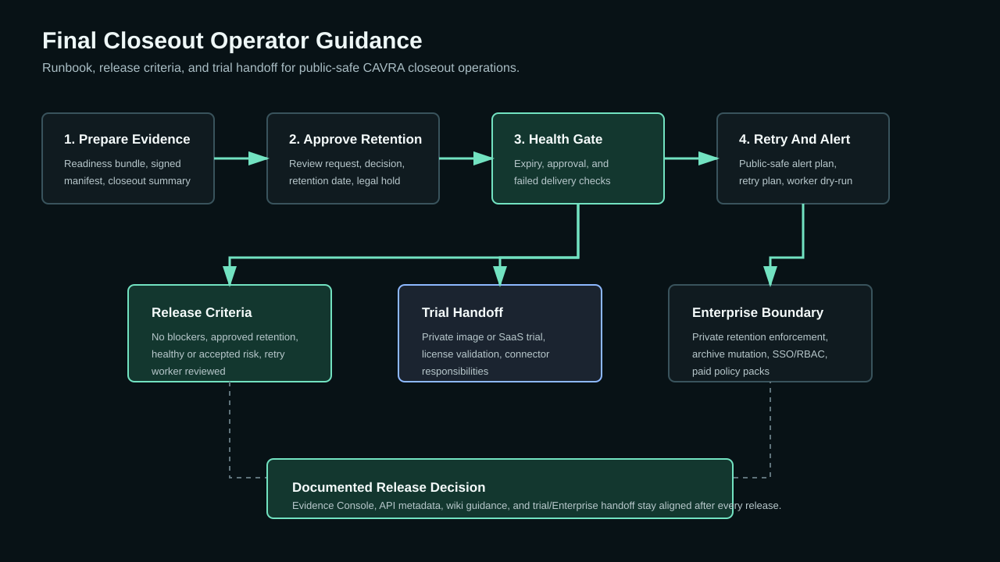

# Release Governance Final Closeout Operator Guide

This guide packages the completed final closeout workflow into an operator runbook for release managers, platform owners, auditors, and customer trial teams. It uses only Community Edition metadata and public-safe controls. Private retention enforcement, archive mutation, connector credentials, SSO/RBAC, and license validation remain outside this public repository.

## Operating Goal

Before a promoted Go backend rollback drill or release-governance trial is considered closed, operators should be able to prove:

- final readiness evidence exists,
- the archive manifest is externally signed,
- release closeout is closed,
- retention review is approved,
- artifact bundle metadata is downloadable,
- retention health has no unaccepted critical findings,
- failed closeout delivery attempts have retry plans or accepted risk,
- customer-facing trial handoff documentation explains what Community records and what Enterprise or SaaS must enforce.

## Runbook Checklist

1. Generate final readiness evidence.
   - Use the final reporting readiness bundle.
   - Confirm release readiness approval, release record attachment, closure packet verification, auditor export, archive reference, and archive health evidence are present.

2. Sign the archive manifest externally.
   - Use the signed archive manifest workflow.
   - Do not place signing keys or private KMS material in Community Edition.
   - Record only public-safe signature metadata and key references.

3. Generate and deliver the release closeout summary.
   - Confirm `closeout_state` is `closed`.
   - Deliver the summary to the configured public-safe connector path.
   - If delivery fails, keep the redacted connector delivery metadata for retry planning.

4. Request and approve retention.
   - Create a retention review request with `retention_until`, legal hold status, and review notes.
   - Record an approved retention decision before building the final artifact bundle.
   - Keep private retention policy details in Enterprise or operator-owned systems.

5. Build the closeout artifact bundle.
   - Include closeout summary, readiness bundle, signed archive manifest, and file hashes.
   - Confirm `retention_decision_state` is `approved`.
   - Download and attach the bundle to the release record or audit case as required by the customer workflow.

6. Run retention health.
   - Check for missing approval, expired retention, expiring retention, missing retention dates, and failed closeout delivery metadata.
   - Treat `critical` findings as release blockers unless an authorized risk owner records an external exception.

7. Send retention health alerts.
   - Route alert plans to SIEM, ITSM, ChatOps, GRC, or webhook connectors when health is not healthy.
   - Persist redacted delivery metadata only.
   - Do not store connector credentials in closeout evidence.

8. Plan and dry-run closeout delivery retries.
   - Create a retry plan for failed final closeout deliveries.
   - Run the retry worker in dry-run mode first.
   - Execute live retries only through configured operator-owned or Enterprise connector paths.

9. Record release decision.
   - Mark release closeout accepted only when release criteria are met.
   - Link the closeout bundle, retention health report, alert plan, retry plan, worker run, and retry execution records.

## Role Responsibilities

| Role | Responsibility |
| --- | --- |
| Release manager | Owns closeout execution, release record updates, and final acceptance. |
| Platform owner | Owns connector configuration, retry execution, and operational routing. |
| Security architect | Reviews retention health, exception handling, and open-core boundaries. |
| Auditor | Reviews downloadable artifact bundle and public-safe evidence chain. |
| Trial owner | Explains which controls are Community metadata versus Enterprise/SaaS enforcement. |

## Evidence To Retain

- Final readiness bundle metadata
- Signed archive manifest metadata
- Release closeout summary and delivery metadata
- Retention review request and approval decision
- Closeout artifact bundle metadata
- Retention health report
- Retention alert plan and redacted delivery evidence
- Closeout retry plan
- Retry worker run
- Retry execution record
- External release record or audit case reference

## Escalation Rules

Escalate to the release manager when:

- `closeout_state` is not `closed`,
- retention review is not approved,
- artifact bundle is missing,
- retention health is `critical`,
- closeout delivery failed and no retry plan exists,
- retry worker has not been reviewed,
- alert delivery failed for the required provider.

Escalate to the security architect when:

- retention is expired,
- legal hold is missing for regulated evidence,
- a customer asks for private retention enforcement details,
- a trial user expects Enterprise enforcement from Community metadata.

## Diagram

## Open-Core Boundary

Community Edition records evidence and public-safe metadata. Enterprise Edition or operator-owned systems enforce private retention policies, perform archive writes or deletions, handle SSO/RBAC, execute live connector delivery with secrets, validate licenses, and run paid policy packs.

## Next Recommended Issue

Delivered in enterprise/final-closeout-trial-walkthrough.md, enterprise/final-closeout-trial-sample-evidence.md, enterprise/final-closeout-sales-engineering-demo.md, and examples/demos/final-closeout-trial/sample-evidence-package.json. Continue by converting the onboarding package into an interactive public sandbox flow.
