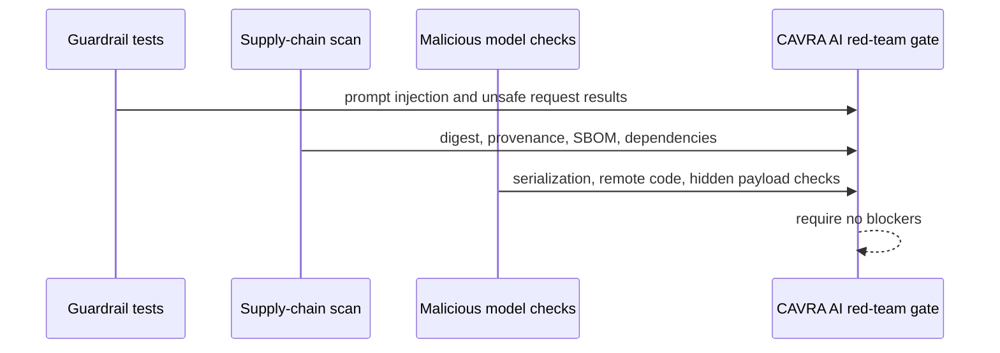

# AI Red-Team And Supply-Chain Gates

CAVRA R6.3 adds native AI red-team and AI supply-chain gates. The public contract validates LLM guardrail tests, AI artifact supply-chain metadata, malicious model indicators, and red-team closeout evidence without moving raw prompts, model weights, training data, private features, or customer records.



## Required Guardrail Tests

- `prompt_injection_override`
- `secret_exfiltration_request`
- `unsafe_tool_chain_request`
- `data_export_without_scope`

## Required Supply-Chain Checks

- artifact digest
- provenance reference
- SBOM reference
- serialization safety
- dependency allowlist
- no raw model egress

## Required Malicious Model Checks

- unsafe serialization
- remote code execution
- hidden prompt payload
- dependency confusion

## Commands

```bash
cavra ai-red-team guardrails
cavra ai-red-team supply-chain --artifact examples/ai-red-team/ai-artifact-metadata.sample.json
cavra ai-red-team malicious-model --artifact examples/ai-red-team/ai-artifact-metadata.sample.json
cavra ai-red-team export --output-dir dist/ai-red-team
cavra ai-red-team readiness examples/ai-red-team/enterprise-ai-red-team.live.sanitized.example.json --require-live
```

## Artifacts

- `src/cavra/ai_red_team.py`
- `scripts/validate_ai_red_team.py`
- `examples/ai-red-team/guardrail-test-suite.sample.json`
- `examples/ai-red-team/ai-artifact-metadata.sample.json`
- `examples/ai-red-team/ai-artifact-metadata.invalid.json`
- `examples/ai-red-team/enterprise-ai-red-team.sample.json`
- `examples/ai-red-team/enterprise-ai-red-team.live.sanitized.example.json`
- `.github/workflows/ai-red-team.yml`
- `tests/test_ai_red_team.py`

## Live Gate

The live gate is accepted only when:

```json
{
  "ready_for_live_ai_red_team_gate": true,
  "blocker_count": 0
}
```
