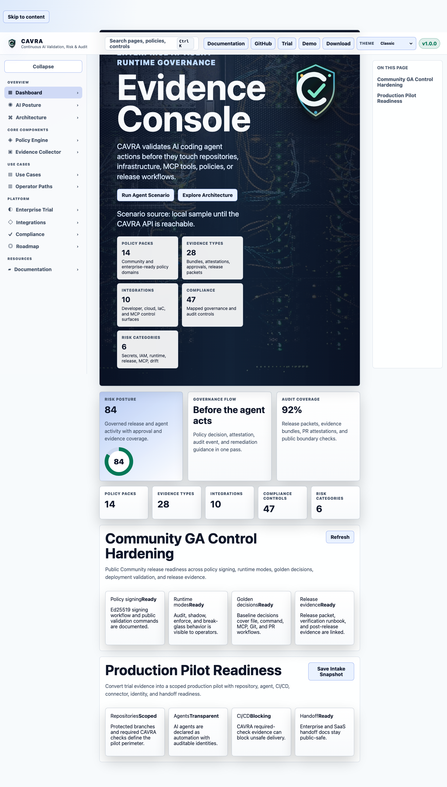
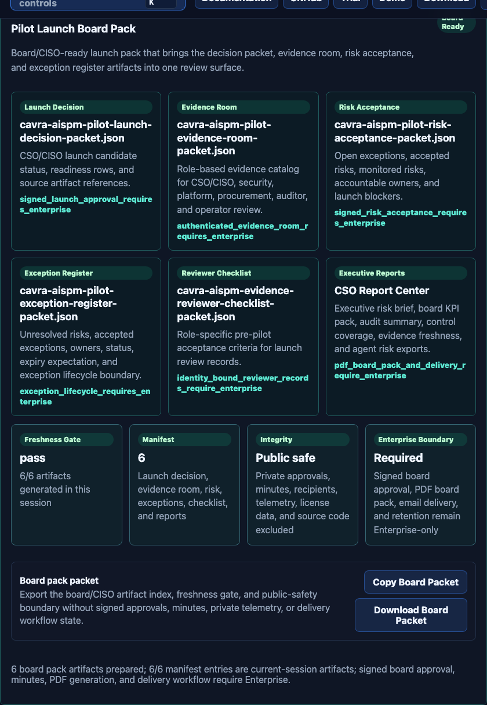
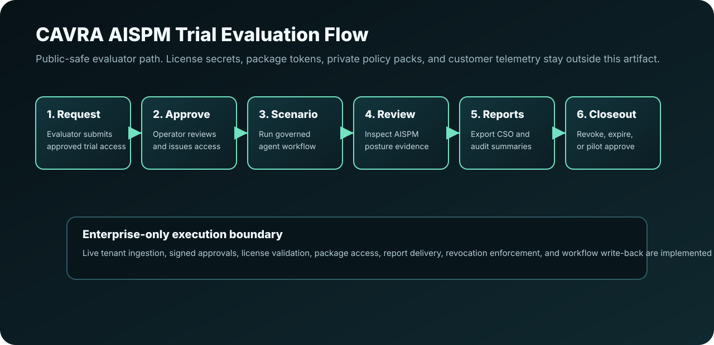

# CAVRA Enterprise Trial Lab Notebook

This page is retained as a legacy wiki pointer. The canonical evaluator
handbook is now the [CAVRA Trial Field Guide](CAVRA-Trial-Field-Guide.md).

Use the Field Guide for the current public-safe trial walkthrough, screenshots,
diagrams, role paths, labs, checkpoints, report-center guidance, operator
handoff expectations, pilot evidence-room review, and trial closeout flow.

## Migration Note

Older release packets and wiki links may still refer to this Lab Notebook name.
New evaluator onboarding should use `CAVRA-Trial-Field-Guide.md`.

## Legacy Visual References

These public-safe assets remain listed here because older v1.0 readiness
validators and release packets still inspect this legacy page:

## Step-By-Step Lab

For the complete current walkthrough, use the
[CAVRA Trial Field Guide](CAVRA-Trial-Field-Guide.md). The canonical guide covers
product orientation, approved trial access, governed agent actions, AISPM
posture review, CSO report-center downloads, operator readiness, pilot
evidence-room review, and trial closeout.

## Public Safety Rules

Do not publish Enterprise source code, license keys, package tokens, private
container URLs, SMTP credentials, signing keys, private policy-pack
implementation details, customer records, evaluator identities, operator
identities, IP addresses, raw prompts, model reasoning, raw tool output,
provider responses, private evidence room ACLs, signed download URLs, or
tenant-specific findings in this public pointer.

## Related Pages

- [CAVRA Trial Field Guide](CAVRA-Trial-Field-Guide.md)
- [Trial Access And Operator Approval](AISPM-Trial-Access-And-Operator-Approval.md)
- [Trial Revocation, Expiry, And Closeout](AISPM-Trial-Revocation-Expiry-And-Closeout.md)
- [AISPM CSO Report Center](AISPM-CSO-Report-Center.md)
