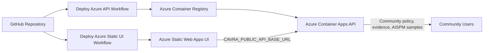

# Azure Community SaaS Deployment

This guide explains how to publish the public CAVRA Community service from
GitHub to Azure.

The deployment creates a hosted Community experience:

- CAVRA FastAPI backend on Azure Container Apps.
- CAVRA static sandbox UI on Azure Static Web Apps.
- Container images through Azure Container Registry.
- GitHub Actions authentication through Azure OIDC.

This is a Community deployment path. It does not add Enterprise tenant
isolation, private policy packs, live production connectors, SMTP or report
provider delivery, license enforcement, or Enterprise AISPM production
validation.

## Deployment Architecture



## Repository Artifacts

The deployment path uses these files:

- `docker/Dockerfile.azure-api`
- `.github/workflows/deploy-azure-api.yml`
- `.github/workflows/deploy-azure-static-ui.yml`
- `apps/sandbox-ui/config.js`
- `src/cavra/api.py`

The API container runs:

```bash
uvicorn cavra.api:app --host 0.0.0.0 --port 8000
```

The static UI workflow copies `apps/sandbox-ui`, writes a deployment-specific
`config.js`, and publishes the folder to Azure Static Web Apps.

## Azure Resources

Create or provide:

- Resource group.
- Azure Container Registry.
- Azure Container Apps environment.
- Azure Container App for the API with external ingress on port `8000`.
- Azure Static Web App for the UI.
- Optional Azure Files volume for Community SQLite store persistence.

Example CLI skeleton:

```bash
az group create -n cavra-community-rg -l eastus
az acr create -g cavra-community-rg -n cavracommunityacr --sku Basic
az containerapp env create -g cavra-community-rg -n cavra-community-env -l eastus
az containerapp create \
  -g cavra-community-rg \
  -n cavra-community-api \
  --environment cavra-community-env \
  --image mcr.microsoft.com/azuredocs/containerapps-helloworld:latest \
  --ingress external \
  --target-port 8000 \
  --min-replicas 1 \
  --max-replicas 3 \
  --env-vars CAVRA_EDITION=community
```

After the first placeholder deployment, the GitHub workflow builds and deploys
the real CAVRA image from `docker/Dockerfile.azure-api`.

## GitHub Variables And Secrets

Create these GitHub repository variables:

| Variable | Purpose |
| --- | --- |
| `AZURE_DEPLOY_ENABLED` | Set to `true` to allow Azure deployment jobs to run. |
| `AZURE_CLIENT_ID` | Federated identity client ID for GitHub Actions OIDC. |
| `AZURE_TENANT_ID` | Azure tenant ID. |
| `AZURE_SUBSCRIPTION_ID` | Azure subscription ID. |
| `AZURE_RESOURCE_GROUP` | Resource group containing the Container App and ACR. |
| `AZURE_CONTAINER_REGISTRY_NAME` | ACR name without `.azurecr.io`. |
| `AZURE_CONTAINER_APP_NAME` | Container App name for the CAVRA API. |
| `CAVRA_PUBLIC_API_BASE_URL` | Public API URL consumed by the static UI. |
| `CAVRA_PUBLIC_TRIAL_API_URL` | Optional public trial URL exposed to the UI. |
| `CAVRA_CORS_ORIGINS` | Static UI origin allowed to call the API. |

Optional persistence variables:

| Variable | Example |
| --- | --- |
| `CAVRA_EVIDENCE_METADATA_DB` | `/data/evidence.sqlite` |
| `CAVRA_APPROVAL_DB` | `/data/approvals.sqlite` |
| `CAVRA_REGISTRY_DB` | `/data/registry.sqlite` |
| `CAVRA_ACTIVITY_DB` | `/data/activity.sqlite` |
| `CAVRA_INVENTORY_DB` | `/data/inventory.sqlite` |
| `CAVRA_INTEGRATION_DB` | `/data/integrations.sqlite` |
| `CAVRA_EVIDENCE_ARTIFACT_ROOT` | `/data/evidence-artifacts` |

Create this GitHub repository secret:

| Secret | Purpose |
| --- | --- |
| `AZURE_STATIC_WEB_APPS_API_TOKEN` | Azure Static Web Apps deployment token. |

Use Azure workload identity federation for GitHub Actions instead of storing an
Azure client secret. The Azure API workflow uses `azure/login@v2` with OIDC.

## Deployment Flow

1. Configure Azure resources and GitHub variables/secrets.
2. Set `AZURE_DEPLOY_ENABLED=true`.
3. Run `Deploy Azure API` from GitHub Actions, or push changes to API paths.
4. Copy the emitted Container App URL into `CAVRA_PUBLIC_API_BASE_URL`.
5. Set `CAVRA_CORS_ORIGINS` to the Azure Static Web Apps origin.
6. Run `Deploy Azure Static UI` from GitHub Actions, or push changes to UI paths.
7. Open the Static Web App and confirm `config.js` points at the Container App.
8. Confirm API health:

```bash
curl https://<container-app-fqdn>/health
curl https://<container-app-fqdn>/deployment/production-readiness
```

## Persistence Boundary

Azure Container Apps container filesystem storage is not a durable database. For
a Community SaaS demo, use explicit SQLite paths mounted on Azure Files or
accept that sample state is ephemeral. For production multi-tenant SaaS, replace
file-backed stores with an Enterprise-managed database design.

## Community Boundary

This deployment exposes the public Community product surfaces:

- CLI/API decision and evidence contracts.
- Public-safe sandbox GUI.
- Public-safe AISPM sample and local posture views.
- Community policy and evidence workflows.

It does not claim Enterprise readiness. Enterprise readiness still requires real
tenant isolation, live connectors, report delivery, private policy packs,
runtime workflow validation, and final AISPM production gates.

## Related Textbook Chapters

- [Install And Deploy CAVRA](Textbook-05-Install-And-Deploy-CAVRA.md)
- [Operations, Integrations, And Deployment Patterns](Textbook-12-Operations-Integrations-And-Deployment-Patterns.md)
- [CAVRA GUI And Sandbox Guide](Textbook-09-CAVRA-GUI-And-Sandbox-Guide.md)
- [AISPM Guide](Textbook-10-AISPM-Guide.md)
