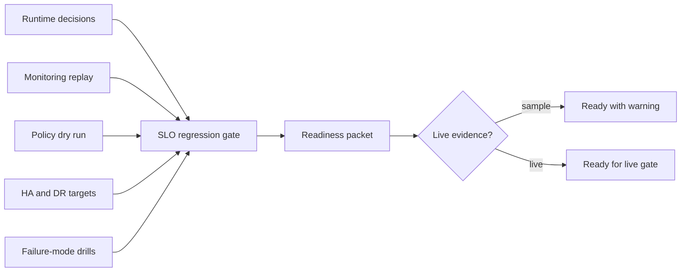

# Benchmark SLO Regression Gates

CAVRA R6.1 publishes a benchmark and SLO regression gate for latency, throughput, HA/DR targets, and failure-mode drills.

The public gate is deterministic by default. It validates the benchmark contract and demonstrates the packet shape that a live Enterprise deployment must fill with real CI, HA, and drill evidence.



## Required Suites

| Suite | SLO family |
| --- | --- |
| `runtime_decision_latency` | p95 latency and throughput |
| `continuous_monitoring_replay` | p95 latency and throughput |
| `policy_lifecycle_dry_run` | p95 latency and throughput |

## Required Failure Drills

| Drill | Expected behavior |
| --- | --- |
| `event_bus_unavailable` | fail closed or queue retry without unsafe approval |
| `store_write_failure` | governed decision remains blocked and evidence is surfaced |
| `connector_timeout` | retry or dead-letter evidence |
| `policy_compile_failure` | policy promotion blocked before enforcement change |

## Commands

```bash
python3 scripts/validate_benchmark_slo.py --export-dir dist/benchmark-slo
python3 scripts/validate_benchmark_slo.py --report examples/benchmark-slo/generated/benchmark-slo-report.json
python3 scripts/validate_benchmark_slo.py --packet examples/benchmark-slo/enterprise-benchmark-slo.sample.json
python3 scripts/validate_benchmark_slo.py --packet examples/benchmark-slo/enterprise-benchmark-slo.live.sanitized.example.json --require-live
```

CLI:

```bash
cavra benchmark export --output-dir dist/benchmark-slo
cavra benchmark run
cavra benchmark readiness examples/benchmark-slo/enterprise-benchmark-slo.sample.json
```

## Artifacts

- `src/cavra/benchmark_slo.py`
- `scripts/validate_benchmark_slo.py`
- `examples/benchmark-slo/enterprise-benchmark-slo.sample.json`
- `examples/benchmark-slo/enterprise-benchmark-slo.live.sanitized.example.json`
- `.github/workflows/benchmark-slo.yml`
- `tests/test_benchmark_slo.py`

## Live Completion Gate

Sample packets prove the contract only. Production readiness requires a live packet with real CI run evidence, benchmark report evidence, HA/DR evidence, and failure-drill closeout evidence.

The live gate is accepted only when:

```json
{
  "ready_for_live_benchmark_slo_gate": true,
  "blocker_count": 0
}
```
