# CAVRA Trial Field Guide

The CAVRA Trial Field Guide is the public-safe operating handbook for approved
Community and Enterprise Trial evaluators. It walks trial users through CAVRA
from first contact to closeout without exposing Enterprise source code,
license material, private package credentials, customer data, raw prompts, or
private policy-pack implementation details.

Use this guide with the public Community portal, the approved Enterprise Trial
request flow, and the validation packets linked from the release evidence
index.

## Audience

| Role | Primary Question | Field Guide Path |
| --- | --- | --- |
| Developer | Will CAVRA govern agent actions before they change code or tools? | Labs 1, 3, and 4 |
| Platform engineer | Can we wire CAVRA into repositories, CI, and runtime control points? | Labs 2, 3, 6, and 7 |
| Security engineer | Can we see risky agent actions, violations, and control coverage? | Labs 3, 4, 5, and 7 |
| Auditor | Can we prove what happened, who approved it, and what evidence exists? | Labs 4, 5, 6, and 8 |
| CSO/CISO | Is the AI-agent security posture understandable and board-reviewable? | Labs 4, 5, 7, and 8 |

## Guided Lab Map

| Lab | Name | Outcome | Primary Surface |
| --- | --- | --- | --- |
| 1 | Product orientation | Understand Community, Enterprise Trial, SaaS, and private-source boundaries. | Public docs and portal |
| 2 | Trial access request | Understand approved-access signup, operator review, package access, and license validation. | Trial portal |
| 3 | Governed agent action | Review allow, warn, block, approval, and attestation decisions. | Community dashboard |
| 4 | AISPM posture review | Inspect risk, agent coverage, timelines, evidence confidence, and control coverage. | AI Posture |
| 5 | CSO report center | Download Community reports and understand Enterprise delivery, audit, and retention controls. | Report Center |
| 6 | Operator readiness | Review release gates, trial handoff, runtime controls, and package-readiness boundaries. | Readiness packets |
| 7 | Pilot evidence room | Review pilot launch, exception, risk, board-pack, deployment, report-delivery, and runtime-workflow evidence. | Evidence packets |
| 8 | Trial closeout | Understand revocation, expiry, package access removal, blocked runtime validation, and feedback capture. | Closeout pages |

## Visual Walkthrough

The dashboard introduces the product, shows public-safe controls, and links to
Community documentation, trial access, demo flows, and release evidence.

The AISPM posture view uses sample or local data in Community and live,
authenticated, tenant-scoped data in Enterprise.

The CSO Report Center gives executives and auditors a central place to
download public-safe reports. Enterprise expands this with signed exports,
email delivery, retention, evidence rooms, and audit trails.

The board-pack view groups launch decision, evidence room, risk acceptance,
exceptions, reviewer checklist, and report artifacts into one executive review
surface.

## Trial License Generation And Use

Enterprise Trial license material is generated only after an approved request
through the public trial portal:

- `https://cavra-trial.mind-ops.cloud`

The portal collects the evaluator's business contact, GitHub username, company
role, and evaluation goal. A CAVRA trial operator reviews the request. Approved
evaluators receive private package access and one-time, time-limited license
material through a controlled channel.

Use the license material this way:

1. Store the license in the protected location described in the approval
   handoff. Do not commit it to Git, tickets, screenshots, public docs, or
   chat transcripts.
2. Configure package access exactly as described in the handoff.
3. Run the supplied license validation step before starting Enterprise
   workflows.
4. Keep the license bound to the approved evaluator, tenant, and evaluation
   window.
5. Treat expiry, revocation, and closeout as part of the trial, not as
   administrative cleanup after the fact.

The public textbook intentionally avoids publishing private package names,
license commands, token formats, signing details, or approval-channel
implementation details.

## Complete Trial Use Case: Prove Runtime Authority

Use this scenario to prove CAVRA's efficiency during a trial.

Goal: show that CAVRA lets a team safely use an AI coding agent for a real
workflow while preserving runtime authority, approval evidence, and executive
posture visibility.

1. Pick one repository or workflow that represents a real business risk.
2. Define one risky agent action, such as editing deployment automation,
   changing IAM or Kubernetes configuration, invoking a repository mutation
   tool, or running a destructive command.
3. Request Enterprise Trial access from `https://cavra-trial.mind-ops.cloud`.
4. After approval, activate private package access and validate the evaluator
   license using the handoff instructions.
5. Run the workflow through CAVRA and record the decision: allow, warn, block,
   require approval, or allow with attestation.
6. Route one legitimate high-risk action for approval and deny one unsafe
   action.
7. Generate an evidence bundle and verify that the evidence explains actor,
   action, policy, decision, approval path, and evidence references.
8. Review the AISPM posture view and report center to see how the trial action
   appears to security, audit, and executive users.
9. Close the trial by confirming license expiry or revocation, package access
   removal, evidence archive status, feedback, and pilot decision.

Success criteria: the evaluator can show exactly what the agent attempted, how
CAVRA decided, who approved or denied the action, where the evidence lives, and
whether remaining blockers prevent pilot or production expansion.

## Lab 1: Product Orientation

1. Open `https://huzefaaa2.github.io/cavra/#dashboard`.
2. Confirm that the product is CAVRA: Controlled Agentic Verification &
   Runtime Authority.
3. Review the open-core boundary: Community source is public; Enterprise
   source, license service, SaaS backend, private policy packs, and private
   trial package implementation remain private.
4. Open the documentation links for AISPM Dashboard Roadmap, AI Security
   Posture Dashboard Contract, and Enterprise Trial Availability.

Checkpoint: `checkpoint-product-surfaces`

Expected result: the evaluator can explain Community, Enterprise Trial, SaaS,
and private-source boundaries.

## Lab 2: Trial Access Request

1. Open `https://cavra-trial.mind-ops.cloud`.
2. Submit a trial request with business contact details, GitHub username,
   company role, and evaluation goal.
3. Confirm the request is recorded as pending operator review.
4. Review [Trial Access And Operator Approval](AISPM-Trial-Access-And-Operator-Approval.md)
   to understand operator approval, package access, and license issuance.
5. After approval, follow the private handoff to configure package access,
   store license material securely, and validate the time-limited evaluator
   license before running Enterprise workflows.

Checkpoint: `checkpoint-trial-request`

Expected result: the evaluator understands why Enterprise Trial access is
approved and gated instead of anonymous, and how the license is generated,
activated, validated, and closed out.

## Lab 3: Governed Agent Action

1. Open the public dashboard and run the sample agent scenario.
2. Inspect the generated decision: allow, warn, block, require approval, or
   allow with attestation.
3. Download the public-safe evidence JSON.
4. Confirm the evidence identifies what the agent attempted, what CAVRA
   decided, why, and which evidence references support the decision.

Checkpoint: `checkpoint-agent-decision`

Expected result: the evaluator can see how CAVRA governs an AI-agent action
before relying on after-the-fact review.

## Lab 4: AISPM Posture Review

1. Open `AI Posture`.
2. Review live activity sample data, risk queue, execution timeline, approval
   lineage, control coverage heatmap, evidence confidence, and evidence
   freshness panels.
3. Confirm each tile clearly indicates public-safe sample/local provenance.
4. Review the executive risk narrative and near-miss queue.

Checkpoint: `checkpoint-aispm-posture`

Expected result: CSO/CISO, security, and platform teams can inspect AI-agent
posture without raw prompt or private payload exposure in Community.

## Lab 5: CSO Report Center

1. Open the report center inside the AI Posture route.
2. Download Community-safe executive, audit, control coverage, evidence
   freshness, and agent-risk reports.
3. Review [AISPM CSO Report Center](AISPM-CSO-Report-Center.md) for the Enterprise
   expansion: PDF, XLSX, DOCX, HTML, signed JSON, JSONL, GRC packages,
   scheduled email delivery, retry evidence, retention, and evidence-room
   access events.

Checkpoint: `checkpoint-report-center`

Expected result: executives and auditors can identify which reports exist in
Community and which delivery/governance capabilities require Enterprise.

## Lab 6: Operator Readiness

1. Review the Enterprise Trial readiness public summary:
   `docs/release-verifications/aispm-enterprise-trial-readiness-public-summary.json`.
2. Confirm the public-safe gates are ready: runtime binding, alert transport,
   release dashboard publication, trial field guide, operator audit archive,
   runtime-control closeout, systems-of-record attachment, and announcement
   closeout.
3. Review the release evidence index for validator paths and packet names.

Checkpoint: `checkpoint-operator-readiness`

Expected result: evaluators can see the readiness trail without seeing private
operator records or package credentials.

## Lab 7: Pilot Evidence Room

1. Review the public-safe pilot evidence room packet.
2. Confirm it references launch decision, reviewer checklist, exception
   register, risk acceptance, board pack, deployment runtime validation,
   report-delivery validation, and runtime-workflow validation.
3. Confirm the private implementation owns signed acceptance, board minutes,
   private ACLs, customer data, and authenticated evidence-room access logs.

Checkpoint: `checkpoint-pilot-evidence-room`

Expected result: CSO/CISO and auditors can understand the pilot evidence room
without receiving customer-private evidence.

## Lab 8: Trial Closeout

1. Review [Trial Revocation, Expiry, And Closeout](AISPM-Trial-Revocation-Expiry-And-Closeout.md).
2. Confirm closeout expectations: license expiry or revocation, package access
   removal, blocked runtime validation, archived evidence packet, evaluator
   feedback, and commercial/pilot handoff decision.

Checkpoint: `checkpoint-revocation-expiry`

Expected result: the evaluator understands how trial access is ended or
converted without leaving stale package or license access behind.

## Acceptance Checklist

| Checkpoint | Expected Evidence |
| --- | --- |
| Product surfaces | Public dashboard and open-core docs reviewed. |
| Trial request | Approved-access flow, operator review, license handoff, and secure license storage understood. |
| Agent decision | Public-safe decision evidence downloaded. |
| AISPM posture | Risk, coverage, timeline, and freshness panels reviewed. |
| Report center | Community downloads and Enterprise delivery boundary understood. |
| Operator readiness | Public-safe readiness summary reviewed. |
| Pilot evidence room | Required artifact families identified. |
| Revocation and expiry | Closeout and blocked-access expectations understood. |

## Public Safety Rules

Do not publish or attach Enterprise source code, license keys, package tokens,
private container URLs, SMTP credentials, signing keys, private policy-pack
implementation details, customer records, evaluator identities, operator
identities, IP addresses, raw prompts, model reasoning, raw tool output,
provider responses, private evidence room ACLs, signed download URLs, or
tenant-specific findings in this public guide.

Use public-safe summaries, screenshots, diagrams, packet names, hashes, and
status fields only.

## Related Pages

- [Trial Access And Operator Approval](AISPM-Trial-Access-And-Operator-Approval.md)
- [Trial Revocation, Expiry, And Closeout](AISPM-Trial-Revocation-Expiry-And-Closeout.md)
- [AISPM CSO Report Center](AISPM-CSO-Report-Center.md)
- [AISPM Report Center Enterprise Readiness](AISPM-Report-Center-Enterprise-Readiness.md)
- [AISPM Enterprise Trial Announcement Closeout Sync](Development-And-Testing-Artifacts.md)
