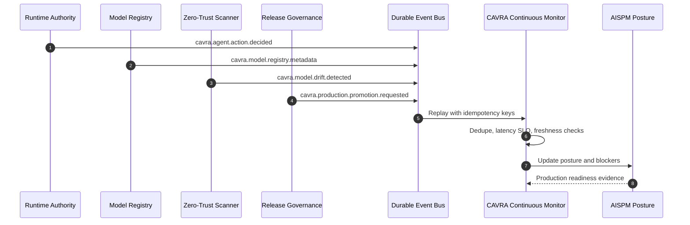

# Continuous Monitoring Event Core

CAVRA continuous monitoring turns runtime decisions, model registry updates, drift signals, and production promotions into replayable events. This is roadmap item R5.3.

The public repository now includes the event schema, replay/dedupe/latency/freshness logic, sample event stream, sanitized live readiness packet, CLI, validator, CI workflow, and tests. Live customer queue configuration, monitor dashboards, and event-bus evidence remain Enterprise deployment artifacts.

## Event-Driven Posture Loop



## Required Event Types

| Event type | Purpose |
| --- | --- |
| `cavra.agent.action.decided` | Agent action decision from the runtime authority plane. |
| `cavra.model.registry.metadata` | Metadata-only model registration or model version update. |
| `cavra.model.drift.detected` | Drift, risk change, scanner finding, or posture change signal. |
| `cavra.production.promotion.requested` | Production release, model, runtime, or policy promotion signal. |

## Commands

```bash
cavra monitor export --output-dir dist/continuous-monitoring
cavra monitor replay examples/continuous-monitoring/generated/continuous-monitoring-events.json --now 2026-07-04T10:15:00+00:00
cavra monitor readiness examples/continuous-monitoring/enterprise-continuous-monitoring.live.sanitized.example.json --require-live
python scripts/validate_continuous_monitoring.py --packet examples/continuous-monitoring/enterprise-continuous-monitoring.live.sanitized.example.json --require-live
```

## Evidence

- Sample packet: `examples/continuous-monitoring/enterprise-continuous-monitoring.sample.json`
- Sanitized live example: `examples/continuous-monitoring/enterprise-continuous-monitoring.live.sanitized.example.json`
- CI workflow: `.github/workflows/continuous-monitoring.yml`
- Tests: `tests/test_continuous_monitoring.py`

## Completion Gate

```bash
python scripts/validate_continuous_monitoring.py \
  --packet <live-continuous-monitoring-packet.json> \
  --require-live
```

Completion means `ready_for_live_continuous_monitoring: true` with `blocker_count: 0`.
