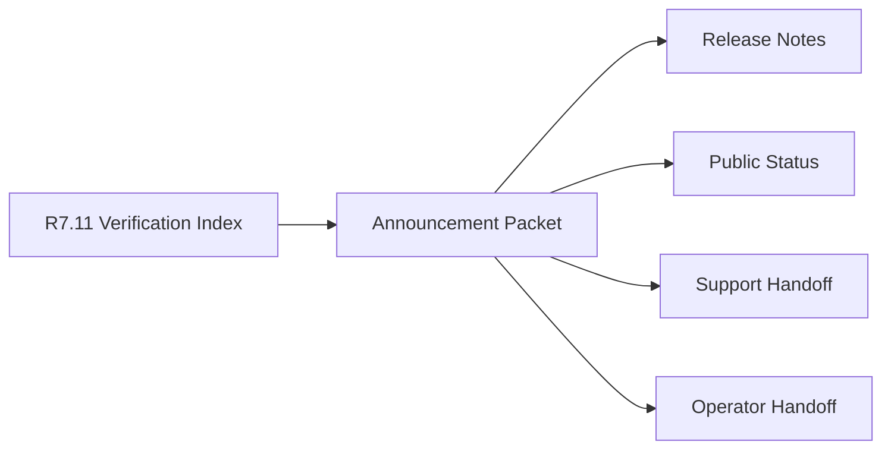

# Customer Lifecycle Closeout Announcement

The customer lifecycle closeout announcement packet is the R7.12 public-safe
communication gate for CAVRA Managed and Enterprise lifecycle closeout. It
consumes the R7.11 verification index and produces a release-note-ready,
customer-safe packet for final status communication and operator handoff.

## Announcement Flow



## Required Checks

- The verification index is live, sanitized, ready, and blocker-free.
- Release, customer success, security, support, and communications owner refs
  are present.
- Announcement sections are complete and supported by sanitized refs.
- Release-note and operator-handoff refs are present.
- Controls confirm customer-safe language, release-note approval, support path,
  operator handoff, and redaction boundaries.
- No customer identities, raw evidence, private notes, pricing, contract values,
  renewal amounts, raw contracts, legal terms, or commercial terms are embedded.

## Run The Gate

```bash
python3 scripts/validate_customer_lifecycle_announcement.py \
  --packet examples/customer-lifecycle-announcement/customer-lifecycle-announcement.live.sanitized.example.json \
  --repo-root . \
  --require-live
```

Ready means:

```json
{
  "ready_for_customer_lifecycle_announcement_packet": true,
  "blocker_count": 0,
  "warning_count": 0
}
```

## Related Files

- `src/cavra/customer_lifecycle_announcement.py`
- `scripts/validate_customer_lifecycle_announcement.py`
- `examples/customer-lifecycle-announcement/`
- `.github/workflows/customer-lifecycle-announcement.yml`
- `tests/test_customer_lifecycle_announcement.py`
