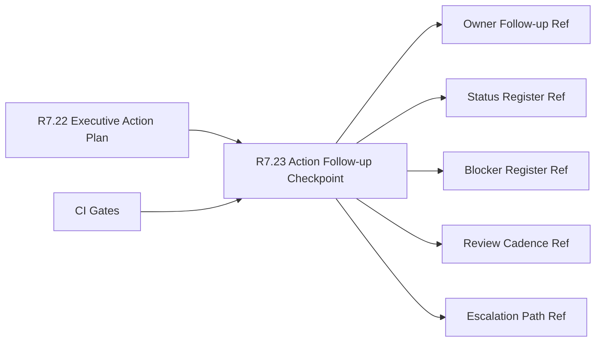

# Customer Lifecycle Phase 8 Action Follow-up Checkpoint

The customer lifecycle Phase 8 action follow-up checkpoint packet is the R7.23
readiness gate for turning the R7.22 executive action plan into a customer-safe
checkpoint contract with status refs, blocker refs, owner follow-up refs, and
review cadence.

## Action Follow-up Checkpoint Flow



## Required Checks

- The executive action plan source gate is ready.
- Executive, program, customer-success, support, security, and product owner
  refs are present.
- Checkpoint plan, status register, blocker register, owner follow-up, review
  cadence, and escalation path refs are complete.
- Risk posture, support, adoption, and next-review status refs are sanitized.
- Risk posture, support, adoption, and executive-escalation blocker refs are
  sanitized.
- CI gates cover source action plan, follow-up checkpoint, status refs, blocker
  refs, and redaction validation.

## Run The Gate

```bash
python3 scripts/validate_customer_lifecycle_phase8_action_followup_checkpoint.py \
  --packet examples/customer-lifecycle-phase8-action-followup-checkpoint/customer-lifecycle-phase8-action-followup-checkpoint.live.sanitized.example.json \
  --repo-root . \
  --require-live
```

Expected result:

```json
{
  "ready_for_customer_lifecycle_phase8_action_followup_checkpoint": true,
  "blocker_count": 0,
  "warning_count": 0
}
```

## Related Files

- `src/cavra/customer_lifecycle_phase8_action_followup_checkpoint.py`
- `scripts/validate_customer_lifecycle_phase8_action_followup_checkpoint.py`
- `examples/customer-lifecycle-phase8-action-followup-checkpoint/`
- `.github/workflows/customer-lifecycle-phase8-action-followup-checkpoint.yml`
- `tests/test_customer_lifecycle_phase8_action_followup_checkpoint.py`
- `docs/customer-lifecycle-phase8-action-followup-checkpoint.md`
