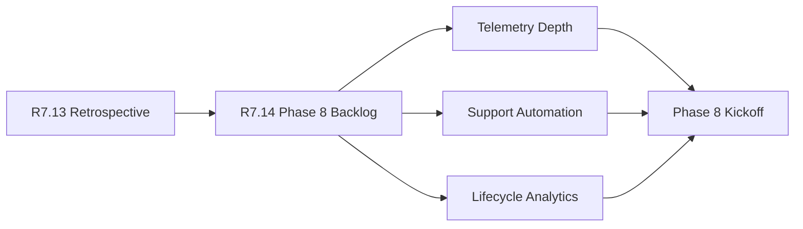

# Customer Lifecycle Phase 8 Backlog

The customer lifecycle Phase 8 backlog is the R7.14 planning packet for
turning the R7.13 retrospective into concrete next-phase work. It preserves a
public, customer-safe contract for backlog readiness without exposing customer
identities, raw evidence, private notes, pricing, contract values, renewal
amounts, raw contracts, legal terms, or commercial terms.

## Backlog Flow



## Required Checks

- The retrospective packet is live, sanitized, ready, and blocker-free.
- Program, product, security, and support owner refs are present.
- Required backlog items exist for telemetry depth, support automation, and
  lifecycle analytics.
- Each backlog item has a valid priority, owner ref, dependency refs, tracking
  ref, and acceptance gates.
- Backlog controls confirm that priorities, owners, dependencies, acceptance
  gates, and redaction boundaries are ready.

## Run The Gate

```bash
python3 scripts/validate_customer_lifecycle_phase8_backlog.py \
  --packet examples/customer-lifecycle-phase8-backlog/customer-lifecycle-phase8-backlog.live.sanitized.example.json \
  --repo-root . \
  --require-live
```

Expected result:

```json
{
  "ready_for_customer_lifecycle_phase8_backlog": true,
  "blocker_count": 0,
  "warning_count": 0
}
```

## Related Files

- `src/cavra/customer_lifecycle_phase8_backlog.py`
- `scripts/validate_customer_lifecycle_phase8_backlog.py`
- `examples/customer-lifecycle-phase8-backlog/`
- `.github/workflows/customer-lifecycle-phase8-backlog.yml`
- `tests/test_customer_lifecycle_phase8_backlog.py`
- `docs/customer-lifecycle-phase8-backlog.md`
