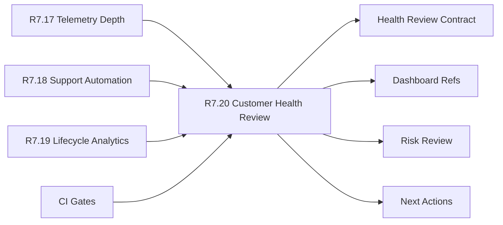

# Customer Lifecycle Phase 8 Customer Health Review

The customer lifecycle Phase 8 customer health review packet is the R7.20
readiness gate for combining telemetry depth, support automation, and lifecycle
analytics into one customer-safe operating health review.

## Customer Health Review Flow



## Required Checks

- Telemetry depth, support automation, and lifecycle analytics source gates are
  ready.
- Program, customer-success, support, analytics, and security owner refs are
  present.
- Health review contract refs are complete and sanitized.
- Dashboard refs cover posture, support load, adoption, and cadence.
- CI gates cover input gate, review contract, dashboard, and redaction
  validation.

## Run The Gate

```bash
python3 scripts/validate_customer_lifecycle_phase8_customer_health_review.py \
  --packet examples/customer-lifecycle-phase8-customer-health-review/customer-lifecycle-phase8-customer-health-review.live.sanitized.example.json \
  --repo-root . \
  --require-live
```

Expected result:

```json
{
  "ready_for_customer_lifecycle_phase8_customer_health_review": true,
  "blocker_count": 0,
  "warning_count": 0
}
```

## Related Files

- `src/cavra/customer_lifecycle_phase8_customer_health_review.py`
- `scripts/validate_customer_lifecycle_phase8_customer_health_review.py`
- `examples/customer-lifecycle-phase8-customer-health-review/`
- `.github/workflows/customer-lifecycle-phase8-customer-health-review.yml`
- `tests/test_customer_lifecycle_phase8_customer_health_review.py`
- `docs/customer-lifecycle-phase8-customer-health-review.md`
