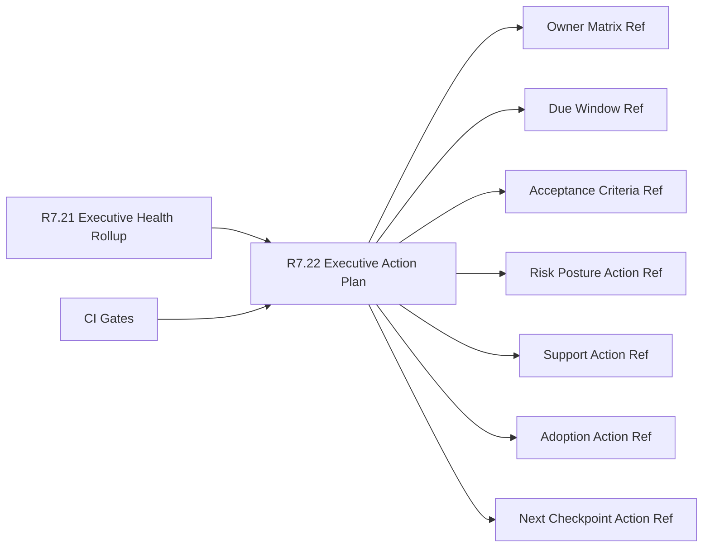

# Customer Lifecycle Phase 8 Executive Action Plan

The customer lifecycle Phase 8 executive action plan packet is the R7.22
readiness gate for turning the R7.21 executive health rollup into a
customer-safe, owner-backed action plan contract.

## Executive Action Plan Flow



## Required Checks

- The executive health rollup source gate is ready.
- Executive, program, customer-success, support, security, and product owner
  refs are present.
- Action-plan refs cover owner matrix, due windows, acceptance criteria,
  dependencies, and decision logs.
- Risk posture, support, adoption, and next-checkpoint action commitment refs
  are complete.
- CI gates cover source rollup, action plan, commitment refs, and redaction
  validation.

## Run The Gate

```bash
python3 scripts/validate_customer_lifecycle_phase8_executive_action_plan.py \
  --packet examples/customer-lifecycle-phase8-executive-action-plan/customer-lifecycle-phase8-executive-action-plan.live.sanitized.example.json \
  --repo-root . \
  --require-live
```

Expected result:

```json
{
  "ready_for_customer_lifecycle_phase8_executive_action_plan": true,
  "blocker_count": 0,
  "warning_count": 0
}
```

## Related Files

- `src/cavra/customer_lifecycle_phase8_executive_action_plan.py`
- `scripts/validate_customer_lifecycle_phase8_executive_action_plan.py`
- `examples/customer-lifecycle-phase8-executive-action-plan/`
- `.github/workflows/customer-lifecycle-phase8-executive-action-plan.yml`
- `tests/test_customer_lifecycle_phase8_executive_action_plan.py`
- `docs/customer-lifecycle-phase8-executive-action-plan.md`
