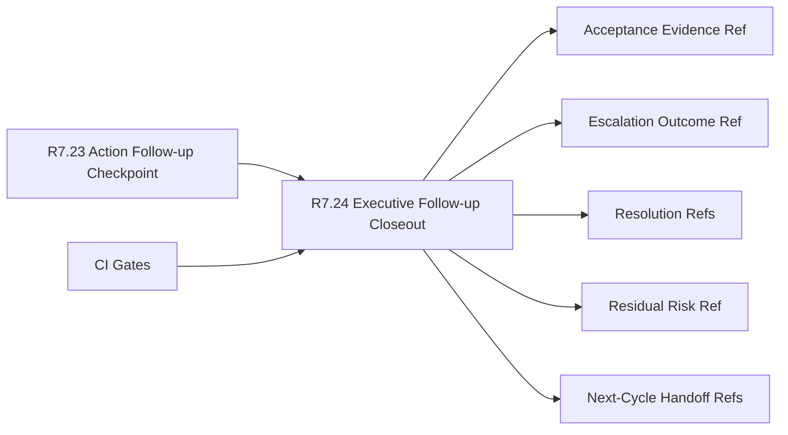

# Customer Lifecycle Phase 8 Executive Follow-up Closeout

The customer lifecycle Phase 8 executive follow-up closeout packet is the R7.24
readiness gate for closing the R7.23 action follow-up checkpoint and handing the
program into the next lifecycle cycle.

## Executive Follow-up Closeout Flow



## Required Checks

- The action follow-up checkpoint source gate is ready.
- Executive, program, customer-success, support, security, and product owner
  refs are present.
- Closeout plan, acceptance evidence, escalation outcome, residual risk,
  next-cycle handoff, and decision record refs are complete.
- Risk posture, support, adoption, and executive-escalation resolution refs are
  sanitized.
- Next-cycle backlog, owner transition, cadence reset, and evidence archive
  refs are sanitized.
- CI gates cover source checkpoint, closeout contract, resolution refs, handoff
  refs, and redaction validation.

## Run The Gate

```bash
python3 scripts/validate_customer_lifecycle_phase8_executive_followup_closeout.py \
  --packet examples/customer-lifecycle-phase8-executive-followup-closeout/customer-lifecycle-phase8-executive-followup-closeout.live.sanitized.example.json \
  --repo-root . \
  --require-live
```

Expected result:

```json
{
  "ready_for_customer_lifecycle_phase8_executive_followup_closeout": true,
  "blocker_count": 0,
  "warning_count": 0
}
```

## Related Files

- `src/cavra/customer_lifecycle_phase8_executive_followup_closeout.py`
- `scripts/validate_customer_lifecycle_phase8_executive_followup_closeout.py`
- `examples/customer-lifecycle-phase8-executive-followup-closeout/`
- `.github/workflows/customer-lifecycle-phase8-executive-followup-closeout.yml`
- `tests/test_customer_lifecycle_phase8_executive_followup_closeout.py`
- `docs/customer-lifecycle-phase8-executive-followup-closeout.md`
