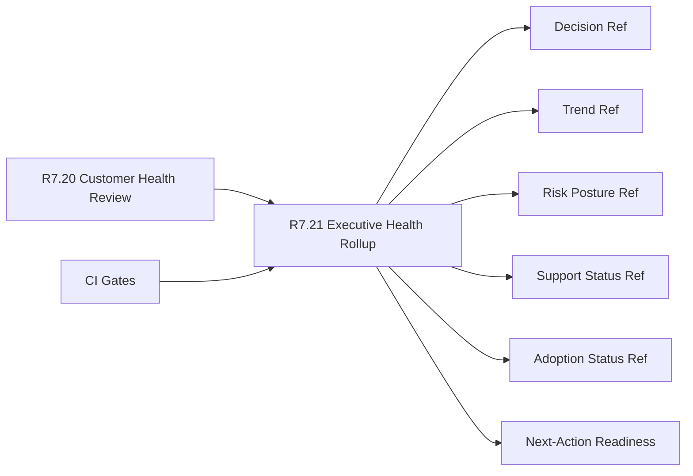

# Customer Lifecycle Phase 8 Executive Health Rollup

The customer lifecycle Phase 8 executive health rollup packet is the R7.21
readiness gate for turning the R7.20 customer health review into a customer-safe
executive summary contract.

## Executive Health Rollup Flow



## Required Checks

- The customer health review source gate is ready.
- Executive, program, customer-success, security, and support owner refs are
  present.
- Decision, trend, risk posture, support status, adoption status, and
  next-action readiness refs are complete.
- Executive brief refs are sanitized.
- CI gates cover source health, rollup contract, executive brief, and redaction
  validation.

## Run The Gate

```bash
python3 scripts/validate_customer_lifecycle_phase8_executive_health_rollup.py \
  --packet examples/customer-lifecycle-phase8-executive-health-rollup/customer-lifecycle-phase8-executive-health-rollup.live.sanitized.example.json \
  --repo-root . \
  --require-live
```

Expected result:

```json
{
  "ready_for_customer_lifecycle_phase8_executive_health_rollup": true,
  "blocker_count": 0,
  "warning_count": 0
}
```

## Related Files

- `src/cavra/customer_lifecycle_phase8_executive_health_rollup.py`
- `scripts/validate_customer_lifecycle_phase8_executive_health_rollup.py`
- `examples/customer-lifecycle-phase8-executive-health-rollup/`
- `.github/workflows/customer-lifecycle-phase8-executive-health-rollup.yml`
- `tests/test_customer_lifecycle_phase8_executive_health_rollup.py`
- `docs/customer-lifecycle-phase8-executive-health-rollup.md`
