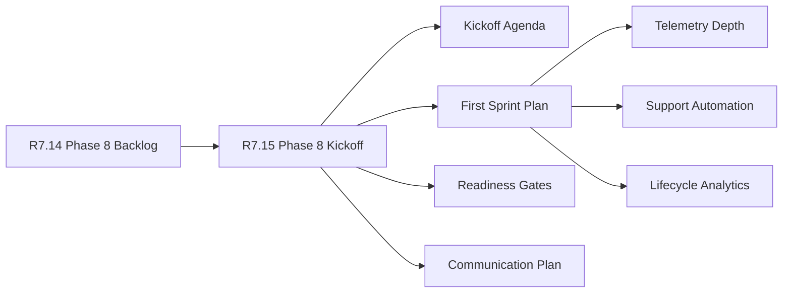

# Customer Lifecycle Phase 8 Kickoff

The customer lifecycle Phase 8 kickoff is the R7.15 readiness packet for
starting Phase 8 execution. It consumes the R7.14 Phase 8 backlog and verifies
that owner refs, kickoff sections, first sprint work, readiness gates, and
communication controls are ready without exposing customer-private material.

## Kickoff Flow



## Required Checks

- The Phase 8 backlog packet is live, sanitized, ready, and blocker-free.
- Program, product, engineering, security, and support owner refs are present.
- The kickoff agenda, first sprint plan, readiness gates, and communication
  plan are complete.
- First sprint items include telemetry depth, support automation, and lifecycle
  analytics with sanitized owner and tracking refs.
- The public/private evidence boundary is explicitly confirmed.

## Run The Gate

```bash
python3 scripts/validate_customer_lifecycle_phase8_kickoff.py \
  --packet examples/customer-lifecycle-phase8-kickoff/customer-lifecycle-phase8-kickoff.live.sanitized.example.json \
  --repo-root . \
  --require-live
```

Expected result:

```json
{
  "ready_for_customer_lifecycle_phase8_kickoff": true,
  "blocker_count": 0,
  "warning_count": 0
}
```

## Related Files

- `src/cavra/customer_lifecycle_phase8_kickoff.py`
- `scripts/validate_customer_lifecycle_phase8_kickoff.py`
- `examples/customer-lifecycle-phase8-kickoff/`
- `.github/workflows/customer-lifecycle-phase8-kickoff.yml`
- `tests/test_customer_lifecycle_phase8_kickoff.py`
- `docs/customer-lifecycle-phase8-kickoff.md`
