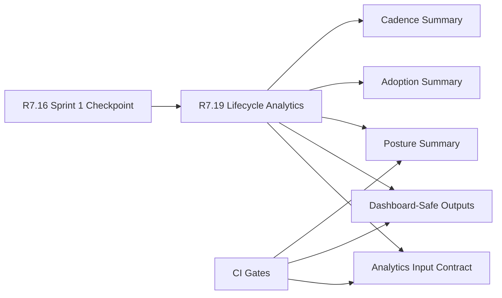

# Customer Lifecycle Phase 8 Lifecycle Analytics

The customer lifecycle Phase 8 lifecycle analytics packet is the R7.19
readiness gate for validating dashboard-safe lifecycle analytics. It consumes
the R7.16 Sprint 1 checkpoint and verifies analytics input schema, posture,
adoption, cadence summaries, dashboard-safe outputs, CI coverage, and
private-material controls.

## Lifecycle Analytics Flow



## Required Checks

- The Sprint 1 checkpoint packet is live, sanitized, ready, and blocker-free.
- Program, analytics, security, customer-success, and product owner refs are
  present.
- Analytics input contract fields are complete.
- Dashboard-safe outputs are sanitized refs.
- Posture, adoption, and cadence summary refs are present.
- CI gates cover input, dashboard output, summary, and redaction validation.

## Run The Gate

```bash
python3 scripts/validate_customer_lifecycle_phase8_lifecycle_analytics.py \
  --packet examples/customer-lifecycle-phase8-lifecycle-analytics/customer-lifecycle-phase8-lifecycle-analytics.live.sanitized.example.json \
  --repo-root . \
  --require-live
```

Expected result:

```json
{
  "ready_for_customer_lifecycle_phase8_lifecycle_analytics": true,
  "blocker_count": 0,
  "warning_count": 0
}
```

## Related Files

- `src/cavra/customer_lifecycle_phase8_lifecycle_analytics.py`
- `scripts/validate_customer_lifecycle_phase8_lifecycle_analytics.py`
- `examples/customer-lifecycle-phase8-lifecycle-analytics/`
- `.github/workflows/customer-lifecycle-phase8-lifecycle-analytics.yml`
- `tests/test_customer_lifecycle_phase8_lifecycle_analytics.py`
- `docs/customer-lifecycle-phase8-lifecycle-analytics.md`
