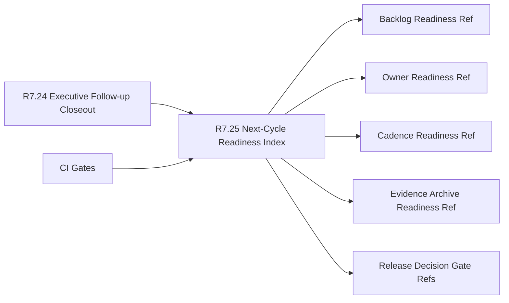

# Customer Lifecycle Phase 8 Next-Cycle Readiness Index

The customer lifecycle Phase 8 next-cycle readiness index packet is the R7.25
readiness gate for turning the R7.24 executive follow-up closeout into a
customer-safe next-cycle readiness decision.

## Next-Cycle Readiness Flow



## Required Checks

- The executive follow-up closeout source gate is ready.
- Executive, program, customer-success, support, security, and product owner
  refs are present.
- Readiness index, backlog, owner readiness, cadence, evidence archive, and
  release decision gate refs are complete.
- Backlog, owner, cadence, evidence archive, and release gate readiness refs
  are sanitized.
- Next-cycle go, risk acceptance, evidence archive, and readiness review gate
  refs are sanitized.
- CI gates cover source closeout, readiness index, readiness refs, decision
  gates, and redaction validation.

## Run The Gate

```bash
python3 scripts/validate_customer_lifecycle_phase8_next_cycle_readiness_index.py \
  --packet examples/customer-lifecycle-phase8-next-cycle-readiness-index/customer-lifecycle-phase8-next-cycle-readiness-index.live.sanitized.example.json \
  --repo-root . \
  --require-live
```

Expected result:

```json
{
  "ready_for_customer_lifecycle_phase8_next_cycle_readiness_index": true,
  "blocker_count": 0,
  "warning_count": 0
}
```

## Related Files

- `src/cavra/customer_lifecycle_phase8_next_cycle_readiness_index.py`
- `scripts/validate_customer_lifecycle_phase8_next_cycle_readiness_index.py`
- `examples/customer-lifecycle-phase8-next-cycle-readiness-index/`
- `.github/workflows/customer-lifecycle-phase8-next-cycle-readiness-index.yml`
- `tests/test_customer_lifecycle_phase8_next_cycle_readiness_index.py`
- `docs/customer-lifecycle-phase8-next-cycle-readiness-index.md`
