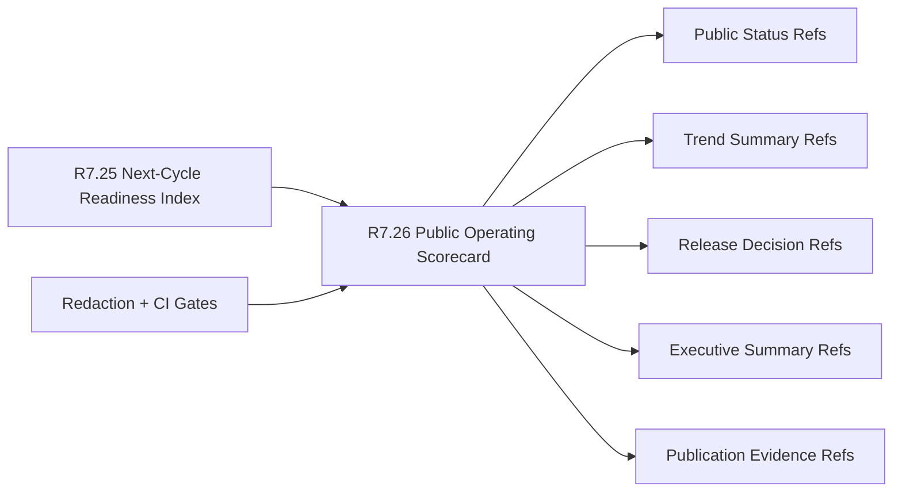

# Customer Lifecycle Phase 8 Public Operating Scorecard

The customer lifecycle Phase 8 public operating scorecard packet is the R7.26
gate that turns the R7.25 next-cycle readiness index into a customer-safe
operating scorecard. It is designed for publishable executive and operating
review surfaces where CAVRA can show readiness, trend, release decision, and
evidence archive status without leaking raw customer material.

## Scorecard Flow



## Required Checks

- The next-cycle readiness index source gate is ready.
- Executive, program, customer-success, support, security, and product owner
  refs are present.
- Scorecard, public status, trend summary, release decision, evidence archive,
  executive summary, and publication channel refs are complete.
- Operating readiness, release gate, evidence archive, customer-success,
  support, and security status refs are sanitized.
- Posture, adoption, support, and lifecycle trend refs are sanitized.
- Publish-go, hold-reason, refresh-cadence, and evidence-archive gate refs are
  sanitized.
- Executive summary and publication evidence refs are sanitized.
- CI gates cover source readiness-index validation, scorecard contract
  validation, status refs, trend refs, and publication redaction.

## Run The Gate

```bash
python3 scripts/validate_customer_lifecycle_phase8_public_operating_scorecard.py \
  --packet examples/customer-lifecycle-phase8-public-operating-scorecard/customer-lifecycle-phase8-public-operating-scorecard.live.sanitized.example.json \
  --repo-root . \
  --require-live
```

Expected result:

```json
{
  "ready_for_customer_lifecycle_phase8_public_operating_scorecard": true,
  "blocker_count": 0,
  "warning_count": 0
}
```

## Related Files

- `src/cavra/customer_lifecycle_phase8_public_operating_scorecard.py`
- `scripts/validate_customer_lifecycle_phase8_public_operating_scorecard.py`
- `examples/customer-lifecycle-phase8-public-operating-scorecard/`
- `.github/workflows/customer-lifecycle-phase8-public-operating-scorecard.yml`
- `tests/test_customer_lifecycle_phase8_public_operating_scorecard.py`
- `docs/customer-lifecycle-phase8-public-operating-scorecard.md`
