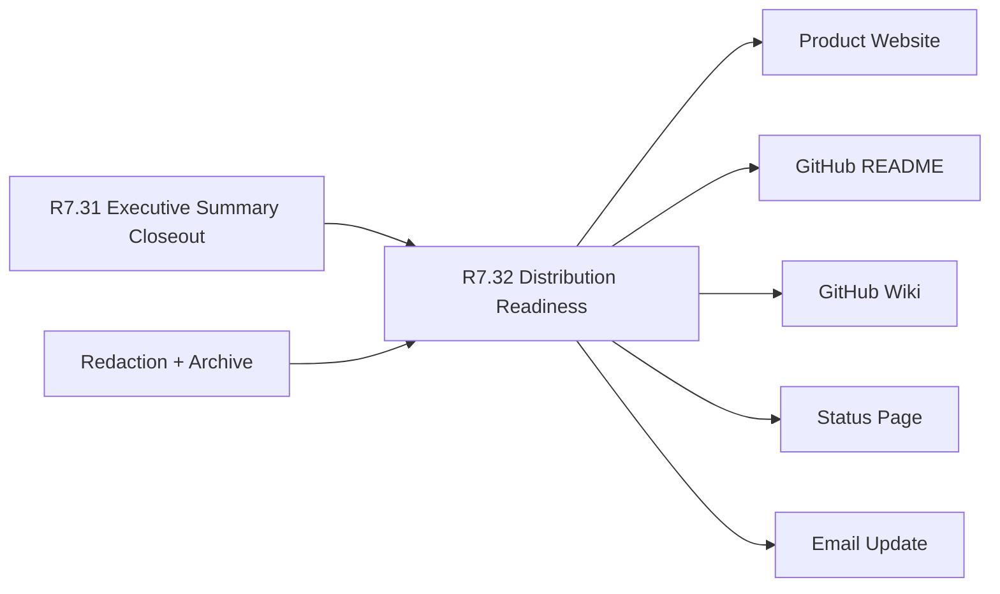

# Customer Lifecycle Phase 8 Public Scorecard Distribution Readiness

The customer lifecycle Phase 8 public scorecard distribution readiness packet
is the R7.32 gate that proves the public-safe executive scorecard summary can
be distributed through approved public channels without exposing private
customer, operational, subscriber, or commercial material.

## Distribution Flow



## Required Checks

- The R7.31 public scorecard executive summary closeout source gate is ready.
- Executive, communications, customer-success, security, product, and web owner
  refs are present.
- Source executive summary closeout, channel plan, audience subscription,
  release notification, website linkage, archive, redaction, and redaction
  status refs are complete.
- Product website, GitHub README, GitHub Wiki, status page, and email update
  channel refs are sanitized.
- Executive, security, customer-success, and public-reader audience refs are
  sanitized.
- Release, customer-success, security, and public status notification refs are
  sanitized.
- Product website, README, Wiki, Trial Field Guide, and sandbox linkage refs
  are sanitized.
- Distribution manifest, published channel snapshot, notification archive, and
  linkage archive refs are sanitized.
- Distribution redaction manifest, private-material scan, customer-identity
  scan, and commercial-terms scan refs are sanitized.
- CI gates cover source executive summary closeout, channel refs, audience
  refs, notification refs, linkage refs, archive refs, and redaction.

## Run The Gate

```bash
python3 scripts/validate_customer_lifecycle_phase8_public_scorecard_distribution_readiness.py \
  --packet examples/customer-lifecycle-phase8-public-scorecard-distribution-readiness/customer-lifecycle-phase8-public-scorecard-distribution-readiness.live.sanitized.example.json \
  --repo-root . \
  --require-live
```

Expected result:

```json
{
  "ready_for_customer_lifecycle_phase8_public_scorecard_distribution_readiness": true,
  "blocker_count": 0,
  "warning_count": 0
}
```

## Related Files

- `src/cavra/customer_lifecycle_phase8_public_scorecard_distribution_readiness.py`
- `scripts/validate_customer_lifecycle_phase8_public_scorecard_distribution_readiness.py`
- `examples/customer-lifecycle-phase8-public-scorecard-distribution-readiness/`
- `.github/workflows/customer-lifecycle-phase8-public-scorecard-distribution-readiness.yml`
- `tests/test_customer_lifecycle_phase8_public_scorecard_distribution_readiness.py`
- `docs/customer-lifecycle-phase8-public-scorecard-distribution-readiness.md`
