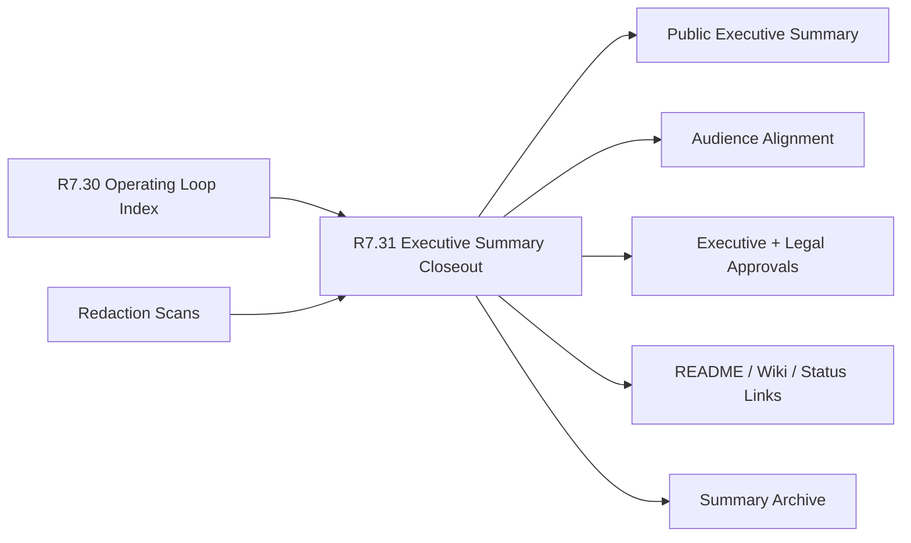

# Customer Lifecycle Phase 8 Public Scorecard Executive Summary Closeout

The customer lifecycle Phase 8 public scorecard executive summary closeout
packet is the R7.31 gate that proves the recurring public scorecard operating
loop can be summarized for executive and public readers without exposing
private customer, operational, or commercial material.

## Executive Summary Flow



## Required Checks

- The R7.30 public scorecard operating loop index source gate is ready.
- Executive, communications, customer-success, security, product, and legal
  review owner refs are present.
- Source operating-loop index, summary publication, audience alignment,
  approval, archive, redaction, and redaction status refs are complete.
- Public executive summary, decision summary, operating loop summary, and
  next-cycle summary refs are sanitized.
- Executive, security, customer-success, and public-reader audience refs are
  sanitized.
- Executive, communications, security, product, and legal redaction approval
  refs are sanitized.
- Published summary, README link, wiki link, and status page link refs are
  sanitized.
- Summary archive manifest, published summary snapshot, approval archive, and
  redaction archive refs are sanitized.
- Redaction manifest, private-material scan, customer-identity scan, and
  commercial-terms scan refs are sanitized.
- CI gates cover source operating-loop index, summary refs, audience refs,
  approval refs, publication refs, archive refs, and redaction.

## Run The Gate

```bash
python3 scripts/validate_customer_lifecycle_phase8_public_scorecard_executive_summary_closeout.py \
  --packet examples/customer-lifecycle-phase8-public-scorecard-executive-summary-closeout/customer-lifecycle-phase8-public-scorecard-executive-summary-closeout.live.sanitized.example.json \
  --repo-root . \
  --require-live
```

Expected result:

```json
{
  "ready_for_customer_lifecycle_phase8_public_scorecard_executive_summary_closeout": true,
  "blocker_count": 0,
  "warning_count": 0
}
```

## Related Files

- `src/cavra/customer_lifecycle_phase8_public_scorecard_executive_summary_closeout.py`
- `scripts/validate_customer_lifecycle_phase8_public_scorecard_executive_summary_closeout.py`
- `examples/customer-lifecycle-phase8-public-scorecard-executive-summary-closeout/`
- `.github/workflows/customer-lifecycle-phase8-public-scorecard-executive-summary-closeout.yml`
- `tests/test_customer_lifecycle_phase8_public_scorecard_executive_summary_closeout.py`
- `docs/customer-lifecycle-phase8-public-scorecard-executive-summary-closeout.md`
