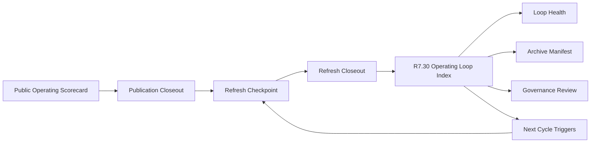

# Customer Lifecycle Phase 8 Public Scorecard Operating Loop Index

The customer lifecycle Phase 8 public scorecard operating loop index packet is
the R7.30 gate that proves public scorecard operations have become a recurring
operating model. It binds the public operating scorecard, publication closeout,
refresh checkpoint, refresh closeout, cadence, loop health, archives,
governance reviews, and next-cycle triggers into one public-safe index.

## Operating Loop Flow



## Required Checks

- The R7.29 public scorecard refresh closeout source gate is ready.
- Executive, communications, customer-success, support, security, and product
  owner refs are present.
- Source refresh closeout, publication closeout, refresh checkpoint, refresh
  closeout, cadence, loop-health, next-cycle trigger, governance review, and
  redaction status refs are complete.
- Public operating scorecard, publication closeout, refresh checkpoint, refresh
  closeout, and next-cycle readiness dependency refs are sanitized.
- Active cadence, last loop completion, next loop due, and exception handling
  refs are sanitized.
- Loop health summary, publication freshness, owner-response SLO, and
  stale-resolution SLO refs are sanitized.
- Operating loop manifest, publication archive, refresh archive, and closeout
  archive refs are sanitized.
- Next public scorecard cycle, next refresh checkpoint, next closeout, and
  owner review trigger refs are sanitized.
- Executive, communications, security, and product governance refs are
  sanitized.
- CI gates cover source refresh closeout, dependency index, cadence, loop
  health, archive, next-cycle trigger, governance, and redaction.

## Run The Gate

```bash
python3 scripts/validate_customer_lifecycle_phase8_public_scorecard_operating_loop_index.py \
  --packet examples/customer-lifecycle-phase8-public-scorecard-operating-loop-index/customer-lifecycle-phase8-public-scorecard-operating-loop-index.live.sanitized.example.json \
  --repo-root . \
  --require-live
```

Expected result:

```json
{
  "ready_for_customer_lifecycle_phase8_public_scorecard_operating_loop_index": true,
  "blocker_count": 0,
  "warning_count": 0
}
```

## Related Files

- `src/cavra/customer_lifecycle_phase8_public_scorecard_operating_loop_index.py`
- `scripts/validate_customer_lifecycle_phase8_public_scorecard_operating_loop_index.py`
- `examples/customer-lifecycle-phase8-public-scorecard-operating-loop-index/`
- `.github/workflows/customer-lifecycle-phase8-public-scorecard-operating-loop-index.yml`
- `tests/test_customer_lifecycle_phase8_public_scorecard_operating_loop_index.py`
- `docs/customer-lifecycle-phase8-public-scorecard-operating-loop-index.md`
