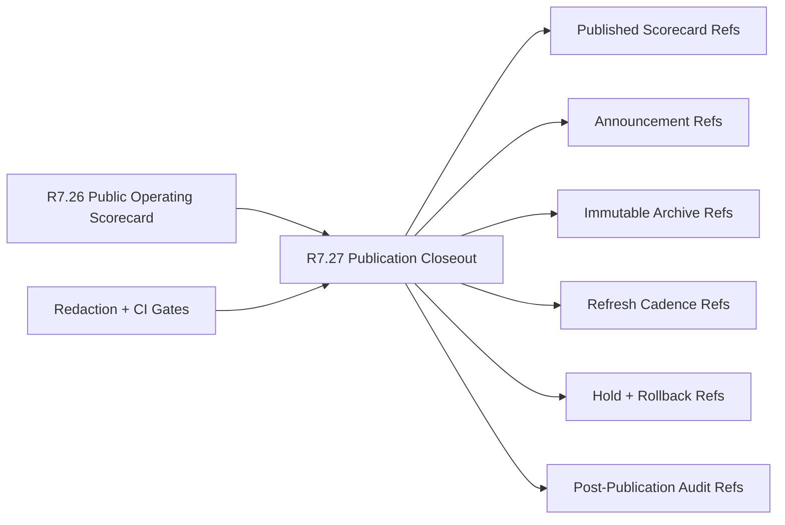

# Customer Lifecycle Phase 8 Public Scorecard Publication Closeout

The customer lifecycle Phase 8 public scorecard publication closeout packet is
the R7.27 gate that proves the public operating scorecard can be safely
published, announced, archived, refreshed, and audited.

## Publication Closeout Flow



## Required Checks

- The public operating scorecard source gate is ready.
- Executive, communications, customer-success, support, security, and product
  owner refs are present.
- Publication, scorecard, announcement, evidence archive, refresh cadence,
  rollback plan, and post-publication audit refs are complete.
- Published scorecard, public status page, release notes, and stakeholder
  notification refs are sanitized.
- Executive, customer-success, support, and security announcement refs are
  sanitized.
- Immutable archive, scorecard snapshot, publication manifest, and audit
  evidence refs are sanitized.
- Refresh cadence, next review, owner follow-up, and staleness threshold refs
  are sanitized.
- Publication hold, rollback trigger, rollback owner, and correction notice
  refs are sanitized.
- CI gates cover source scorecard, publication contract, announcement refs,
  archive refs, rollback refs, and audit redaction.

## Run The Gate

```bash
python3 scripts/validate_customer_lifecycle_phase8_public_scorecard_publication_closeout.py \
  --packet examples/customer-lifecycle-phase8-public-scorecard-publication-closeout/customer-lifecycle-phase8-public-scorecard-publication-closeout.live.sanitized.example.json \
  --repo-root . \
  --require-live
```

Expected result:

```json
{
  "ready_for_customer_lifecycle_phase8_public_scorecard_publication_closeout": true,
  "blocker_count": 0,
  "warning_count": 0
}
```

## Related Files

- `src/cavra/customer_lifecycle_phase8_public_scorecard_publication_closeout.py`
- `scripts/validate_customer_lifecycle_phase8_public_scorecard_publication_closeout.py`
- `examples/customer-lifecycle-phase8-public-scorecard-publication-closeout/`
- `.github/workflows/customer-lifecycle-phase8-public-scorecard-publication-closeout.yml`
- `tests/test_customer_lifecycle_phase8_public_scorecard_publication_closeout.py`
- `docs/customer-lifecycle-phase8-public-scorecard-publication-closeout.md`
