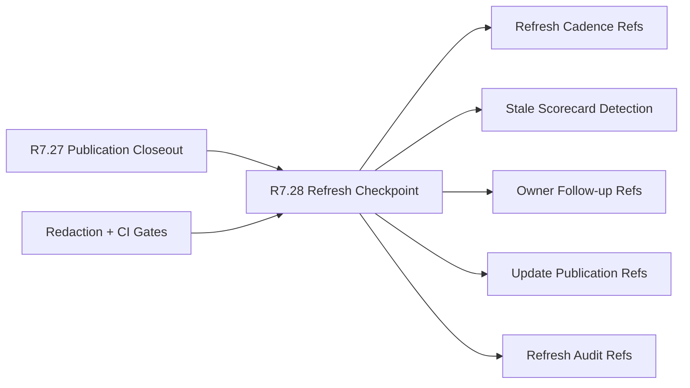

# Customer Lifecycle Phase 8 Public Scorecard Refresh Checkpoint

The customer lifecycle Phase 8 public scorecard refresh checkpoint packet is
the R7.28 gate that keeps the public scorecard operational after publication.
It proves there is a refresh cadence, stale-scorecard detection, accountable
owner follow-up, update publication path, and refresh audit evidence.

## Refresh Checkpoint Flow



## Required Checks

- The public scorecard publication closeout source gate is ready.
- Executive, communications, customer-success, support, security, and product
  owner refs are present.
- Source publication, refresh cadence, staleness detection, owner follow-up,
  update publication, and refresh audit refs are complete.
- Active cadence, last refresh, next refresh, and cadence exception refs are
  sanitized.
- Stale-scorecard detection, threshold, owner escalation, and public notice
  refs are sanitized.
- Executive, customer-success, support, security, and product follow-up refs
  are sanitized.
- Updated scorecard, update release notes, public status update, and
  stakeholder update refs are sanitized.
- Refresh manifest, redaction audit, archive snapshot, and refresh evidence
  refs are sanitized.
- CI gates cover source publication closeout, refresh contract, cadence refs,
  staleness refs, owner follow-up, update publication, and refresh audit
  redaction.

## Run The Gate

```bash
python3 scripts/validate_customer_lifecycle_phase8_public_scorecard_refresh_checkpoint.py \
  --packet examples/customer-lifecycle-phase8-public-scorecard-refresh-checkpoint/customer-lifecycle-phase8-public-scorecard-refresh-checkpoint.live.sanitized.example.json \
  --repo-root . \
  --require-live
```

Expected result:

```json
{
  "ready_for_customer_lifecycle_phase8_public_scorecard_refresh_checkpoint": true,
  "blocker_count": 0,
  "warning_count": 0
}
```

## Related Files

- `src/cavra/customer_lifecycle_phase8_public_scorecard_refresh_checkpoint.py`
- `scripts/validate_customer_lifecycle_phase8_public_scorecard_refresh_checkpoint.py`
- `examples/customer-lifecycle-phase8-public-scorecard-refresh-checkpoint/`
- `.github/workflows/customer-lifecycle-phase8-public-scorecard-refresh-checkpoint.yml`
- `tests/test_customer_lifecycle_phase8_public_scorecard_refresh_checkpoint.py`
- `docs/customer-lifecycle-phase8-public-scorecard-refresh-checkpoint.md`
