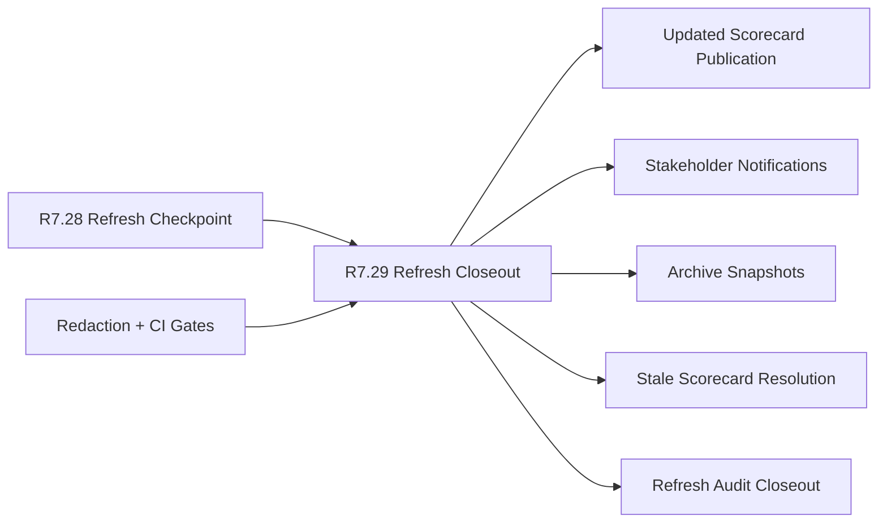

# Customer Lifecycle Phase 8 Public Scorecard Refresh Closeout

The customer lifecycle Phase 8 public scorecard refresh closeout packet is the
R7.29 gate that proves a refreshed public scorecard was published,
communicated, archived, and closed with audit-ready evidence. It consumes the
R7.28 public scorecard refresh checkpoint and turns the refresh plan into a
completed public operating event.

## Refresh Closeout Flow



## Required Checks

- The public scorecard refresh checkpoint source gate is ready.
- Executive, communications, customer-success, support, security, and product
  owner refs are present.
- Source refresh checkpoint, updated scorecard publication, notification,
  archive snapshot, stale-resolution, refresh-audit closeout, and redaction
  status refs are complete.
- Published updated scorecard, scorecard delta, public status update, and
  release notes update refs are sanitized.
- Executive, customer-success, support, security, and stakeholder notification
  refs are sanitized.
- Immutable refresh archive, previous scorecard snapshot, updated scorecard
  snapshot, and refresh manifest refs are sanitized.
- Stale scorecard resolution, owner resolution, public notice resolution, and
  next staleness review refs are sanitized.
- Refresh audit report, redaction closeout, archive integrity, and publication
  integrity refs are sanitized.
- CI gates cover source refresh checkpoint, updated scorecard validation,
  notification refs, archive snapshots, stale resolution, refresh audit
  closeout, and redaction.

## Run The Gate

```bash
python3 scripts/validate_customer_lifecycle_phase8_public_scorecard_refresh_closeout.py \
  --packet examples/customer-lifecycle-phase8-public-scorecard-refresh-closeout/customer-lifecycle-phase8-public-scorecard-refresh-closeout.live.sanitized.example.json \
  --repo-root . \
  --require-live
```

Expected result:

```json
{
  "ready_for_customer_lifecycle_phase8_public_scorecard_refresh_closeout": true,
  "blocker_count": 0,
  "warning_count": 0
}
```

## Related Files

- `src/cavra/customer_lifecycle_phase8_public_scorecard_refresh_closeout.py`
- `scripts/validate_customer_lifecycle_phase8_public_scorecard_refresh_closeout.py`
- `examples/customer-lifecycle-phase8-public-scorecard-refresh-closeout/`
- `.github/workflows/customer-lifecycle-phase8-public-scorecard-refresh-closeout.yml`
- `tests/test_customer_lifecycle_phase8_public_scorecard_refresh_closeout.py`
- `docs/customer-lifecycle-phase8-public-scorecard-refresh-closeout.md`
