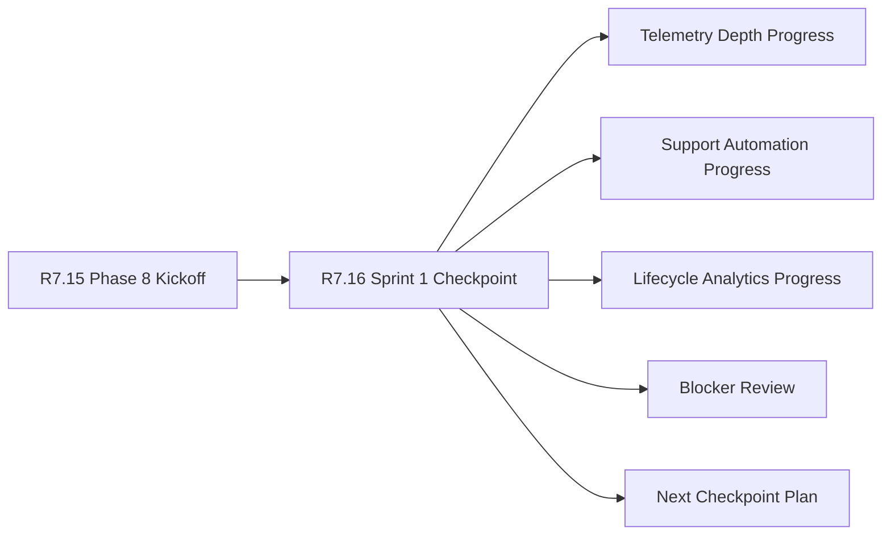

# Customer Lifecycle Phase 8 Sprint 1 Checkpoint

The customer lifecycle Phase 8 Sprint 1 checkpoint is the R7.16 progress gate
for confirming that Phase 8 execution has started cleanly after kickoff. It
consumes the R7.15 kickoff packet and validates public-safe sprint progress,
blocker triage, evidence summaries, and next checkpoint readiness.

## Checkpoint Flow



## Required Checks

- The Phase 8 kickoff packet is live, sanitized, ready, and blocker-free.
- Program, product, engineering, security, and support owner refs are present.
- Sprint progress exists for telemetry depth, support automation, and lifecycle
  analytics.
- Progress items have sanitized owner, tracking, and evidence refs.
- Blocker review confirms zero open blockers.
- Evidence summary and next checkpoint plan are complete and public-safe.

## Run The Gate

```bash
python3 scripts/validate_customer_lifecycle_phase8_sprint1_checkpoint.py \
  --packet examples/customer-lifecycle-phase8-sprint1-checkpoint/customer-lifecycle-phase8-sprint1-checkpoint.live.sanitized.example.json \
  --repo-root . \
  --require-live
```

Expected result:

```json
{
  "ready_for_customer_lifecycle_phase8_sprint1_checkpoint": true,
  "blocker_count": 0,
  "warning_count": 0
}
```

## Related Files

- `src/cavra/customer_lifecycle_phase8_sprint1_checkpoint.py`
- `scripts/validate_customer_lifecycle_phase8_sprint1_checkpoint.py`
- `examples/customer-lifecycle-phase8-sprint1-checkpoint/`
- `.github/workflows/customer-lifecycle-phase8-sprint1-checkpoint.yml`
- `tests/test_customer_lifecycle_phase8_sprint1_checkpoint.py`
- `docs/customer-lifecycle-phase8-sprint1-checkpoint.md`
