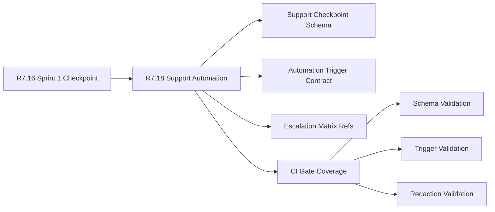

# Customer Lifecycle Phase 8 Support Automation

The customer lifecycle Phase 8 support automation packet is the R7.18 readiness
gate for validating the first Phase 8 support checkpoint and automation
contract. It consumes the R7.16 Sprint 1 checkpoint and verifies schema fields,
automation trigger refs, escalation refs, CI coverage, and private-material
controls.

## Support Automation Flow



## Required Checks

- The Sprint 1 checkpoint packet is live, sanitized, ready, and blocker-free.
- Program, support, engineering, customer-success, and security owner refs are
  present.
- Support checkpoint schema fields are complete.
- Automation trigger contract refs are present and marked sanitized.
- Escalation matrix refs are sanitized.
- CI gates cover schema, trigger, and redaction validation.

## Run The Gate

```bash
python3 scripts/validate_customer_lifecycle_phase8_support_automation.py \
  --packet examples/customer-lifecycle-phase8-support-automation/customer-lifecycle-phase8-support-automation.live.sanitized.example.json \
  --repo-root . \
  --require-live
```

Expected result:

```json
{
  "ready_for_customer_lifecycle_phase8_support_automation": true,
  "blocker_count": 0,
  "warning_count": 0
}
```

## Related Files

- `src/cavra/customer_lifecycle_phase8_support_automation.py`
- `scripts/validate_customer_lifecycle_phase8_support_automation.py`
- `examples/customer-lifecycle-phase8-support-automation/`
- `.github/workflows/customer-lifecycle-phase8-support-automation.yml`
- `tests/test_customer_lifecycle_phase8_support_automation.py`
- `docs/customer-lifecycle-phase8-support-automation.md`
