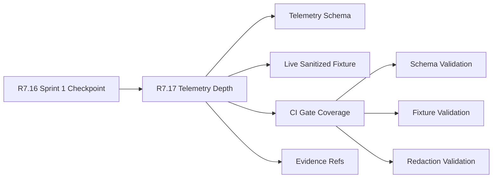

# Customer Lifecycle Phase 8 Telemetry Depth

The customer lifecycle Phase 8 telemetry depth packet is the R7.17 readiness
gate for validating the first Phase 8 telemetry contract. It consumes the R7.16
Sprint 1 checkpoint and verifies schema fields, live sanitized fixtures, CI
coverage, evidence refs, and private-material controls.

## Telemetry Flow



## Required Checks

- The Sprint 1 checkpoint packet is live, sanitized, ready, and blocker-free.
- Program, security, engineering, and analytics owner refs are present.
- Telemetry schema fields are complete.
- Live sanitized fixture refs are present and marked sanitized.
- CI gates cover schema, fixture, and redaction validation.
- Evidence refs are sanitized and customer-private material is excluded.

## Run The Gate

```bash
python3 scripts/validate_customer_lifecycle_phase8_telemetry_depth.py \
  --packet examples/customer-lifecycle-phase8-telemetry-depth/customer-lifecycle-phase8-telemetry-depth.live.sanitized.example.json \
  --repo-root . \
  --require-live
```

Expected result:

```json
{
  "ready_for_customer_lifecycle_phase8_telemetry_depth": true,
  "blocker_count": 0,
  "warning_count": 0
}
```

## Related Files

- `src/cavra/customer_lifecycle_phase8_telemetry_depth.py`
- `scripts/validate_customer_lifecycle_phase8_telemetry_depth.py`
- `examples/customer-lifecycle-phase8-telemetry-depth/`
- `.github/workflows/customer-lifecycle-phase8-telemetry-depth.yml`
- `tests/test_customer_lifecycle_phase8_telemetry_depth.py`
- `docs/customer-lifecycle-phase8-telemetry-depth.md`
