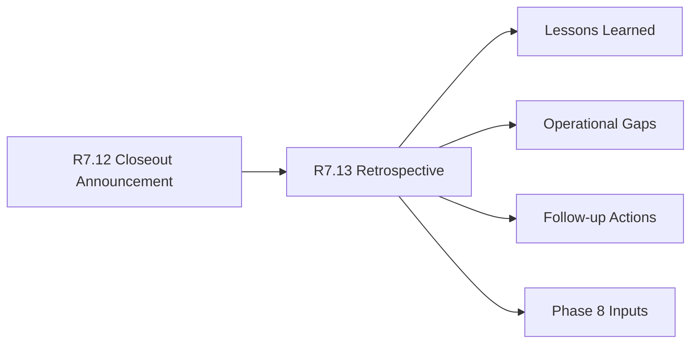

# Customer Lifecycle Retrospective

The customer lifecycle retrospective is the R7.13 internal-safe lessons learned
packet for CAVRA Managed and Enterprise lifecycle closeout. It consumes the
R7.12 closeout announcement and produces a sanitized retrospective with
operational gaps, follow-up actions, and Phase 8 inputs.

## Retrospective Flow



## Required Checks

- Announcement packet is live, sanitized, ready, and blocker-free.
- Program, customer success, security, support, and product owner refs exist.
- Retrospective sections are complete and supported by sanitized refs.
- Follow-up actions have owner refs and tracking refs.
- Phase 8 input refs are present.
- No customer identities, raw evidence, private notes, pricing, contract values,
  renewal amounts, raw contracts, legal terms, or commercial terms are embedded.

## Run The Gate

```bash
python3 scripts/validate_customer_lifecycle_retrospective.py \
  --packet examples/customer-lifecycle-retrospective/customer-lifecycle-retrospective.live.sanitized.example.json \
  --repo-root . \
  --require-live
```

Ready means:

```json
{
  "ready_for_customer_lifecycle_retrospective": true,
  "blocker_count": 0,
  "warning_count": 0
}
```

## Related Files

- `src/cavra/customer_lifecycle_retrospective.py`
- `scripts/validate_customer_lifecycle_retrospective.py`
- `examples/customer-lifecycle-retrospective/`
- `.github/workflows/customer-lifecycle-retrospective.yml`
- `tests/test_customer_lifecycle_retrospective.py`
