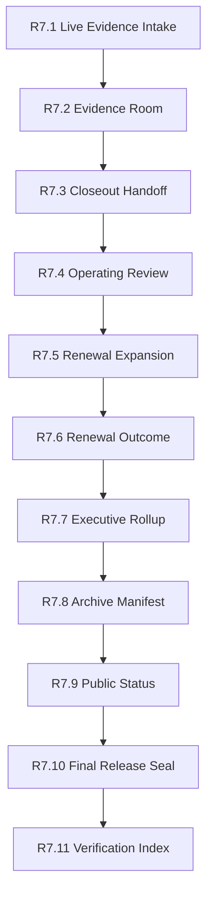

# Customer Lifecycle Verification Index

The customer lifecycle verification index is the R7.11 closeout index for the
CAVRA Managed and Enterprise customer lifecycle chain. It verifies that every
public R7 gate from R7.1 through R7.10 exists, has a live sanitized example,
has a ready result packet, and is backed by validator, workflow, test, repo
documentation, and wiki documentation artifacts.

## Verification Map



## What The Index Checks

- Live sanitized example packet exists for each R7 gate.
- Live result packet exists and the gate-specific readiness key is `true`.
- Validator script exists.
- GitHub Actions workflow exists.
- Focused regression test exists.
- Repository documentation exists.
- Wiki documentation exists.
- Validator command matches the expected public contract command.
- The index contains no customer identities, raw evidence, private notes,
  pricing, contract values, renewal amounts, raw contracts, legal terms, or
  commercial terms.

## Run The Gate

```bash
python3 scripts/validate_customer_lifecycle_verification_index.py \
  --index examples/customer-lifecycle-verification-index/customer-lifecycle-verification-index.live.sanitized.example.json \
  --repo-root . \
  --require-live
```

Ready means:

```json
{
  "ready_for_customer_lifecycle_verification_index": true,
  "blocker_count": 0,
  "warning_count": 0
}
```

## Related Files

- `src/cavra/customer_lifecycle_verification_index.py`
- `scripts/validate_customer_lifecycle_verification_index.py`
- `examples/customer-lifecycle-verification-index/`
- `.github/workflows/customer-lifecycle-verification-index.yml`
- `tests/test_customer_lifecycle_verification_index.py`
