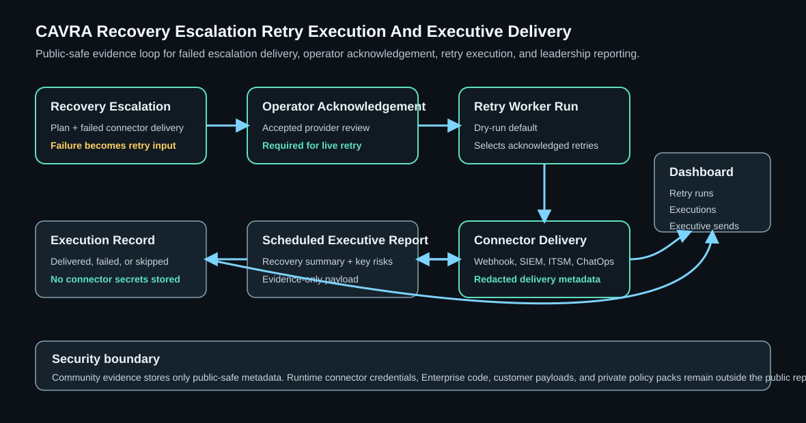

# Go Backend Rollback Drill Recovery Escalation Retry Execution And Executive Delivery

CAVRA now automates recovery escalation retry execution and scheduled executive report delivery with public-safe evidence records.

## Feature Details

- Recovery escalation retry worker runs are dry-run by default.
- Live retry execution requires an accepted, acknowledged, or resolved recovery escalation acknowledgement.
- Retry execution records bind the worker run, retry plan, escalation plan, provider, delivery metadata, and execution status.
- Scheduled executive report delivery sends public-safe report summaries through configured connectors.
- Dashboard metrics expose retry worker runs, retry execution outcomes, executive report deliveries, and failed delivery counts.

## How To Use

1. Build a recovery escalation plan.
2. Deliver the recovery escalation notification.
3. Acknowledge the escalation provider.
4. Build a recovery escalation retry plan.
5. Run the recovery escalation retry worker.
6. Schedule and deliver the executive report.

## API

```text
POST /runtime/go-pilot/rollback-drill-notifications/acknowledgements/audit-delivery/recovery-escalations/retry-worker-run
POST /runtime/go-pilot/rollback-drill-notifications/acknowledgements/audit-delivery/recovery-executive-report/schedule-runs/{run_id}/deliver
```

## User Stories

- As a release manager, I can retry failed recovery escalation delivery after accepted review.
- As an auditor, I can verify retry execution status and executive delivery evidence.
- As an executive stakeholder, I can receive scheduled recovery summaries from governed channels.

## Enterprise Challenge Solved

The feature turns recovery escalation follow-through into an auditable operating loop without putting connector secrets, private incident data, or Enterprise implementation code in the public repository.

## Diagram



## Next Work

Recovery escalation retry health reporting and executive report delivery retry planning are now covered in `Go-Backend-Rollback-Drill-Recovery-Retry-Health-And-Executive-Delivery-Retry.md`.
