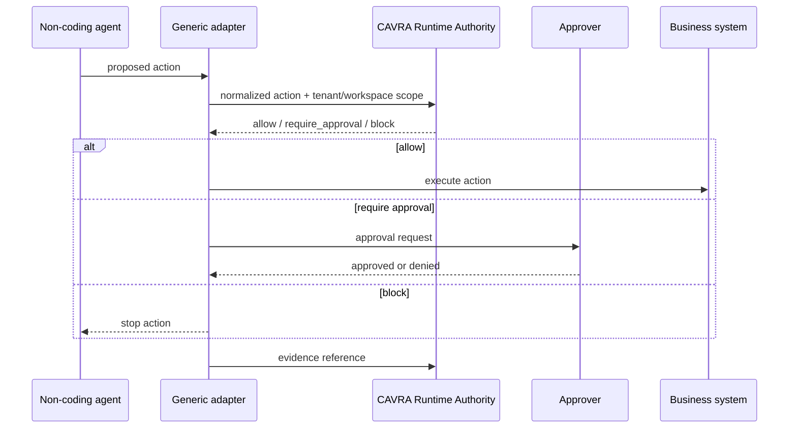

# Generic Agent Adapter SDK And Action Taxonomy

CAVRA R6.2 expands runtime authority beyond coding agents. Generic adapters let non-coding agents request a CAVRA decision before they mutate CRM records, identity roles, data exports, model promotions, support workflows, customer communications, or financial operations.



## Public Taxonomy

| Action type | Domain | Effect | Default |
| --- | --- | --- | --- |
| `knowledge.search` | data | read | allow |
| `ticket.summarize` | support | read | allow |
| `crm.update_record` | sales | write | require approval |
| `customer.email_send` | communications | send | require approval |
| `data.export_dataset` | data | export | require approval |
| `model.promote` | model governance | promote | require approval |
| `identity.grant_role` | identity | grant | block |
| `finance.release_payment` | finance | approve | block |
| `workflow.close_control` | workflow | approve | require approval |

Runtime-native actions such as file, command, Git, and MCP checks route back to `RuntimeGuard`.

## Commands

```bash
cavra adapter taxonomy
cavra adapter manifest-validate examples/generic-adapters/reference-business-agent.manifest.json
cavra adapter evaluate examples/generic-adapters/non-coding-agent-actions.sample.json
cavra adapter export --output-dir dist/generic-agent-adapter
cavra adapter readiness examples/generic-adapters/enterprise-generic-agent-adapter.live.sanitized.example.json --require-live
```

## Evidence Artifacts

- `src/cavra/generic_agent_adapter.py`
- `scripts/validate_generic_agent_adapter.py`
- `examples/generic-adapters/action-taxonomy.json`
- `examples/generic-adapters/reference-business-agent.manifest.json`
- `examples/generic-adapters/non-coding-agent-actions.sample.json`
- `examples/generic-adapters/enterprise-generic-agent-adapter.sample.json`
- `examples/generic-adapters/enterprise-generic-agent-adapter.live.sanitized.example.json`
- `.github/workflows/generic-agent-adapter.yml`
- `tests/test_generic_agent_adapter.py`

## Live Gate

The live gate is accepted only when the packet supplies real CI, taxonomy, adapter-test, and non-coding scenario evidence and returns:

```json
{
  "ready_for_live_generic_adapter_sdk": true,
  "blocker_count": 0
}
```
